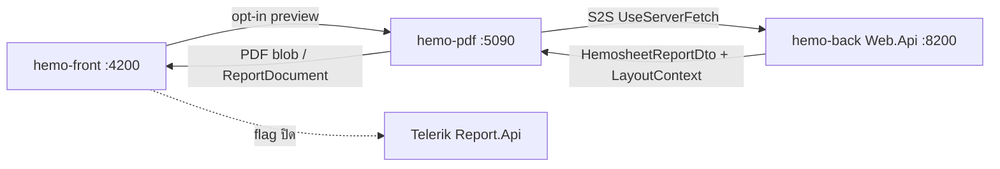

# HEM-1074 — สรุป Branch PDF Report (Frontend / Backend / Hemo-PDF)

> **อัปเดต:** 2026-08-03  
> **Jira:** HEM-1074 — Overhaul Custom Report System  
> **เป้าหมายหลัก:** แทนที่ Telerik Report Viewer / `.trdp` สำหรับ **Hemosheet** ด้วยระบบ PDF ใหม่ (QuestPDF + DOM/PDF preview) ที่แยก deploy ได้  
> **เอกสารสถาปัตยกรรมละเอียด:** [PDF-REPORT-SYSTEM.md](./PDF-REPORT-SYSTEM.md)  
> **Checklist master:** [hemo-pdf_implementation plan](../plans/hemo-pdf_implementation_8969dd4f.plan.md)

---

## 1. ภาพรวมสั้น ๆ

ระบบ PDF Report ใหม่ทำงานร่วมกัน **3 repo** บน branch คู่ขนาน:

| Repo | Branch | บทบาท |
|------|--------|-------|
| **hemo-pdf** | `feature/HEM-1074-PDF-Overhual-Custom-Report-System` | Standalone PDF engine (QuestPDF) + Angular report-viewer library |
| **hemo-back** | `feature/HEM-1074-BE-Overhual-Custom-Report-System` | ต้นทางข้อมูล — `report-data` DTO + layout context + template catalog |
| **hemo-front** | `feature/HEM-1074-FE-Overhual-Custom-Report-System` | UI preview/print — opt-in `useHemoPdfPreview` + fallback Telerik |

**สถานะโดยรวม:** พื้นฐาน E2E ใช้ได้แล้ว (~70–75%) — เปิด flag แล้วดู/พิมพ์ Hemosheet ผ่าน Hemo-PDF ได้ แต่ยัง **ไม่ถึงเกณฑ์แทน Telerik จริง** (layout parity, cutover, plugin send)



---

## 2. สิ่งที่ทำไปแล้ว — แยกตาม Repo

### 2.1 Hemo-PDF (`hemo-pdf`) — Engine ใหม่ทั้งก้อน

สร้าง repo ใหม่จากศูนย์ (Phase 0–6 เสร็จ) แล้วต่อด้วย Phase 7 Hemosheet + server-fetch

**โครงสร้าง solution**

```
src/
  Hemo.Pdf.Api/           # ASP.NET Core 8 — port 5090
  Hemo.Pdf.Application/   # Pipeline, guards, S2S fetch, cache
  Hemo.Pdf.Core/          # Models, ReportDocument, ReportTemplates
  Hemo.Pdf.Branding/      # JSON branding ต่อ tenant
  Hemo.Pdf.Sections/      # Header/Footer/Content + ReportBlock → QuestPDF
  Hemo.Pdf.Layouts/       # 12 template ids (Generic + Hemosheet dedicated)
  Hemo.Pdf.Rendering/     # QuestPDF + Sarabun fonts
client/
  hemo-pdf-client/        # Angular print/download lib
  hemo-report-viewer/     # DOM ReportDocument viewer (source of truth)
assets/
  branding/               # default, local, tenant-demo-a/b
  fonts/sarabun/          # .ttf มีแล้ว
  mock-data/              # hemosheet scenarios หลัก
```

**ความสามารถที่ ship แล้ว**

| หัวข้อ | รายละเอียด |
|--------|-----------|
| Dual API | `POST /api/pdf/generate` → PDF, `POST /api/report/preview` → ReportDocument JSON |
| Auth | Dev mock Bearer + Production JWT (HS256 ร่วม Web.Api) + tenant bind |
| Branding | ไฟล์ JSON ต่อ tenant + มี `default.json` |
| Template registry | 12 ids; dedicated: `template-01`, `template-04-hemosheet`; อื่น ๆ = Generic |
| Hemosheet engine | Layout Planner + Section Renderer Registry (~26 sections) |
| Profiles | Default / Rama / ThaiUr (ThaiUr = one-page PDF composer + PDF-as-preview) |
| S2S fetch | `UseServerFetch=true` → ดึง report-data จาก Web.Api + cache ~45s |
| Template resolve | อ่าน `layoutContext.hemoPdfTemplateId` จาก catalog ฝั่ง BE |
| Docker / CI | `docker-compose` (host.docker.internal → Web.Api), unit + integration tests |
| Fonts | Sarabun ครบใน `assets/fonts/sarabun/` |

**Commits สำคัญบน branch (นอก merge)**

- Foundation: API, QuestPDF, branding, 12 templates, Angular libs, Phase 6 preview
- Hemosheet: ThaiUR composer, parity blocks, auth hardening
- `cfab2cd` — server-fetch report-data + template-safe pipeline + cache
- `e1f2c6e` — resolve admin hemosheet template, ThaiUr one-page, Docker host Web.Api

---

### 2.2 Backend (`hemo-back`) — ต้นทางข้อมูล + catalog

**ไฟล์ใหม่หลัก (~1.2k lines เทียบ develop)**

| ส่วน | Path / บทบาท |
|------|----------------|
| API | `HemosheetReportDataController` — `GET .../records/{id}/report-data`, `GET .../report-data/template` |
| Service | `HemosheetReportDataService` — ใช้ `HemosheetResolver` (SoT เดียวกับ Telerik) → map DTO |
| DTO | `HemosheetReportDto` + assessment mapping + report settings |
| Layout | `HemosheetLayoutResolver` — DialysisMode, VascularAccess, Features, LayoutProfile |
| Catalog | `HemosheetTemplateCatalog` — map `.trdp` filename → profile + `HemoPdfTemplateId` |
| HemoAdmin | publish `useHemoPdfPreview` / `pdfApiUrl` ใน tenant frontend config |
| Tests | LayoutResolver, TemplateCatalog, AssessmentMapping |

**Catalog ที่รองรับ**

| Key | Telerik file | LayoutProfile | HemoPdfTemplateId |
|-----|--------------|---------------|-------------------|
| default | `Hemosheet.trdp` | Default | `template-04-hemosheet` |
| rama | `Hemosheet-RAMA.trdp` | Rama | 同上 |
| thaiur | `Hemosheet-ThaiUR.trdp` | ThaiUr | 同上 |
| cah | `Hemosheet-CAH.trdp` | Default | 同上 |
| new | `Hemosheet-New.trdp` | Default | 同上 |

> **ยังไม่มี** entry แยกสำหรับ YTL (fallback เป็น Default)

**Commits สำคัญ**

- DTO + assessment mapping + layout resolver
- `HemosheetTemplateCatalog` แทน heuristic ชื่อไฟล์
- Tenant config `useHemoPdfPreview` / `pdfApiUrl` + LogoAlignResolver
- Docs: catalog → `layoutContext` สำหรับ Hemo-PDF

---

### 2.3 Frontend (`hemo-front`) — Preview UI + opt-in

**ไฟล์ใหม่หลัก (~3.6k lines เทียบ develop)**

| ส่วน | บทบาท |
|------|--------|
| `share/hemo-pdf/` | Port เรียก Hemo-PDF, catalog, providers, print util, viewer host |
| `report-viewer/` | DOM blocks sync จาก hemo-pdf (`npm run sync:report-viewer`) |
| `hemo-report-pdf-canvas` | pdf.js สำหรับ PDF-as-preview (ThaiUr) |
| `reports.page` | สลับ Hemo-PDF ↔ Telerik ตาม flag + catalog |
| `embedded-hemosheet-report` | Doctor view — path เดียวกับ reports |
| HemoAdmin tenant detail | Toggle `useHemoPdfPreview` + `pdfApiUrl` |
| Config | `pdfApiUrl`, `useHemoPdfPreview` (default **false**) |

**พฤติกรรม preview**

| Profile | Preview mode | Print/Download |
|---------|--------------|----------------|
| Default / Rama / อื่น | DOM จาก `ReportDocument` | `POST /api/pdf/generate` |
| ThaiUr | PDF-as-preview (pdf.js canvas) | 同上 (ใช้ cache S2S) |
| Flag ปิด / report อื่น | Telerik `tr-viewer` | Report.Api |

**Commits สำคัญ**

- pdf.js shell + hemosheet parity blocks
- DOM ReportDocument + HemoAdmin toggle
- default Hemo-PDF **off** + ThaiUr PDF preview
- ให้ Hemo-PDF fetch report-data เอง (slim body)
- ส่ง hemosheet wire id ให้ admin template ขับ Hemo-PDF

---

## 3. Data Flow ปัจจุบัน (เมื่อเปิด flag)

1. FE โหลด hemosheet → เรียก Hemo-PDF `POST /api/report/preview` (หรือ generate สำหรับ ThaiUr) พร้อม `entityId` + JWT  
2. Hemo-PDF (`UseServerFetch`) → `GET Web.Api/.../report-data` → ได้ `HemosheetReportDto` + `layoutContext` (รวม `hemoPdfTemplateId` จาก catalog)  
3. Pipeline: validate → resolve data → branding → signatures → Factory → Planner → Section renderers  
4. ออกเป็น ReportDocument (DOM) หรือ PDF bytes  
5. FE แสดงใน `hemo-report-viewer` / pdf canvas; Print/Download ใช้ generate อีกครั้ง  

เมื่อ `useHemoPdfPreview=false` → เส้นทางเดิม Telerik ทั้งก้อน

---

## 4. วิเคราะห์ความสมบูรณ์

### 4.1 สมบูรณ์แล้ว (พร้อมใช้ / ยอมรับได้ใน Dev)

| หัวข้อ | ระดับ | หมายเหตุ |
|--------|-------|----------|
| Standalone PDF API + Docker | ✅ | Port 5090, health, CI |
| Auth mock + JWT + tenant bind | ✅ | Production ต้องตั้ง Issuer/Key |
| Dual output PDF + ReportDocument | ✅ | Pipeline ร่วมกัน |
| Web.Api `report-data` SoT | ✅ | ใช้ HemosheetResolver เดิม |
| Template catalog BE↔FE↔PDF | ✅ | Track 2A เสร็จ |
| FE opt-in + Telerik fallback | ✅ | Safe default off |
| HemoAdmin toggle config | ✅ | publish เข้า tenant config |
| S2S server-fetch + cache | ✅ | Dev default on |
| ThaiUr dedicated PDF path | ✅ | PDF-as-preview ลด drift |
| Sarabun fonts ใน repo | ✅ | แผนเก่ายัง mark pending — โค้ดมีแล้ว |
| branding `default.json` | ✅ | มีไฟล์แล้ว (ต้องยืนยัน fallback path ไม่วิ่ง 500) |
| Unit/integration tests (PDF + BE catalog) | ✅ | พื้นฐานมี |
| Viewer sync script + CI check | ✅ | ลด drift FE copy |
| Mock hemosheet scenarios | ✅ | HD/AV, HDF, perm, RAMA, ThaiUR, empty |

### 4.2 ยังไม่สมบูรณ์ (บล็อก production cutover)

| หัวข้อ | ความสำคัญ | สถานะ |
|--------|-----------|--------|
| **Hemosheet layout parity ≥95% vs `.trdp`** | P0 | Patient/dehydration/prescription/vascular ยังไม่ตรงสัดส่วน; assessment ≠ topic matrix |
| **Labs ใน DTO + section** | P0 | ยังไม่ครบ / ยังไม่ wire แสดง |
| **Pagination หลายหน้า** | P0 | ส่วนใหญ่ single-page; trdp หลายหน้าเมื่อ records เต็ม |
| **A4 margin / header-footer bands PDF ↔ DOM** | P1 | ต้องจูน |
| **Profile YTL (+ แยก CAH/New ถ้า layout ต่าง)** | P1 | Catalog ใส่ CAH/New เป็น Default; YTL ยังไม่มี |
| **Parity tests / visual sign-off** | P0 | ยังไม่มีระบบเทียบ Telerik |
| **Telerik cutover (ลบ `tr-viewer`)** | P0 | Dual stack; flag ยัง opt-in |
| **Plugin send → Hemo-PDF** | P0 | `GenerateHemosheetPdf` ยัง Report.Api — PDF ส่งออกอาจไม่ตรง preview |
| **`useHemoPdfPreview` เป็น default / GlobalSetting** | P1 | ยัง frontend config เท่านั้น |
| **ตัดสินใจ dual ComposePdf + MapToPreview** | P1 | Track 2B ยังค้าง |
| **Dedicated layouts template 02–03, 05–12** | P2 | ยัง Generic key-value |
| **Mock DTO ครบ 12 template** | P2 | มีแค่ 01 + hemosheet variants |
| **Report อื่นใน FE catalog** | P2 | มีแค่ `hemosheet` |
| **DbBrandingStore / Admin branding UI** | P3 | ยัง JSON ไฟล์ |
| **HemoRecords / report อื่นนอก Hemosheet** | นอก scope | ทำหลัง Hemosheet นิ่ง |

### 4.3 หนี้เทคนิคที่รู้แล้ว

- Viewer เป็น **source copy** ผ่าน sync script — ยังไม่ publish npm package จริง  
- กติกา visibility อยู่ทั้ง `.trdp` และ `HemosheetLayoutResolver` จนกว่าจะเลิก Telerik  
- `HemosheetLayoutProfileRegistry.GetSectionOrder` ยัง inert  
- เมื่อปิด `UseServerFetch` = client-trust DTO (ไม่เหมาะ clinical official)  
- Dev machine อาจมีปัญหา .NET runtime ผสม (6/8/10) ตอน `dotnet test`

---

## 5. Phase progress (สรุป)

| Phase | ขอบเขต | สถานะ |
|-------|--------|--------|
| 0–5 | Scaffold API, branding, 12 ids, Angular client, JWT/Docker/CI | ✅ |
| 6 | ReportDocument + `@hemo/report-viewer` | ✅ |
| 7 | Hemopro Hemosheet integration (E2E opt-in) | 🔄 ~70–75% |
| Layout parity | แทน `.trdp` visually | ⏳ |
| Cutover Phase 2 | Catalog ✅; sunset Telerik / plugin send ⏳ | 🔄 2A done |
| Templates อื่น | Dedicated 02–12 | ⏳ หลัง Hemosheet |

---

## 6. งานถัดไปที่แนะนำ (ลำดับ)

1. **Layout fidelity** — patient / dehydration / prescription / vascular ให้ใกล้ `.trdp`  
2. **Assessment spike** — checklist vs topic matrix จาก Telerik  
3. **Labs + pagination** — ครบข้อมูลและหลายหน้า  
4. **Parity sign-off** ทุก mock scenario  
5. **Plugin send → Hemo-PDF** (feature flag) ให้ PDF ที่ส่งออกตรง preview  
6. **เปิด default flag ทีละ tenant** → ลบ `tr-viewer` เมื่อมั่นใจ  
7. ค่อยทำ report/template อื่นและ dedicated Generic layouts

---

## 7. วิธีรัน local (สั้น)

| Service | Port |
|---------|------|
| Web.Api | 8200 |
| HemoAdmin | 8600 |
| Hemo.Pdf.Api | 5090 |
| Frontend | 4200 |

1. รัน Web.Api + Hemo-PDF (`dotnet run` ที่ `Hemo.Pdf.Api`)  
2. ตั้ง tenant config: `useHemoPdfPreview: true`, `pdfApiUrl: http://localhost:5090` (ผ่าน HemoAdmin หรือ storage)  
3. `nx serve` → เปิด Hemosheet ใน Reports / Doctor view  

คู่มือเต็ม: [LOCAL-DEV.md](./LOCAL-DEV.md)

---

## 8. สรุปหนึ่งย่อหน้า

Branch **HEM-1074** สร้าง **Hemo-PDF** เป็น engine แยก (QuestPDF + preview) ครบ foundation และเชื่อม **Backend report-data + template catalog** กับ **Frontend opt-in viewer** ได้แล้ว — รวม S2S fetch, ThaiUr PDF path, และ fallback Telerik ปลอดภัย แต่ยังเป็น **dual stack**: layout ยังไม่ parity กับ `.trdp`, ยังไม่ pagination/labs ครบ, plugin ส่ง PDF ยังใช้ Telerik และยังไม่ cutover production ดังนั้นระบบพร้อม **ทดลองและพัฒนาต่อ** แต่ยัง **ไม่พร้อมประกาศแทน Telerik Hemosheet**

---

## 9. ลิงก์เอกสารใน repo

| เอกสาร | เนื้อหา |
|--------|---------|
| [PDF-REPORT-SYSTEM.md](./PDF-REPORT-SYSTEM.md) | สถาปัตยกรรม 3 repo + fallback + วิธีขึ้น template |
| [LOCAL-DEV.md](./LOCAL-DEV.md) | รัน local ทั้ง stack |
| [03-IMPLEMENT-REPORT-LAYOUT.md](../../03-IMPLEMENT-REPORT-LAYOUT.md) | แผน parity Hemosheet |
| [hemo-pdf_implementation plan](../plans/hemo-pdf_implementation_8969dd4f.plan.md) | Master checklist Phase 0–7 |
| [pdf_chore_phase2_template_cutover](../plans/pdf_chore_phase2_template_cutover.plan.md) | Catalog + Telerik sunset + plugin send |
