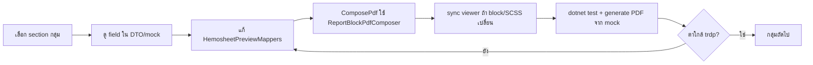

# Layout Fidelity — วิธีทำ (Process)

> ใช้กับ Phase 3B ของ [03-IMPLEMENT-REPORT-LAYOUT.md](../../03-IMPLEMENT-REPORT-LAYOUT.md)  
> เป้าหมาย: ให้ Default/Rama Hemosheet ใกล้ `.trdp` ≥ 95% ทีละกลุ่ม section

---

## หลักการ (อย่าข้าม)

1. **Map once, render both** — แก้ที่ `HemosheetPreviewMappers` แล้วให้ PDF กับ DOM ใช้ `ReportBlock` ชุดเดียวกัน  
   - Preview: `MapToPreview` → Angular block  
   - PDF: `ComposePdf` → `ReportBlockPdfComposer` (ห้าม hardcode field ซ้ำใน `*Section.cs` แยก mapper)
2. **ทีละกลุ่ม** — อย่าแก้ทั้งฟอร์มพร้อมกัน  
3. **เทียบ mock ก่อน tenant จริง** — generate จาก `assets/mock-data/template-04-hemosheet-*.json`  
4. **ThaiUr แยก track** — มี one-page composer อยู่แล้ว; Default/Rama ใช้ planner + section renderers



---

## ลำดับกลุ่ม (แนะนำ)

| รอบ | กลุ่ม | Mapper / files | เกณฑ์ผ่านคร่าว ๆ |
|-----|-------|----------------|------------------|
| **1** | Patient + SessionMeta | `MapPatient`, `MapSessionMeta` | ครบ field Basic (แพทย์/แพ้ยา/สิทธิ์/อายุ); PDF=preview |
| **2** | Dehydration | `MapDehydration` | field-grid 2–3 คอลัมน์; flush ตาม features |
| **3** | Prescription + AC | `MapPrescription` | duration split, AC/HDF ตาม features, Note |
| **4** | Vascular Access | `MapVascularAccess` | AV vs PermCath fields ครบ |
| **5** | Assessment | `MapAssessment` | spike checklist vs matrix ก่อน |
| **6** | Record grids | dialysis/nurse/doctor/med/PN | column width + fixed lines |
| **7** | Footer | NIS, consent, signatures | Rama/ThaiUr variants |
| **8** | A4 / fonts / pagination | page layout | ก่อน cutover |

---

## Checklist ต่อ 1 section

```
□ อ่าน field ที่ .trdp / mock มี vs mapper ปัจจุบัน
□ เพิ่ม/จัด field ใน HemosheetPreviewMappers เท่านั้น
□ ComposePdf เรียก mapper แล้ว ReportBlockPdfComposer (ไม่มี dual hardcode)
□ ถ้า block type ใหม่ → C# composer + Angular block + sync:report-viewer
□ unit/integration ที่เกี่ยวข้องยัง green
□ generate PDF จาก mock HD-AV (และ HDF/perm ถ้าเกี่ยว) แล้วเทียบตา
□ อัปเดตสถานะใน 03-IMPLEMENT-REPORT-LAYOUT.md ตาราง §2.1
```

---

## จุดที่เคยผิด (อย่าทำซ้ำ)

| ผิด | ถูก |
|-----|-----|
| `PatientInfoSection` hardcode 6 fields แยกจาก `MapPatient` | PDF ใช้ `PatientInfoReportBlock` จาก mapper |
| แก้เฉพาะ Angular SCSS ให้ “สวย” แต่ PDF ไม่ตาม | แก้ mapper / QuestPDF section ที่ใช้ block เดียวกัน |
| ไล่ absolute x/y จาก Telerik | จับคอลัมน์/แถว/สัดส่วน (flow layout) |
| รวม ThaiUr one-page กับ Default planner ใน PR เดียว | แยก PR / แยก verify |

---

## คำสั่งตรวจเร็ว

```bash
# จาก hemo-pdf
dotnet test Hemo.Pdf.sln --filter "FullyQualifiedName~Hemosheet"

# generate ผ่าน API (API ต้องรัน) — หรือ integration test
curl -X POST http://localhost:5090/api/pdf/generate \
  -H "Content-Type: application/json" \
  -H "X-Tenant-Code: local" \
  -H "Authorization: Bearer dev" \
  -d @<(jq -n --slurpfile d assets/mock-data/template-04-hemosheet-hd-av.json \
    '{reportTemplateId:"template-04-hemosheet",tenantCode:"local",entityId:$d[0].id,data:$d[0]}') \
  --output /tmp/hemosheet-hd-av.pdf
```

หลังแก้ viewer ใน `client/projects/hemo-report-viewer`:

```bash
# จาก hemo-front
npm run sync:report-viewer
```
