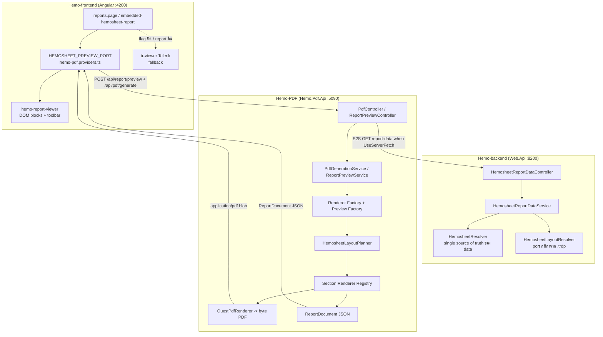
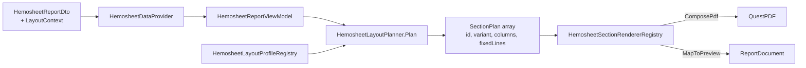

# ระบบออก PDF Report — สรุปสถาปัตยกรรมและการทำงานร่วมกัน 3 Repo

> **วัตถุประสงค์:** เอกสารกลางไว้ใช้ร่วมกันในทีม สรุปว่าปัจจุบันระบบออก PDF/Preview ทำงานอย่างไร
> ตั้งแต่ต้นทางข้อมูลจนถึงการแสดงผลและ fallback รวมถึงแนวทางบำรุงรักษา template และการขึ้น template ใหม่
> **สถานะ ณ วันที่เขียน:** อ้างอิงจากโค้ดจริง (ไม่ใช่แค่แผน) — Phase 6 เสร็จ, Phase 7 (Hemosheet parity) กำลังดำเนินการ
> **ขอบเขต:** สรุปจากการอ่านโค้ดจริงในทั้ง 3 repo — ดู path ประกอบทุกหัวข้อ

---

## สารบัญ

1. [ภาพรวม 3 Repo และบทบาท](#1-ภาพรวม-3-repo-และบทบาท)
2. [สถาปัตยกรรมรวม (แผนภาพ)](#2-สถาปัตยกรรมรวม-แผนภาพ)
3. [Data Flow ตั้งแต่ต้นทางจนถึงจอ](#3-data-flow-ตั้งแต่ต้นทางจนถึงจอ)
4. [กลไก Fallback ทุกชั้น](#4-กลไก-fallback-ทุกชั้น)
5. [หัวใจของความยืดหยุ่น: Dual Output + Section Renderer](#5-หัวใจของความยืดหยุ่น-dual-output--section-renderer)
6. [การบำรุงรักษา / แก้ไข Template แบบยืดหยุ่น](#6-การบำรุงรักษา--แก้ไข-template-แบบยืดหยุ่น)
7. [การขึ้น Template ตัวใหม่ (Step-by-step)](#7-การขึ้น-template-ตัวใหม่-step-by-step)
8. [Hemosheet — กรณีที่ซับซ้อนที่สุด (Layout Planner + Profile)](#8-hemosheet--กรณีที่ซับซ้อนที่สุด-layout-planner--profile)
9. [ประเด็นที่ควรระวัง / หนี้ทางเทคนิค](#9-ประเด็นที่ควรระวัง--หนี้ทางเทคนิค)
10. [Quick Reference — ไฟล์สำคัญ](#10-quick-reference--ไฟล์สำคัญ)

---

## 1. ภาพรวม 3 Repo และบทบาท

ระบบ PDF Report ใหม่ประกอบด้วย 3 repo หลัก (Telerik/Report.Api เดิมยังอยู่คู่ขนานระหว่าง migrate):

| Repo | บทบาท | Stack |
|------|-------|-------|
| **Hemo-backend** (`Hemo-backend`) | **ต้นทางข้อมูล** — ประกอบ DTO + คำนวณ layout context (features/profile/mode) แล้วส่ง JSON ให้ Hemo-PDF ผ่าน HTTP | .NET 6 ASP.NET Core (Web.Api :8200) |
| **Hemo-PDF** (`Hemo-PDF`) | **Standalone PDF service** — รับ DTO → render เป็น `application/pdf` (QuestPDF) หรือ `ReportDocument` JSON (preview) + Angular libraries | .NET 8 (`Hemo.Pdf.Api` :5090) + Angular libs |
| **Hemo-frontend** (`Hemo-frontend`) | **UI** — โหลด DTO จาก backend แล้วเรียก preview/generate, แสดง viewer ในจอ (มี Telerik เป็น fallback) | Ionic 7 / Angular 19 |

repo เสริมที่เกี่ยวข้อง:
- **Hemo-Report** — asset store ของ Telerik `.trdp` (Hemosheet.trdp + variant RAMA/ThaiUR/YTL/New/CAH/Nopparat, HemoRecords.trdp) + MockData JSON — เป็น **layout baseline** ที่ระบบใหม่พยายาม parity ให้ได้
- **NSS** — repo อ้างอิงแพทเทิร์น QuestPDF (Factory/Strategy) ที่ Hemo-PDF ยืมมา

### หลักการออกแบบสำคัญ

1. **แยกความรับผิดชอบ:** Hemo-PDF เป็น service แยก deploy ไม่ฝังใน business API และไม่ query DB ของ Hemopro โดยตรง — เมื่อ `UseServerFetch=true` จะดึง DTO จาก Web.Api (S2S + JWT forward) เอง; ปิด flag แล้วยังรับ `data` จาก client ได้ (เทส/legacy)
2. **Dual output จาก pipeline เดียว (ฝั่ง server):** DTO ชุดเดียว → ออกได้ทั้ง PDF (`POST /api/pdf/generate`) และ ReportDocument JSON (`POST /api/report/preview`) โดยใช้ data provider + planner ตัวเดียวกัน
3. **Hemopro preview = DOM จาก ReportDocument:** `hemo-report-viewer` render blocks เป็น HTML (ความรู้สึกใกล้ Telerik) — Print/Download ใช้ PDF จาก `POST /api/pdf/generate` (ThaiUr ใช้ PDF-as-preview ผ่าน `meta.previewMode`)

---

## 2. สถาปัตยกรรมรวม (แผนภาพ)



---

## 3. Data Flow ตั้งแต่ต้นทางจนถึงจอ

### ขั้นที่ 1 — ต้นทางข้อมูล (Hemo-backend)

Frontend เรียก endpoint หนึ่งใน 2 ตัว (`HemosheetReportDataController.cs`):

```
GET /api/Hemodialysis/records/{hemoId}/report-data?tcvUsePercent=false   // ข้อมูลจริง
GET /api/Hemodialysis/report-data/template?unitId=&templateMode=hd|hdf   // ฟอร์มเปล่า
```

- `HemosheetReportDataService.BuildAsync` เรียก **`HemosheetResolver.PrepareHemosheetDataForApiAsync(hemoId)`** — ตัวเดียวกับที่ป้อน Telerik (single source of truth ของ data) ประกอบข้อมูลจาก repository จำนวนมาก (patient, admission, labs, dehydration, avShunt, assessments, records, signatures, nurses-in-shift, fixed lines)
- แล้ว `HemosheetReportDtoMapper.Map(...)` แปลงเป็น **`HemosheetReportDto`** และแนบ **`LayoutContext`** ด้วย **`HemosheetLayoutResolver.BuildContext(dto, settings)`**
- `HemosheetLayoutResolver` = **การ port กติกา `Visible` จาก Telerik `.trdp` มาเป็น C# ที่ test ได้** คำนวณ:
  - `DialysisMode` (HD/HDF จาก `Mode`)
  - `VascularAccess` (AvFistula / PermCath จาก `CatheterType` หรือ `BloodAccessRoute`)
  - `LayoutProfile` (Default / Rama / ThaiUr — resolve จาก **ชื่อไฟล์ template** ใน per-tenant setting)
  - `Features` dict (`showHdfColumns`, `showAvPanel`, `showCathPanel`, `showAcFields`, `showConsentBlock`, `showNurseInShiftNonPn`, ...)

> **จุดสำคัญ:** "tenant profile" ไม่ได้ hardcode ตาม tenant code — มาจากค่า `GlobalSetting.Hemosheet.Report.HemosheetTemplate` (เก็บใน tenant DB) ที่ตั้งชื่อไฟล์ `.trdp` เช่น `Hemosheet-RAMA.trdp` → profile = Rama

### ขั้นที่ 2 — Frontend เรียก preview/generate (Hemo-frontend)

- Frontend **ไม่ได้ใช้ npm library โดยตรง** แต่ใช้ port ของตัวเองใน `src/app/share/hemo-pdf/hemo-pdf.providers.ts`:
  - `HEMOSHEET_PREVIEW_PORT` → `loadHemosheetPreview()` = `POST {pdfApiUrl}/api/report/preview` → `ReportDocument`
  - `generatePdf()` / `download()` = `POST {pdfApiUrl}/api/pdf/generate` → PDF blob
  - `buildPreviewBody()` ใส่ `reportTemplateId` จาก catalog (hemosheet → `template-04-hemosheet`), `entityId: hemoId`, `data: dto`
  - tenant code มาจาก JWT claim (fallback `'local'`)
- config: tenant `config.json` → `pdfApiUrl`, `useHemoPdfPreview` (opt-in); offline bootstrap default **`useHemoPdfPreview: false`** (ปลอดภัยเมื่อ HemoAdmin ล่ม)
- ThaiUr profile: preview ใช้ **PDF-as-preview** (`generatePdf` + `hemo-report-pdf-canvas`) เพราะ PDF composer bypass planner — profile อื่นยังเป็น DOM `ReportDocument`
- viewer source: sync จาก `Hemo-PDF/client/.../hemo-report-viewer` ผ่าน `npm run sync:report-viewer`

### ขั้นที่ 3 — Hemo-PDF render (Hemo.Pdf.Api)

Request body ชุดเดียว (`GeneratePdfRequest`) เข้าได้ 2 endpoint:

| Endpoint | Service | Output |
|----------|---------|--------|
| `POST /api/pdf/generate` | `PdfGenerationService.GenerateAsync` | `application/pdf` (byte[]) |
| `POST /api/report/preview` | `ReportPreviewService.PreviewAsync` | `ReportDocument` JSON (`meta.previewMode`: `dom` \| `pdf`) |

เมื่อ `HemoPdf:UseServerFetch=true` body เหลือ `reportTemplateId`, `tenantCode`, `entityId`, `parameters` — Hemo-PDF เรียก Web.Api report-data ด้วย JWT ที่ forward (short cache ~45s เพื่อลด ThaiUr preview→generate ซ้ำ)

ทั้งคู่ทำ pipeline เกือบเหมือนกันผ่าน `ReportRequestPipeline` (validate → resolve data → re-validate):

- Template (`parameters.template=true`): ข้าม `entityId == data.id` และข้าม signature guard
- ThaiUr: preview คืน `meta.previewMode=pdf` (ไม่ build DOM); FE เรียก generate (ใช้ cache)

```
GeneratePdfRequest
  → Guard (SignatureRequiredGuard — 403 ถ้า template ต้อง sign แต่ยังไม่ครบ)
  → BrandingResolver.ResolveAsync(tenantCode)   // อ่าน assets/branding/{tenant}.json
  → resolve signatures (request.Signatures → TryResolveFromData → store by EntityId)
  → สร้าง PdfReportContext (templateId, tenant, entity, branding, Data JsonElement, signatures, metadata)
  → Factory.Create(templateId) → IReportRenderer / IReportPreviewRenderer
      → DataProvider.GetDataAsync   // JSON → ViewModel  (ใช้ provider เดียวกันทั้ง 2 สาย!)
      → Composer.Compose
          - PDF:     ILayoutComposer → QuestLayout → QuestPdfRenderer → byte[]  (cap 50MB)
          - Preview: IReportDocumentComposer → ReportDocument JSON
```

- Factory มี 4 สาย: **Placeholder / Generic / DialysisSession / Hemosheet**
  - template ที่รู้จักแต่ไม่มี renderer เฉพาะ (02,03,05–12) → **Generic** stack
  - Hemosheet (`template-04`) และ DialysisSession (`template-01`) มี renderer เฉพาะ

### ขั้นที่ 4 — แสดงผลบนจอ (Hemo-frontend)

- `hemo-report-viewer` รับ **`document: ReportDocument`** แล้ว render เป็น DOM ผ่าน `hemo-report-page` + `hemo-report-block-outlet`
- Toolbar (`hemo-report-toolbar`): zoom (CSS scale) / เปลี่ยนหน้า / Print / Download
- Fit-to-width: `ResizeObserver` + ความกว้าง A4 mm→px
- Print/Download → `POST /api/pdf/generate` (PDF จริง); print ผ่าน `printPdfBlob` (hidden iframe สำหรับสั่งพิมพ์เท่านั้น)

> **หมายเหตุ:** Hemopro ใช้ DOM preview สำหรับ Hemosheet เมื่อ `useHemoPdfPreview=true` และ layout ไม่ใช่ ThaiUr — ThaiUr ใช้ PDF canvas; `hemo-report-pdf-canvas` mount เฉพาะ PDF-as-preview path

---

## 4. กลไก Fallback ทุกชั้น

| ชั้น | Fallback | ไฟล์/กลไก |
|------|----------|-----------|
| **Frontend viewer** | ถ้า `useHemoPdfPreview=false` หรือ report ไม่ใช่ hemosheet → ใช้ **Telerik `tr-viewer`** | `reports.page.ts/html`, `embedded-hemosheet-report` |
| **Hemo-PDF preview UI** | Hemosheet → **DOM ReportDocument blocks** (ไม่ใช้ iframe) | `hemo-report-viewer`, `hemo-report-block-outlet` |
| **Renderer factory (PDF)** | template id ไม่รู้จัก → `PlaceholderReportRenderer` | `TemplateReportRendererFactory` |
| **Renderer factory (Preview)** | template id ไม่รู้จัก → `GenericReportPreviewRenderer` | `TemplateReportPreviewRendererFactory` |
| **Known template ไม่มี renderer เฉพาะ** | 02,03,05–12 → **Generic** stack (key-value flatten) | `ResolveRendererType` |
| **Section resolver (header/footer)** | ไม่มี match `(*, templateId)` → `ConfigurableHeaderSection` / `ConfigurableFooterSection` | `SectionResolver<T>` |
| **Hemosheet layout context** | ถ้า `Features` ว่าง (ข้อมูลเก่า/ไม่มี context) → สังเคราะห์จากข้อมูลด้วย `HemosheetLayoutContextFallback.Build` | `HemosheetDataProvider` |
| **ค่าว่างในเซลล์** | ทุก field/table ที่ค่าว่าง → placeholder `"—"` | `HemosheetPreviewMappers`, `PdfTextHelpers`, `PadRows` |
| **Fixed lines** | เติมบรรทัดว่าง `"—"` ให้ครบตาม setting | `PadRows`, `EnsureFixedLines` (backend) |
| **Font** | หาไฟล์ Sarabun ไม่เจอ → log warning + ใช้ default font | `FontRegistration.EnsureRegistered` |
| **Logo** | data-URL base64 → path บน disk → URL | `PdfImageHelpers.LoadLogoBytes` |
| **Frontend error** | preview HTTP 404/500/0 → map เป็นข้อความไทย + guard `previewLoadId` กัน race | `embedded-hemosheet-report` |

> ⚠️ **ข้อยกเว้น (ไม่มี fallback):** ถ้าไฟล์ branding `assets/branding/{tenant}.json` **ไม่มี** → `JsonFileBrandingStore` throw `FileNotFoundException` → กลายเป็น HTTP 500 (ไม่มี default profile) — ดูหัวข้อ 9

---

## 5. หัวใจของความยืดหยุ่น: Dual Output (Server) + DOM Preview (UI)

### 5.0 Hemopro preview path (มาตรฐาน Hemosheet)

```
DTO → POST /api/report/preview → ReportDocument → Angular DOM blocks → toolbar
Print/Download → POST /api/pdf/generate → PDF blob
```

- Preview เป็น HTML (เลือกข้อความได้) — Print/Download ยังเป็น PDF จริง
- Trade-off: layout DOM อาจ drift จาก QuestPDF เล็กน้อย ต้องไล่ parity เป็นรอบถัดไป

### 5.1 "Map once, render both" — `ReportBlock` เป็นตัวกลาง (ฝั่ง server)

`ReportBlock` (polymorphic JSON, discriminator = `type`) คือ **สัญญากลาง** ระหว่าง PDF และ Preview:

```
                     ┌── ComposePdf() ──→ ReportBlockPdfComposer ──→ QuestPDF
Data → ReportBlock ──┤
                     └── MapToPreview() ──→ ReportDocument JSON ──→ Angular block component
```

- ฝั่ง C#: `ReportBlockPdfComposer.Compose(block, container)` มี `switch` กลางที่แปลง **ทุก** `ReportBlock` เป็น QuestPDF (`Sections/Content/ReportBlockPdfComposer.cs`)
- ฝั่ง Angular: `hemo-report-block-outlet` `@switch (block.type)` — ใช้ใน Hemopro preview
- **ผลลัพธ์:** เพิ่ม block type ใหม่ = แก้ mapper 1 ที่ (C#) + เพิ่ม component 1 ตัว (Angular) แล้ว PDF กับ preview ตรงกันอัตโนมัติ

### 5.2 Block types ที่มีอยู่ (C# ↔ Angular)

| `ReportBlock.type` | C# Section | Angular Component |
|--------------------|-----------|-------------------|
| `patient-info` | `PatientInfoSection` | `patient-info-block` |
| `key-value-table` | `KeyValueTableSection` | `key-value-table-block` |
| `field-grid` | `FieldGridSection` | `field-grid-block` |
| `data-grid` | `DataGridSection` | `data-grid-block` |
| `checklist-table` | `ChecklistTableSection` | `checklist-table-block` |
| `checklist-cluster` | `ChecklistClusterSection` | `checklist-cluster-block` |
| `vascular-access` | (reuse key-value) | `vascular-access-block` |
| `sub-header-bar` | `SubHeaderBarSection` | `sub-header-bar-block` |
| `section-row` / `column-stack` | `SectionRowSection` | `section-row-block` |
| `pre-post-hd-notes` | `PrePostHdNotesSection` | `pre-post-hd-notes-block` |
| `signature` | `SignatureBlockSection` | `signature-block` |
| `text` | inline | inline ใน block-outlet |

---

## 6. การบำรุงรักษา / แก้ไข Template แบบยืดหยุ่น

มี **3 ระดับ** ในการปรับแต่ง เรียงจากง่าย→ยาก:

### ระดับ 1 — แก้ Branding (ไม่แตะโค้ด)
แก้/เพิ่มไฟล์ `assets/branding/{tenantCode}.json` (logo, ชื่อหน่วยงาน, ที่อยู่, alignment, สี, disclaimer, ShowPageNumber)
- โหลดผ่าน `JsonFileBrandingStore` (alias `localhost`/`127.0.0.1` → `local`)
- Template เดียวกัน + tenant ต่างกัน = เนื้อหาเหมือนกัน หัว/ท้ายต่างกัน

### ระดับ 2 — ปรับ Section / Block (แก้ mapper)
- แก้ layout ของ section ที่มีอยู่ → แก้ preview mapper ที่เดียว (เช่น `HemosheetPreviewMappers.MapDehydration`) แล้ว PDF/preview อัปเดตพร้อมกัน (เพราะ PDF วิ่งผ่าน `ReportBlockPdfComposer` ตัวเดียวกัน)
- เพิ่ม block type ใหม่ → ดูหัวข้อ 5.1

### ระดับ 3 — เพิ่ม/แก้ Section ใน Hemosheet (Section Renderer Registry)
- เพิ่ม section = implement `IHemosheetSectionRenderer` 1 ไฟล์ (มี `SectionId`, `MapToPreview`, `ComposePdf`) + ลงทะเบียนใน `HemosheetSectionRendererRegistration.AddHemosheetSectionRenderers` + เพิ่ม Angular block 1 ตัว
- Composer ไม่ต้องแก้ (dispatch ผ่าน registry ด้วย `plan.SectionId`)
- ควบคุมลำดับ/การแสดง section ที่ `HemosheetLayoutPlanner.Plan` (ใช้ `Features` + `FixedLines` + profile)

---

## 7. การขึ้น Template ตัวใหม่ (Step-by-step)

### กรณี A — Template ทั่วไป (key-value พอ)
ไม่ต้องทำอะไรเพิ่มถ้าใช้ Generic stack ได้ — แค่มี id อยู่ใน `ReportTemplates` แล้วส่ง DTO ที่เป็น flat key-value มา ระบบ route ไป Generic อัตโนมัติ

### กรณี B — Template ที่มี layout เฉพาะ (ทำครบทุกชั้น)

**ฝั่ง Hemo-PDF (.NET):**
1. เพิ่ม id const + `ReportTemplateDefinition` (Thai DisplayName + `RequiresSignature`) ใน `Core/Constants/ReportTemplates.cs`
2. สร้าง `IReportDataProvider` (JSON → ViewModel)
3. สร้าง PDF composer (`ILayoutComposer` ผ่าน `BaseReportComposer<TVm>`) + renderer (`BaseReportRenderer`)
4. สร้าง Preview composer (`IReportDocumentComposer` ผ่าน `BaseReportDocumentComposer<TVm>`) + preview renderer (`BaseReportPreviewRenderer`)
5. ลงทะเบียนทุกตัวใน `TemplateRegistration.AddTemplateServices`
6. map id → renderer type ใน `TemplateReportRendererFactory.ResolveRendererType` (PDF) และ `TemplateReportPreviewRendererFactory.ResolveRendererType` (preview)
7. (optional) เพิ่ม header/footer override ใน `AddHemoPdf` (`SectionResolver` registration)
8. (optional) เพิ่มไฟล์ branding ต่อ tenant

**ฝั่ง Hemo-backend (ถ้าต้องการข้อมูลจริง):**
9. สร้าง data service + endpoint คืน DTO (แบบ `HemosheetReportDataService`)

**ฝั่ง Hemo-frontend:**
10. เพิ่มการเรียก preview (ปรับ `hemo-pdf.providers.ts` ให้ส่ง `reportTemplateId` ใหม่) + mount `hemo-report-viewer`
11. ถ้ามี block type ใหม่ → เพิ่ม Angular block component + ลง `hemo-report-block-outlet` และ `report-document.model.ts`

### แนวทางแนะนำสำหรับ block ใหม่
ให้ทำผ่าน `ReportBlock` + mapper เสมอ (อย่าเขียน QuestPDF layout ตรง ๆ ใน composer) เพื่อให้ PDF/preview ตรงกันด้วย `ReportBlockPdfComposer`

---

## 8. Hemosheet — กรณีที่ซับซ้อนที่สุด (Layout Planner + Profile)

Hemosheet (`template-04`) คือ template ที่ต้องแทน Telerik ให้ได้เต็มรูปแบบ จึงมี engine เฉพาะ:



- **`HemosheetLayoutPlanner.Plan(vm)`** = สมองตัดสินลำดับ/การแสดง section จาก `LayoutContext.Features` (`showAvPanel`/`showCathPanel`/`showHdfColumns`...), `ReportSettings.FixedLines`, การมีอยู่ของข้อมูล และ profile
- **`HemosheetSectionId`** = enum ~26 section (Patient, SessionMeta, Dehydration, Prescription, VascularAccess, Assessment×4, Labs, Dialysis/Nurse/Doctor/Medicine/ProgressNote records, NursesInShift, Consent, Signatures, ฯลฯ)
- **`IHemosheetSectionRenderer`** — แต่ละ section เป็น 1 ไฟล์ที่รู้วิธี emit ทั้ง PDF และ preview (`HemosheetSectionRenderers.cs`, `HemosheetParitySectionRenderers.cs`)
- **`HemosheetLayoutProfileRegistry`** — Default/Rama/ThaiUr; ปัจจุบัน `GetSectionOrder` คืนลำดับเดียวกันทุก profile (planner สร้างลำดับเอง), profile ใช้จริงแค่ `IsProfileSection` (Consent = Rama เท่านั้น)

**Data scenario ที่ต้องรองรับ** (มี mock ใน `assets/mock-data/`): HD/AV, HDF/AV, HD/perm-cath, RAMA (consent), ThaiUR (nurse-in-shift non-PN)

---

## 9. ประเด็นที่ควรระวัง / หนี้ทางเทคนิค

### 9.1 แก้แล้วในรอบ clean-up นี้ ✅

| หัวข้อ | สิ่งที่ทำ |
|--------|-----------|
| **Viewer ซ้ำ 2 ชุด (drift)** | `sync-report-viewer.mjs` sync DOM viewer (models, page, blocks, toolbar, scss) + ลบ stale + `--check` ใน CI |
| **Frontend duplication** | สร้าง `HemoPdfPreviewController` + `hemo-pdf-report-catalog.ts` — `reports.page` และ `embedded-hemosheet-report` ใช้ร่วมกัน |
| **Template id hardcode** | `reportTemplateId` ผ่าน `HEMO_PDF_REPORT_TEMPLATES` / request object แทน hardcode ใน provider |
| **Unused npm deps** | ลบ `@hemo/pdf-client`, `@hemo/report-viewer` จาก Hemopro `package.json` (ใช้ source copy + port) |
| **Orphan modal** | ลบ `hemo-report-preview-modal` (ไม่มี caller) |
| **Embedded viewer mount** | ใช้ static `<app-hemo-report-pdf-viewer-host>` แทน dynamic `createComponent` |
| **Kendo CSS** | โหลดเฉพาะเมื่อใช้ Telerik path (`reports.page`, `embedded-hemosheet-report`) |
| **โค้ด inert ฝั่ง Hemo-PDF** | ลบ `RequestSignatureStore`, `PageNumberFooterSection`, `SignedReportFooterSection` (รอบก่อนหน้า) |

### 9.2 ยังเหลือ (ควรจัดการต่อ)

| หัวข้อ | รายละเอียด | ผลกระทบ |
|--------|-----------|---------|
| **branding ไม่มี default** | tenant JSON หาย → HTTP 500 (`FileNotFoundException`) | ควรมี default profile |
| **Mock services** | `MockAuthHandler` / `MockSignatureStore` ใช้ได้เฉพาะ Development + `UseMockServices`; non-Dev เปิด mock → **fail startup** | Production ต้องตั้ง `HemoPdf__Jwt__Issuer` + `HemoPdf__Jwt__Key` (= Web.Api `Authentication__*`) |
| **JWT / tenant bind (P1)** | Symmetric HS256; `ValidAudience == Issuer`; `tenant_code` claim ผูกกับ `X-Tenant-Code` + body `TenantCode` | Header/body spoof → 403 |
| **`HemoproSignatureStore.GetAsync` คืน unsigned** | ลายเซ็นจริงมาจาก `TryResolveFromData` (payload) ผ่าน `ReportSignatureResolver` ร่วมกัน preview/generate | **parity แล้ว** แต่ยังไม่ trusted จนกว่า P1.5 S2S |
| **Dual pipeline PDF + ReportDocument** | Hemosheet maintain `ComposePdf` + `MapToPreview`; Hemopro preview ใช้ JSON DOM (ยกเว้น ThaiUr), print ใช้ PDF | ต้นทุนเพิ่ม template/section สูง — ยอมรับเพื่อความรู้สึก Telerik |
| **ThaiUr preview** | FE บังคับ PDF-as-preview สำหรับ `layoutProfile=ThaiUr` | ปิด drift DOM≠PDF สำหรับ profile นี้ |
| **Client-trust DTO** | เมื่อ `UseServerFetch=true` Hemo-PDF ดึง report-data จาก Web.Api (JWT forward); ปิด flag = กลับ client-trust | เปิด UseServerFetch ใน Dev; production ควรเปิดคู่ flag FE |
| **Telerik fallback** | `useHemoPdfPreview` + `tr-viewer` ยัง active; plugin send ยังใช้ Report.Api | dual stack จนกว่าจะ cutover |
| **โค้ดที่ยัง inert (เหลือ)** | `HemosheetLayoutProfileRegistry.GetSectionOrder` | ตัดสินใจ wire หรือลบ |
| **Layout resolver ทำซ้ำกับ .trdp** | กติกา visibility อยู่ทั้งใน `.trdp` และ `HemosheetLayoutResolver` | sync 2 ที่จนกว่าจะเลิก Telerik |
| **ยังเป็น copy (ไม่ใช่ package จริง)** | sync script ลด drift แต่ยังเป็น source copy | รัน sync เมื่อ lib เปลี่ยน |

### 9.3 Workflow การ sync viewer (สำคัญ)

`Hemo-PDF/client/.../hemo-report-viewer/src/lib` = **source of truth** ของ DOM report viewer  
frontend เก็บ copy เพื่อให้ Angular compiler build ได้ (สอง repo แยกกัน)

```bash
# หลังแก้ viewer ใน Hemo-PDF/client/.../hemo-report-viewer/src/lib
cd Hemo-frontend
npm run sync:report-viewer            # copy DOM viewer files + ลบ stale ใน frontend copy
npm run sync:report-viewer -- --check # CI: fail ถ้า out of sync
```

**ไฟล์ที่ sync:** models, page/header/footer/outlet, block components, toolbar, viewer, scss (และ pdf-canvas ที่ยังเก็บไว้)

- แก้ viewer ให้แก้ที่ **lib เท่านั้น** แล้วรัน sync — อย่าแก้ตรงที่ copy ฝั่ง frontend
- frontend transport อยู่ที่ `HEMOSHEET_PREVIEW_PORT` + `HemoPdfPreviewController` (`src/app/share/hemo-pdf/`)

### 9.4 เพิ่ม report/template ใหม่ (frontend)

1. เพิ่ม mapping ใน `hemo-pdf-report-catalog.ts` (`HEMO_PDF_REPORT_TEMPLATES`) + backend `HemosheetTemplateCatalog` (ถ้าเป็น hemosheet variant)
2. เพิ่ม data fetch ใน backend — DTO ส่ง `layoutContext.hemoPdfTemplateId` อัตโนมัติจาก catalog
3. ใช้ `HemoPdfPreviewController.load({ reportKey, hemoId, tenantCode, data })` — template id อ่านจาก DTO ก่อน catalog fallback
4. ขยาย `isHemoPdfReport()` ใน `reports.page` เมื่อมี report ใหม่

---

## 10. Quick Reference — ไฟล์สำคัญ

### Hemo-backend (ต้นทางข้อมูล)
| บทบาท | Path |
|-------|------|
| API endpoint | `Web.Api/Controllers/Hemodialysis/HemosheetReportDataController.cs` |
| Data service | `Report/Services/HemosheetReportDataService.cs` |
| DTO | `Report.Contracts/Hemosheet/HemosheetReportDto.cs` |
| Layout resolver (กติกา) | `Report.Contracts/Hemosheet/HemosheetLayoutResolver.cs` |
| Data resolver (SoT) | `Report/DocumentLogics/HemosheetResolver.cs` |
| Telerik registry | `Report/CoreReportResolver.cs` |
| Per-tenant setting | `HemoAdmin.Api/Setup/TenantHemosheetReportConfigStore.cs` |

### Hemo-PDF (render)
| บทบาท | Path |
|-------|------|
| DI entry | `src/Hemo.Pdf.Application/ServiceCollectionExtensions.cs` (`AddHemoPdf`) |
| Controllers | `src/Hemo.Pdf.Api/Controllers/{PdfController,ReportPreviewController}.cs` |
| Orchestrators | `src/Hemo.Pdf.Application/{PdfGenerationService,ReportPreviewService}.cs` |
| Guard | `src/Hemo.Pdf.Application/Guards/SignatureRequiredGuard.cs` |
| Template registration | `src/Hemo.Pdf.Layouts/.../TemplateRegistration.cs` + `TemplateReport*RendererFactory` |
| Preview models | `src/Hemo.Pdf.Core/Models/Preview/{ReportDocument,ReportBlock}.cs` |
| Template constants | `src/Hemo.Pdf.Core/Constants/ReportTemplates.cs` |
| Block → PDF | `src/Hemo.Pdf.Sections/Content/ReportBlockPdfComposer.cs` |
| Hemosheet planner | `src/Hemo.Pdf.Layouts/Hemosheet/HemosheetLayoutPlanner.cs` |
| Section renderer interface | `src/Hemo.Pdf.Layouts/Hemosheet/IHemosheetSectionRenderer.cs` |
| Section renderers | `src/Hemo.Pdf.Layouts/Hemosheet/Renderers/Hemosheet*SectionRenderers.cs` |
| Preview mappers | `src/Hemo.Pdf.Sections/Preview/Hemosheet/HemosheetPreviewMappers.cs` |
| QuestPDF | `src/Hemo.Pdf.Rendering/{QuestPdfRenderer,FontRegistration}.cs` |
| Branding | `src/Hemo.Pdf.Branding/JsonFileBrandingStore.cs` + `assets/branding/` |
| Mock data | `assets/mock-data/template-04-hemosheet-*.json` |

### Hemo-frontend (UI)
| บทบาท | Path |
|-------|------|
| Preview port | `src/app/share/hemo-pdf/hemo-pdf.providers.ts` |
| Viewer host | `src/app/share/hemo-pdf/hemo-report-pdf-viewer-host.component.ts` |
| Viewer (synced copy) | `src/app/share/hemo-pdf/report-viewer/{components,models,styles}` |
| PDF canvas (pdf.js) | `.../report-viewer/components/hemo-report-pdf-canvas.component.ts` |
| pdf.js worker asset | `src/assets/pdfjs/pdf.worker.min.mjs` |
| Sync script | `scripts/sync-report-viewer.mjs` (`npm run sync:report-viewer`) — ดู §9.3 |
| Block dispatcher (legacy/demo) | `.../report-viewer/components/hemo-report-block-outlet.component.ts` |
| Report page | `src/app/reports/reports.page.ts` + `.html` |
| Embedded hemosheet | `src/app/doctor-view/patient-overview/components/embedded-hemosheet-report/` |
| Config | `offline-bootstrap.json` + tenant `config.json` (`pdfApiUrl`, `useHemoPdfPreview`) |

### Angular libraries (source of truth)
| Library | Path |
|---------|------|
| `@hemo/pdf-client` | `Hemo-PDF/client/projects/hemo-pdf-client/` |
| `@hemo/report-viewer` | `Hemo-PDF/client/projects/hemo-report-viewer/` |

### Telerik / baseline
| บทบาท | Path |
|-------|------|
| `.trdp` templates | `Hemo-Report/Hemosheet*.trdp`, `HemoRecords.trdp`, `MedHistory*.trdp` |
| Mock shape | `Hemo-Report/MockData/HemosheetData.json` |
| Export endpoint | `Hemo-backend/.../Report.Api/Controllers/ExportController.cs` |
