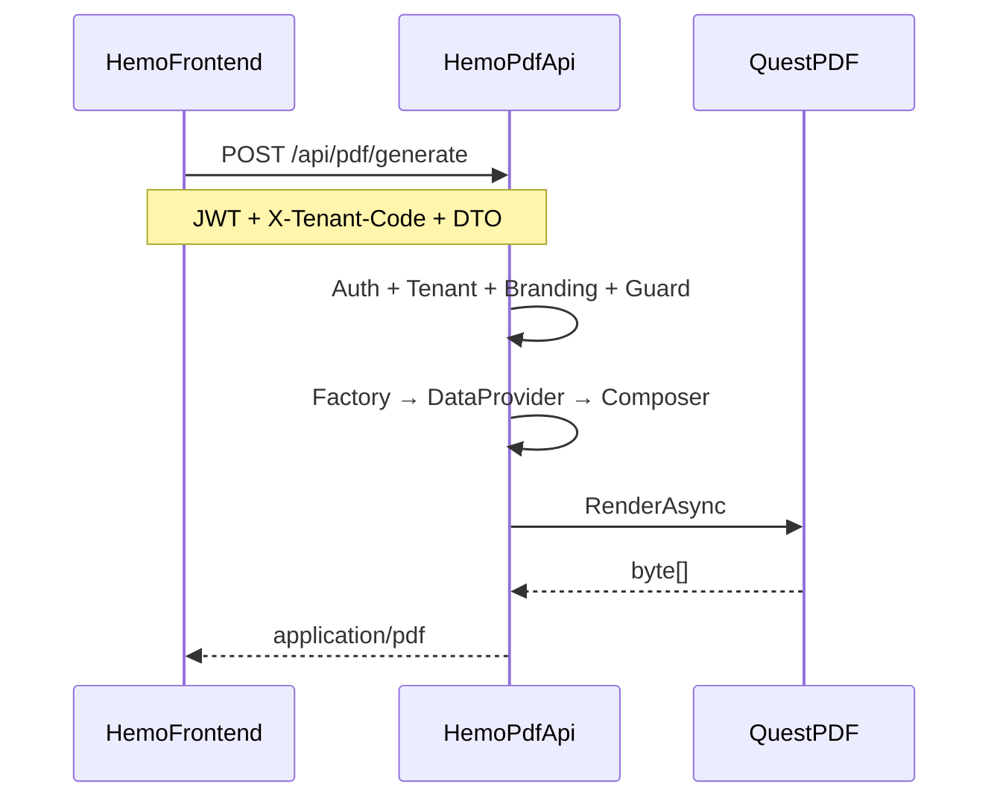

# Hemo-PDF — Implementation Checklist

อ้างอิงจาก [01-IMPLEMENT-PLANNING.md](D:\GoodRepo\Hemo-PDF\01-IMPLEMENT-PLANNING.md) และ [00-REFERENCE-PLANNING.md](D:\GoodRepo\Hemo-PDF\0ฺ0-REFERENCE-PLANNING.md)

## สรุปสถานะ (อัปเดต 2026-07-06)

| Phase | สถานะ | หมายเหตุ |
|-------|--------|----------|
| Phase 0 | ✅ เสร็จ | API + integration test ผ่าน |
| Phase 1 | ✅ เสร็จ | branding 2 tenant + signature guard |
| Phase 2 | ✅ เสร็จ | template-01 dedicated + Angular client |
| Phase 3 | ✅ เสร็จ | templates 02–06 ผ่าน Generic renderer |
| Phase 4 | ✅ เสร็จ | templates 07–12 + branding guideline |
| Phase 5 | ✅ เสร็จ (core) | Docker/CI/CORS/rate limit; JWT จริงรอ Hemopro |
| Phase 6 | ✅ เสร็จ | ReportDocument + `@hemo/report-viewer` + demo — ดู [02-FEATURE-PREVIEW-PDF.md](D:\GoodRepo\Hemo-PDF\02-FEATURE-PREVIEW-PDF.md) |
| Phase 7 | 🔄 ดำเนินการ | Hemopro Hemosheet integration — layout context + report-data API |
| Follow-up | ⏳ ค้าง | ฟอนต์ Sarabun, mock DTO ครบ 12 |

**Tests:** `dotnet test Hemo.Pdf.sln` — 24 tests ผ่าน  
**Commits:** แยก 12 commits ตาม layer (tooling → core → … → docs)

### แก้ไขหลัง implement (dev UX)

- [x] `MockAuthHandler` — auto-auth ใน Development + `UseMockServices` (ไม่บังคับ Bearer)
- [x] `GeneratePdfOperationFilter` — ตัวอย่าง request ใน Swagger ที่ใช้ได้จริง
- [x] `NullableByteArrayJsonConverter` — รองรับ `imageBytes: ""` จาก Swagger

---

## ข้อตัดสินใจที่ล็อกแล้ว

| หัวข้อ | คำตัดสินใจ |
|--------|-----------|
| Deploy | **Standalone `Hemo.Pdf.Api`** ตั้งแต่ Phase 0 (port `5090`) |
| .NET | **net8.0** |
| Angular | **`@hemo/pdf-client`** เป็น library ใน repo นี้ |
| Data | **Stateless** — caller ส่ง DTO ใน `POST /api/pdf/generate` |
| Tenant | `X-Tenant-Code` + mock service ก่อน |
| Branding | ทีม implement ลง JSON ต่อ tenant |
| Signature | mock ก่อน + guard สำหรับ template ที่ต้อง sign |
| Templates | 12 dummy ids (`template-01-dialysis-session` … `template-12-summary`) |

## สถาปัตยกรรมเป้าหมาย



## โครงสร้าง Solution (สร้างแล้ว)

```
Hemo-PDF/
├── Hemo.Pdf.sln
├── src/
│   ├── Hemo.Pdf.Api/              # net8 Web API — deploy target
│   ├── Hemo.Pdf.Application/      # IPdfGenerationService, AddHemoPdf()
│   ├── Hemo.Pdf.Core/             # interfaces, context, factory (no QuestPDF)
│   ├── Hemo.Pdf.Branding/
│   ├── Hemo.Pdf.Sections/
│   ├── Hemo.Pdf.Layouts/
│   └── Hemo.Pdf.Rendering/        # QuestPDF
├── tests/
│   ├── Hemo.Pdf.Core.Tests/
│   ├── Hemo.Pdf.Sections.Tests/
│   └── Hemo.Pdf.Integration.Tests/
├── client/projects/hemo-pdf-client/
├── assets/fonts/sarabun/          # ⏳ ยังไม่มีไฟล์ฟอนต์
└── assets/branding/               # tenant-demo-a.json, tenant-demo-b.json
```

**NSS files สำหรับ port (อ้างอิง):**
- [QuestPdfRenderer.cs](D:\GoodRepo\NSS\backend\NikkisoServiceAPI\Services\Reports\Renderers\Quest\QuestPdfRenderer.cs)
- [QuestLayout.cs](D:\GoodRepo\NSS\backend\NikkisoServiceAPI\Services\Reports\Renderers\Quest\QuestLayout.cs)
- [ReportStyleDefaults.cs](D:\GoodRepo\NSS\backend\NikkisoServiceAPI\Services\Reports\Core\ReportStyleDefaults.cs)
- [ReportComponentRenderer.cs](D:\GoodRepo\NSS\backend\NikkisoServiceAPI\Services\Reports\Core\ReportComponentRenderer.cs)
- [DefaultReportHeaderSection.cs](D:\GoodRepo\NSS\backend\NikkisoServiceAPI\Services\Reports\Sections\DefaultReportHeaderSection.cs) → ปรับเป็น `ConfigurableHeaderSection`
- [DefaultReportFooterSection.cs](D:\GoodRepo\NSS\backend\NikkisoServiceAPI\Services\Reports\Sections\DefaultReportFooterSection.cs) → signature helpers

---

## Phase 0 — Foundation + Standalone API ✅

**เป้าหมาย:** `dotnet run` ที่ `Hemo.Pdf.Api` → `POST /api/pdf/generate` คืน PDF

### 0.1 Solution scaffold
- [x] สร้าง `Hemo.Pdf.sln` + projects ตามโครงสร้างด้านบน (net8.0)
- [x] ตั้ง project references: `Api` → `Application` → `Core/Branding/Sections/Layouts/Rendering`
- [x] เพิ่ม NuGet `QuestPDF` 2024.7.2 ใน `Hemo.Pdf.Rendering` เท่านั้น
- [ ] สร้าง `assets/fonts/sarabun/` — copy ฟอนต์ Sarabun จาก NSS หรือ source ที่มี *(มี `FontRegistration` fallback เป็น default font แล้ว)*

### 0.2 Core abstractions
- [x] `GeneratePdfRequest`, `PdfReportContext`, `ReportMetadata`
- [x] `IPdfRenderer`, `IReportRenderer`, `IReportDataProvider`, `ILayoutComposer`
- [x] `IReportRendererFactory` + `ReportRendererFactory` (registry + fallback)
- [x] `ReportTemplates` constants — 12 dummy ids
- [x] `PdfStyleDefaults` (port จาก NSS)

### 0.3 Rendering layer
- [x] `QuestLayout`, `QuestPdfRenderer` (port + ปรับ namespace)
- [x] `FontRegistration` — ลงทะเบียน Sarabun จาก `assets/fonts/` *(รอไฟล์ฟอนต์)*
- [x] `PlaceholderReportRenderer` — PDF smoke test

### 0.4 Application + API
- [x] `IPdfGenerationService` + `PdfGenerationService` (orchestrate: resolve template → render)
- [x] `AddHemoPdf()` extension ใน `ServiceCollectionExtensions`
- [x] `Hemo.Pdf.Api`: `Program.cs`, `appsettings.Development.json`
- [x] `PdfController`: `POST /api/pdf/generate`
- [x] `GET /health` — health check พื้นฐาน
- [x] `MockAuthHandler` — dev mock auth (+ auto-auth เมื่อ `UseMockServices`)
- [x] `TenantMiddleware` — อ่าน `X-Tenant-Code` → `ITenantContextAccessor`
- [x] `MockTenantContextAccessor` — fallback `tenant-demo-a`
- [x] `launchSettings.json` — port `5090`
- [x] `GeneratePdfOperationFilter` — Swagger example ที่ bind ได้

### 0.5 Tests
- [x] `Hemo.Pdf.Integration.Tests` — `WebApplicationFactory` ยิง `POST /api/pdf/generate` → assert PDF bytes
- [x] อัปเดต [README.md](D:\GoodRepo\Hemo-PDF\README.md) — คำสั่ง `dotnet run` + curl ตัวอย่าง

**Done:** curl POST ได้ PDF เปิดอ่านได้ ✅

---

## Phase 1 — Section System + Branding + Signature Mock ✅

**เป้าหมาย:** เปลี่ยน `tenantCode` → หัวเอกสารต่างกัน; template ที่ต้อง sign ถูก block ถ้ายังไม่ sign

### 1.1 Branding
- [x] `CustomerBrandingProfile`, `HeaderBranding`, `FooterBranding`
- [x] `IBrandingStore` + `JsonFileBrandingStore`
- [x] Seed `assets/branding/tenant-demo-a.json`, `tenant-demo-b.json`
- [x] `IBrandingResolver` — resolve จาก `tenantCode` ใน request

### 1.2 Section system
- [x] `IReportSection`, `IReportHeaderSection`, `IReportFooterSection`
- [x] `ISectionResolver<T>` + `SectionResolver` — key `(tenantCode, templateId)`
- [x] `ConfigurableHeaderSection` — อ่าน branding (logo, companyLines, alignment)
- [x] `ConfigurableFooterSection` + `PageNumberFooterSection`
- [x] `PdfComponentHelpers` (port checkbox, label-value จาก NSS)
- [x] `PdfTextHelpers`, `PdfImageHelpers`

### 1.3 Signature infrastructure
- [x] `SignatureInfo`, `ReportSignatureContext`
- [x] `ISignatureStore` + `MockSignatureStore`
- [x] `IPdfGenerationGuard` + `SignatureRequiredGuard` — อ่าน `RequiresSignature` ต่อ template id
- [x] `SignatureBlockSection`, `PdfSignatureHelpers`, `SignedReportFooterSection`
- [x] กำหนด `RequiresSignature` ใน `ReportTemplates` metadata

### 1.4 Wire pipeline
- [x] `BaseReportComposer<T>` — wire header/footer resolver
- [x] `PlaceholderReportRenderer` ใช้ `BaseReportComposer` + branding จริง
- [x] `AddHemoPdf()` — `HemoPdf:UseMockServices: true` switch mock auth/tenant/signature

### 1.5 Tests
- [x] Unit: `SignatureRequiredGuard` — unsigned template → throw
- [x] Unit: `ConfigurableHeaderSection` smoke test *(ยังไม่ assert output pixel/text ระหว่าง tenant)*
- [x] Integration: POST ด้วย `tenant-demo-a` vs `tenant-demo-b` → PDF ต่างกัน

**Done:** 2 tenant ได้หัวต่างกัน + unsigned blocked ✅

---

## Phase 2 — Template แรก + Angular Client ✅

**เป้าหมาย:** E2E จาก Angular → `Hemo.Pdf.Api` → PDF จริง (mock DTO)

### 2.1 Template #1 (`template-01-dialysis-session`)
- [x] `DialysisSessionViewModel` + mock DTO schema
- [x] `DialysisSessionDataProvider` — map `JsonElement` → ViewModel
- [x] `DialysisSessionComposer` extends `BaseReportComposer`
- [x] Content blocks: `PatientInfoSection`, `DataGridSection`
- [x] `DialysisSessionReportRenderer` — register ใน factory
- [x] Integration test: ครบ 12 template smoke (รวม template-01)

### 2.2 Angular library (`@hemo/pdf-client`)
- [x] สร้าง `client/projects/hemo-pdf-client/`
- [x] `GeneratePdfRequest` model, `HemoPdfService` — POST ไป `pdfApiUrl`
- [x] ส่ง `Authorization` + `X-Tenant-Code` headers
- [x] `PdfDownloadButtonComponent` — loading + error state
- [x] `public-api.ts` export สำหรับ consumer
- [x] เอกสาร integration ใน README

### 2.3 Hemopro integration (minimal)
- [x] ตัวอย่าง `environment.pdfApiUrl` / `HEMO_PDF_CONFIG` ใน README
- [x] ตัวอย่าง mock DTO JSON — `assets/mock-data/template-01-dialysis-session.json`
- [ ] Copy/link library เข้า [Hemo-frontend](D:\GoodRepo\Hemo-frontend) จริง *(รอทีม integrate)*

**Done:** library + API พร้อม integrate; E2E ใน Hemopro ยังไม่ merge ✅

---

## Phase 3 — Templates 02–06 + Shared Blocks ✅

**เป้าหมาย:** 5 template เพิ่ม โดย reuse blocks สูงสุด

### ต่อ template (Generic renderer)
- [x] `template-02-lab-result`
- [x] `template-03-prescription`
- [x] `template-04-hemosheet`
- [x] `template-05-nurse-record`
- [x] `template-06-doctor-record`

### Shared refactor
- [x] แยก `PatientInfoSection`, `KeyValueTableSection`, `DataGridSection`, `ChecklistTableSection` ให้ reuse
- [ ] Mock DTO ต่อ template ใน `assets/mock-data/` *(มีแค่ template-01)*
- [x] Integration test ต่อ template (smoke: bytes > 0 ครบ 12)
- [x] อัปเดต `ReportTemplates.RequiresSignature` ให้ครบ

**Done:** 6 template generate ได้ + shared blocks reuse ✅

---

## Phase 4 — Templates 07–12 + Production Readiness ✅

- [x] `template-07-med-history` … `template-12-summary` (6 template ที่เหลือ)
- [x] Level 3 header override scaffold (`Sections/Headers/Customers/`) — `.gitkeep` + DI registration
- [x] Guideline `DbBrandingStore` สำหรับอนาคต — [docs/BRANDING-GUIDELINE.md](D:\GoodRepo\Hemo-PDF\docs\BRANDING-GUIDELINE.md)
- [x] Mock → Real switch points documented ใน README

**Done:** 12 template register ครบ + factory resolve ถูกต้อง ✅

---

## Phase 5 — Production Hardening ✅ (core)

- [x] Rate limiting policy `PdfGeneration` (~10 req/min per user/IP)
- [x] `CancellationToken` + max PDF 50MB guard ใน `QuestPdfRenderer`
- [x] JWT validation scaffold (`HemoPdf:Jwt`) — ใช้เมื่อ `UseMockServices: false`
- [ ] JWT ร่วมกับ Hemopro authority จริง *(รอ config authority จาก Hemopro)*
- [x] CORS — อนุญาต Angular origin จาก config
- [x] `/health` — basic liveness *(ยังไม่มี dependency checks)*
- [x] `Dockerfile` + `docker-compose.yml`
- [x] CI: `dotnet build` + `dotnet test` บน PR — [.github/workflows/ci.yml](D:\GoodRepo\Hemo-PDF\.github\workflows\ci.yml)
- [ ] (Optional) PDF result caching ตาม `(templateId, entityId, brandingVersion)`

**Done:** deploy ใน container + CI ผ่าน; auth จริงรอ Hemopro ⏳

---

## Phase 6 — Report Preview (`@hemo/report-viewer`) ✅

> เอกสารเต็ม: [02-FEATURE-PREVIEW-PDF.md](D:\GoodRepo\Hemo-PDF\02-FEATURE-PREVIEW-PDF.md)

- [x] `ReportDocument` schema ใน `Hemo.Pdf.Core`
- [x] `POST /api/report/preview` + `ReportPreviewService`
- [x] `GenericReportDocumentComposer` (template 02–12)
- [x] `@hemo/report-viewer` Angular library
- [ ] Migrate `embedded-hemosheet-report` / `reports.page` จาก Telerik → **Phase 7**

---

## Phase 7 — Hemopro Hemosheet Integration 🔄

> แผนเต็ม: `.cursor/plans/hemopro_hemosheet_integration_d1c358da.plan.md`

- [ ] `HemosheetReportDto` + `HemosheetLayoutContext` (Web.Api)
- [ ] `HemosheetLayoutResolver` + unit tests
- [ ] `GET /api/Hemodialysis/records/{id}/report-data`
- [ ] `HemosheetReportDocumentComposer` + layout planner (Hemo-PDF)
- [ ] Frontend: `embedded-hemosheet-report` + feature flag

---

## Follow-up (หลัง Phase 5 / คู่ขนาน Phase 6)

| ลำดับ | งาน | ความสำคัญ |
|-------|-----|-----------|
| 1 | Copy ฟอนต์ Sarabun → `assets/fonts/sarabun/` | สูง — ภาษาไทยใน PDF |
| 2 | Mock DTO JSON ครบ 12 template | กลาง — ทดสอบ manual/Swagger |
| 3 | Integrate `@hemo/pdf-client` + `@hemo/report-viewer` เข้า Hemo-frontend | สูง — E2E + แทน Telerik preview |
| 4 | ปิด `UseMockServices` + JWT จาก Hemopro | สูง — production |
| 5 | Dedicated layout ต่อ template (แทน Generic) — PDF + preview คู่กัน | กลาง — รอ business finalize |
| 6 | `DbBrandingStore` แทน JSON | ต่ำ — ตาม guideline |
| 7 | Health check dependency (branding path, disk) | ต่ำ |
| 8 | PDF caching | ต่ำ — optional |

---

## คำสั่งทดสอบ

```bash
cd src/Hemo.Pdf.Api && dotnet run

curl http://localhost:5090/health

curl -X POST http://localhost:5090/api/pdf/generate \
  -H "Content-Type: application/json" \
  -H "X-Tenant-Code: tenant-demo-a" \
  -H "Authorization: Bearer dev" \
  -d '{
    "reportTemplateId": "template-02-lab-result",
    "tenantCode": "tenant-demo-a",
    "entityId": "test-1",
    "data": { "patientName": "Test Patient", "value": 42 }
  }' --output test.pdf
```

Swagger: `http://localhost:5090/swagger` → Authorize `dev` → Execute (ใช้ example ที่ filter ตั้งให้)

---

## สิ่งที่ยังไม่ต้องทำ / รอ business

- เชื่อม DB / EF ของ Hemopro
- แทนที่ Telerik Report ใน `Wasenshi.HemoDialysisPro.Report.Api` *(preview ใช้ `@hemo/report-viewer`; PDF export ยังใช้ QuestPDF)*
- Admin UI จัดการ branding
- Template ชื่อจริง + layout รายละเอียด (รอ business finalize)

## คำถามเพิ่มเติม — ตอบแล้ว / ไม่บล็อก

| คำถาม | คำตอบ |
|--------|--------|
| .NET version | **net8.0** |
| Angular client | **library แยกใน Hemo-PDF repo** |
| 12 template names | dummy — finalize ทีหลัง |
| Deploy | standalone ตั้งแต่แรก |
| Branding | ทีม implement JSON |
| Signature | mock + guard พร้อม |

**Phase 0–5 implement ครบแล้ว** — งานถัดไป: **Phase 6** (Report Preview) + Follow-up ด้านล่าง
