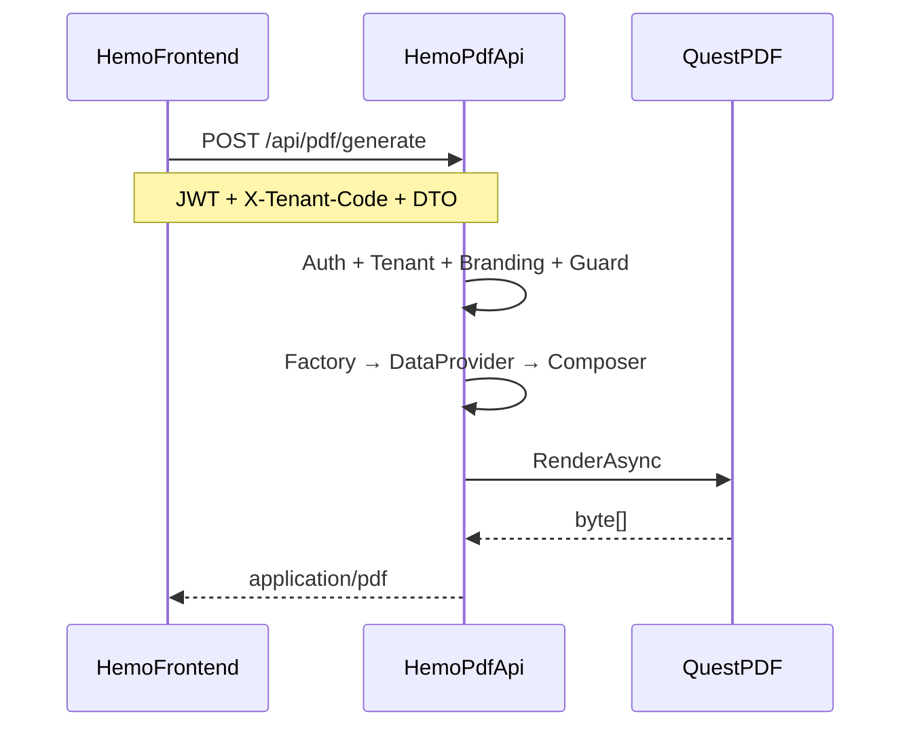

# Hemo-PDF — Implementation Checklist

อ้างอิงจาก [01-IMPLEMENT-PLANNING.md](D:\GoodRepo\Hemo-PDF\01-IMPLEMENT-PLANNING.md) และ [00-REFERENCE-PLANNING.md](D:\GoodRepo\Hemo-PDF\0ฺ0-REFERENCE-PLANNING.md)

## ข้อตัดสินใจที่ล็อกแล้ว

| หัวข้อ | คำตัดสินใจ |
|--------|-----------|
| Deploy | **Standalone `Hemo.Pdf.Api`** ตั้งแต่ Phase 0 (port `5090`) |
| .NET | **net8.0** |
| Angular | **`@hemo/pdf-client`** เป็น library ใน repo นี้ |
| Data | **Stateless** — caller ส่ง DTO ใน `POST /api/pdf/generate` |
| Tenant | `X-Tenant-Code` + mock service ก่อน |
| Branding | ทีม implement ลง JSON ต่อ tenant |
| Signature | mock ก่อน + guard สำหรับ template ที่ต้อง sign |
| Templates | 12 dummy ids (`template-01-dialysis-session` … `template-12-summary`) |

## สถาปัตยกรรมเป้าหมาย



## โครงสร้าง Solution ที่จะสร้าง

```
Hemo-PDF/
├── Hemo.Pdf.sln
├── src/
│   ├── Hemo.Pdf.Api/              # net8 Web API — deploy target
│   ├── Hemo.Pdf.Application/      # IPdfGenerationService, AddHemoPdf()
│   ├── Hemo.Pdf.Core/             # interfaces, context, factory (no QuestPDF)
│   ├── Hemo.Pdf.Branding/
│   ├── Hemo.Pdf.Sections/
│   ├── Hemo.Pdf.Layouts/
│   └── Hemo.Pdf.Rendering/        # QuestPDF
├── tests/
│   ├── Hemo.Pdf.Core.Tests/
│   ├── Hemo.Pdf.Sections.Tests/
│   └── Hemo.Pdf.Integration.Tests/
├── client/projects/hemo-pdf-client/
├── assets/fonts/sarabun/
└── assets/branding/               # tenant-demo-a.json, tenant-demo-b.json
```

**NSS files สำหรับ port (อ้างอิง):**
- [QuestPdfRenderer.cs](D:\GoodRepo\NSS\backend\NikkisoServiceAPI\Services\Reports\Renderers\Quest\QuestPdfRenderer.cs)
- [QuestLayout.cs](D:\GoodRepo\NSS\backend\NikkisoServiceAPI\Services\Reports\Renderers\Quest\QuestLayout.cs)
- [ReportStyleDefaults.cs](D:\GoodRepo\NSS\backend\NikkisoServiceAPI\Services\Reports\Core\ReportStyleDefaults.cs)
- [ReportComponentRenderer.cs](D:\GoodRepo\NSS\backend\NikkisoServiceAPI\Services\Reports\Core\ReportComponentRenderer.cs)
- [DefaultReportHeaderSection.cs](D:\GoodRepo\NSS\backend\NikkisoServiceAPI\Services\Reports\Sections\DefaultReportHeaderSection.cs) → ปรับเป็น `ConfigurableHeaderSection`
- [DefaultReportFooterSection.cs](D:\GoodRepo\NSS\backend\NikkisoServiceAPI\Services\Reports\Sections\DefaultReportFooterSection.cs) → signature helpers

---

## Phase 0 — Foundation + Standalone API

**เป้าหมาย:** `dotnet run` ที่ `Hemo.Pdf.Api` → `POST /api/pdf/generate` คืน PDF ว่าง ๆ

### 0.1 Solution scaffold
- [ ] สร้าง `Hemo.Pdf.sln` + projects ตามโครงสร้างด้านบน (net8.0)
- [ ] ตั้ง project references: `Api` → `Application` → `Core/Branding/Sections/Layouts/Rendering`
- [ ] เพิ่ม NuGet `QuestPDF` 2024.7.2 ใน `Hemo.Pdf.Rendering` เท่านั้น
- [ ] สร้าง `assets/fonts/sarabun/` — copy ฟอนต์ Sarabun จาก NSS หรือ source ที่มี

### 0.2 Core abstractions
- [ ] `GeneratePdfRequest`, `PdfReportContext`, `ReportMetadata`
- [ ] `IPdfRenderer`, `IReportRenderer`, `IReportDataProvider`, `ILayoutComposer`
- [ ] `IReportRendererFactory` + `ReportRendererFactory` (registry ว่าง + fallback)
- [ ] `ReportTemplates` constants — 12 dummy ids
- [ ] `PdfStyleDefaults` (port จาก NSS)

### 0.3 Rendering layer
- [ ] `QuestLayout`, `QuestPdfRenderer` (port + ปรับ namespace)
- [ ] `FontRegistration` — ลงทะเบียน Sarabun จาก `assets/fonts/`
- [ ] `PlaceholderReportRenderer` — PDF ว่างมี page number สำหรับ smoke test

### 0.4 Application + API
- [ ] `IPdfGenerationService` + `PdfGenerationService` (orchestrate: resolve template → render)
- [ ] `AddHemoPdf()` extension ใน `ServiceCollectionExtensions`
- [ ] `Hemo.Pdf.Api`: `Program.cs`, `appsettings.Development.json`
- [ ] `PdfController`: `POST /api/pdf/generate`
- [ ] `GET /health` — health check พื้นฐาน
- [ ] `MockAuthHandler` — ยอมรับ dev token ใด ๆ ใน Development
- [ ] `TenantMiddleware` — อ่าน `X-Tenant-Code` → `ITenantContextAccessor`
- [ ] `MockTenantContextAccessor` — fallback `tenant-demo-a`
- [ ] `launchSettings.json` — port `5090`
- [ ] `Dockerfile` (optional แต่แนะนำใน Phase 0)

### 0.5 Tests
- [ ] `Hemo.Pdf.Integration.Tests` — `WebApplicationFactory` ยิง `POST /api/pdf/generate` → assert `Content-Type: application/pdf` + bytes > 0
- [ ] อัปเดต [README.md](D:\GoodRepo\Hemo-PDF\README.md) — คำสั่ง `dotnet run` + curl ตัวอย่าง

**Done เมื่อ:** curl POST ได้ PDF เปิดอ่านได้

---

## Phase 1 — Section System + Branding + Signature Mock

**เป้าหมาย:** เปลี่ยน `tenantCode` → หัวเอกสารต่างกัน; template ที่ต้อง sign ถูก block ถ้ายังไม่ sign

### 1.1 Branding
- [ ] `CustomerBrandingProfile`, `HeaderBranding`, `FooterBranding`
- [ ] `IBrandingStore` + `JsonFileBrandingStore`
- [ ] Seed `assets/branding/tenant-demo-a.json`, `tenant-demo-b.json` (logo path + companyLines)
- [ ] `IBrandingResolver` — resolve จาก `tenantCode` ใน request

### 1.2 Section system
- [ ] `IReportSection`, `IReportHeaderSection`, `IReportFooterSection`
- [ ] `ISectionResolver<T>` + `SectionResolver` — key `(tenantCode, templateId)`
- [ ] `ConfigurableHeaderSection` — อ่าน branding (logo, companyLines, alignment)
- [ ] `ConfigurableFooterSection` + `PageNumberFooterSection`
- [ ] `PdfComponentHelpers` (port checkbox, label-value จาก NSS)
- [ ] `PdfTextHelpers`, `PdfImageHelpers`

### 1.3 Signature infrastructure
- [ ] `SignatureInfo`, `ReportSignatureContext`
- [ ] `ISignatureStore` + `MockSignatureStore`
- [ ] `IPdfGenerationGuard` + `SignatureRequiredGuard` — อ่าน `RequiresSignature` ต่อ template id
- [ ] `SignatureBlockSection`, `PdfSignatureHelpers`, `SignedReportFooterSection`
- [ ] กำหนด `RequiresSignature` ใน `ReportTemplates` metadata (ตามตารางใน §14 ของแผน)

### 1.4 Wire pipeline
- [ ] `BaseReportComposer<T>` — wire header/footer resolver
- [ ] `PlaceholderReportRenderer` ใช้ `BaseReportComposer` + branding จริง
- [ ] `AddHemoPdf()` — `HemoPdf:UseMockServices: true` switch mock auth/tenant/signature

### 1.5 Tests
- [ ] Unit: `ConfigurableHeaderSection` + tenant A vs B → output ต่างกัน
- [ ] Unit: `SignatureRequiredGuard` — unsigned template → throw
- [ ] Integration: POST ด้วย `tenant-demo-a` vs `tenant-demo-b` → PDF ต่างกัน

**Done เมื่อ:** 2 tenant ได้หัวต่างกัน + unsigned blocked สำหรับ template ที่กำหนด

---

## Phase 2 — Template แรก + Angular Client

**เป้าหมาย:** E2E จาก Angular → `Hemo.Pdf.Api` → PDF จริง (mock DTO)

### 2.1 Template #1 (`template-01-dialysis-session`)
- [ ] `DialysisSessionViewModel` + mock DTO schema (document ใน code/README)
- [ ] `DialysisSessionDataProvider` — map `JsonElement` → ViewModel
- [ ] `DialysisSessionComposer` extends `BaseReportComposer`
- [ ] Content blocks: `PatientInfoSection`, `DataGridSection`
- [ ] `DialysisSessionReportRenderer` — register ใน factory
- [ ] Integration test: template-01 + mock data → PDF bytes

### 2.2 Angular library (`@hemo/pdf-client`)
- [ ] สร้าง `client/projects/hemo-pdf-client/` (Angular library project)
- [ ] `GeneratePdfRequest` model, `HemoPdfService` — POST ไป `pdfApiUrl`
- [ ] ส่ง `Authorization` + `X-Tenant-Code` headers
- [ ] `PdfDownloadButtonComponent` — loading + error state
- [ ] `public-api.ts` export สำหรับ consumer
- [ ] เอกสาร integration สั้น ๆ ใน README (วิธีตั้ง `environment.pdfApiUrl`)

### 2.3 Hemopro integration (minimal)
- [ ] ตัวอย่าง `environment.pdfApiUrl` สำหรับ [Hemo-frontend](D:\GoodRepo\Hemo-frontend) (ยังไม่บังคับ merge)
- [ ] ตัวอย่าง mock DTO JSON สำหรับทดสอบ manual

**Done เมื่อ:** Angular เรียก PDF Api แล้วเปิด PDF template-01 ได้

---

## Phase 3 — Templates 02–06 + Shared Blocks

**เป้าหมาย:** 5 template เพิ่ม โดย reuse blocks สูงสุด

### ต่อ template (ทำซ้ำ pattern จาก Phase 2)
- [ ] `template-02-lab-result`
- [ ] `template-03-prescription`
- [ ] `template-04-hemosheet`
- [ ] `template-05-nurse-record`
- [ ] `template-06-doctor-record`

### Shared refactor
- [ ] แยก `PatientInfoSection`, `KeyValueTableSection`, `DataGridSection`, `ChecklistTableSection` ให้ reuse
- [ ] Mock DTO ต่อ template ใน `assets/mock-data/`
- [ ] Integration test ต่อ template (อย่างน้อย smoke: bytes > 0)
- [ ] อัปเดต `ReportTemplates.RequiresSignature` ให้ครบ

**Done เมื่อ:** 6 template generate ได้ + shared blocks ไม่ duplicate โค้ดมาก

---

## Phase 4 — Templates 07–12 + Production Readiness

- [ ] `template-07-med-history` … `template-12-summary` (6 template ที่เหลือ)
- [ ] Level 3 header override scaffold (`Sections/Headers/Customers/`) — ว่างไว้พร้อม DI registration
- [ ] Guideline `DbBrandingStore` สำหรับอนาคต (doc only — ยังใช้ JSON)
- [ ] Mock → Real switch points documented ใน README

**Done เมื่อ:** 12 template register ครบ + factory resolve ถูกต้อง

---

## Phase 5 — Production Hardening

- [ ] Rate limiting policy `PdfGeneration` (อ้างอิง NSS ~10 req/min)
- [ ] `CancellationToken` + max PDF 50MB guard (จาก NSS `QuestPdfRenderer`)
- [ ] JWT validation ร่วมกับ Hemopro authority (แทน `MockAuthHandler`)
- [ ] CORS — อนุญาต Angular origin จาก config
- [ ] `/health` พร้อม dependency checks
- [ ] `docker-compose.yml` สำหรับ local dev
- [ ] CI: `dotnet build` + `dotnet test` บน PR
- [ ] (Optional) PDF result caching ตาม `(templateId, entityId, brandingVersion)`

**Done เมื่อ:** deploy ได้ใน container + auth จริง + CI ผ่าน

---

## คำสั่งทดสอบหลัง Phase 0 (ตัวอย่าง)

```bash
cd src/Hemo.Pdf.Api && dotnet run

curl -X POST https://localhost:5090/api/pdf/generate \
  -H "Content-Type: application/json" \
  -H "X-Tenant-Code: tenant-demo-a" \
  -H "Authorization: Bearer dev" \
  -d '{"reportTemplateId":"template-01-dialysis-session","tenantCode":"tenant-demo-a","data":{}}' \
  --output test.pdf
```

---

## สิ่งที่ยังไม่ต้องทำใน Phase 0–2

- เชื่อม DB / EF ของ Hemopro
- แทนที่ Telerik Report ใน `Wasenshi.HemoDialysisPro.Report.Api`
- Admin UI จัดการ branding
- Template ชื่อจริง (รอ business finalize)

## คำถามเพิ่มเติม — ตอบแล้ว / ไม่บล็อก

| คำถาม | คำตอบ |
|--------|--------|
| .NET version | **net8.0** |
| Angular client | **library แยกใน Hemo-PDF repo** |
| 12 template names | dummy — finalize ทีหลัง |
| Deploy | standalone ตั้งแต่แรก |
| Branding | ทีม implement JSON |
| Signature | mock + guard พร้อม |

**ไม่มีคำถามบล็อกเพิ่ม** — เริ่ม Phase 0 ได้ทันที
