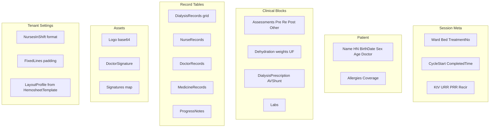
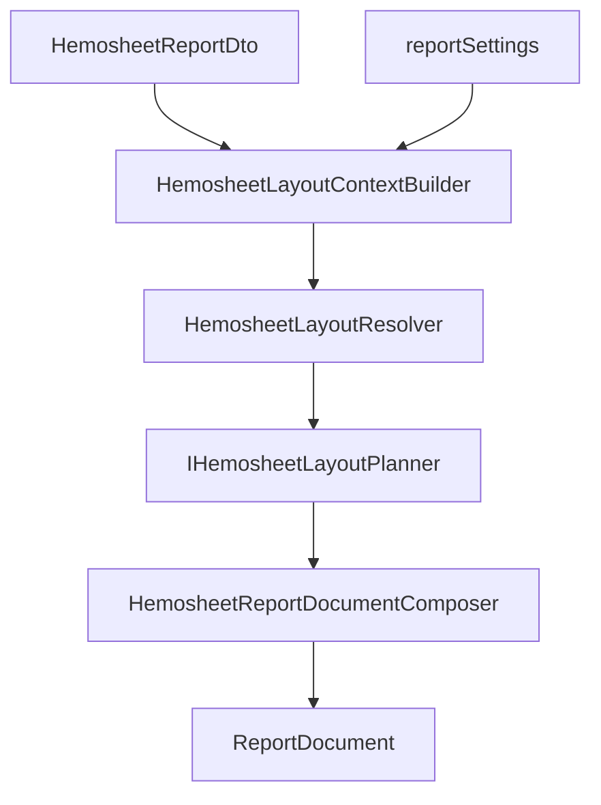
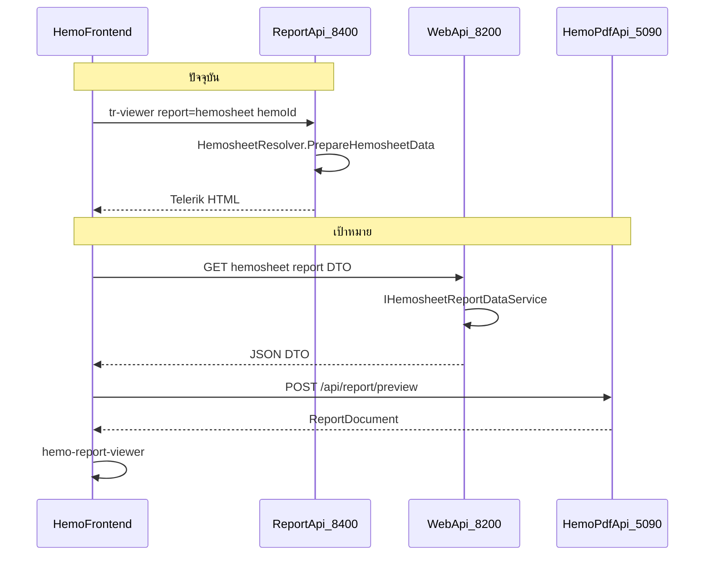

# Phase 7 — อัปเดตแผน + ผนวก Hemosheet เข้า Hemopro

## สถานะปัจจุบัน (หลัง Phase 6)

Phase 6 implement ครบแล้วใน Hemo-PDF (6 commits บน `main`):

- `POST /api/report/preview` + `ReportPreviewService`
- `ReportDocument` models + preview mappers + composers (Generic, DialysisSession)
- `@hemo/report-viewer` + demo [`client/demo/report-preview-demo/index.html`](D:\GoodRepo\Hemo-PDF\client\demo\report-preview-demo\index.html)
- Tests: **24** ผ่าน (`dotnet test Hemo.Pdf.sln`)

**เอกสารที่ยังไม่ sync (ต้องอัปเดตก่อนเริ่ม Phase 7):**

| ไฟล์ | ปัญหา |
|------|--------|
| [`.cursor/plans/hemo-pdf_implementation_8969dd4f.plan.md`](D:\GoodRepo\Hemo-PDF\.cursor\plans\hemo-pdf_implementation_8969dd4f.plan.md) | YAML todo `phase6-report-preview: pending`; ตาราง Phase 6 = ⏳; tests = 15 |
| [`01-IMPLEMENT-PLANNING.md`](D:\GoodRepo\Hemo-PDF\01-IMPLEMENT-PLANNING.md) | §Phase 6 checklist ยังเป็น `[ ]` ทั้งหมด |
| [`0ฺ0-REFERENCE-PLANNING.md`](D:\GoodRepo\Hemo-PDF\0ฺ0-REFERENCE-PLANNING.md) | §2.2 ยังบอก Report Preview เป็น `[ ]` |
| [`02-FEATURE-PREVIEW-PDF.md`](D:\GoodRepo\Hemo-PDF\02-FEATURE-PREVIEW-PDF.md) | Phase 6.1–6.2 done แล้ว — เพิ่ม **Phase 7** section ใหม่ |

**การอัปเดตที่ต้องทำ (ไม่แก้ plan file ของ Phase 6 ที่ user แนบ):**

- Mark Phase 6 `completed` ใน implementation plan YAML + ตารางสรุป
- เพิ่ม **Phase 7 — Hemopro Hemosheet Integration** เป็น milestone ถัดไป
- ย้าย `followup-hemopro` → แตกเป็น Phase 7 todos ชัดเจน
- อัปเดต test count เป็น 24

---

## วิเคราะห์ Hemosheet จาก `.trdp` + Mock Data

### แหล่งอ้างอิง

| แหล่ง | บทบาท |
|-------|--------|
| [`Hemo-Report/MockData/HemosheetData.json`](D:\GoodRepo\Hemo-Report\MockData\HemosheetData.json) | ตัวอย่าง JSON shape ที่ Telerik designer ใช้ |
| [`Hemosheet-RAMA.trdp`](D:\GoodRepo\Hemo-Report\Hemosheet-RAMA.trdp), [`Hemosheet-ThaiUR.trdp`](D:\GoodRepo\Hemo-Report\Hemosheet-ThaiUR.trdp) | layout variant ต่อลูกค้า (zip → `definition.xml`) |
| [`HemosheetData.cs`](D:\GoodRepo\Hemo-backend\HemoDialysisPro\Wasenshi.HemoDialysisPro.Report\Models\HemosheetData.cs) | โมเดลจริงที่ `HemosheetResolver` ประกอบ |
| [`HemosheetResolver.cs`](D:\GoodRepo\Hemo-backend\HemoDialysisPro\Wasenshi.HemoDialysisPro.Report\DocumentLogics\HemosheetResolver.cs) | logic โหลด DB → report DTO |

### โครงสร้างข้อมูลที่ต้องส่งไป Hemo-PDF

จาก mock + resolver — แบ่งเป็น **7 กลุ่มหลัก**:



### ความต่างระหว่าง template variant (`.trdp`)

| Variant | ความต่างหลัก (จาก `definition.xml`) |
|---------|--------------------------------------|
| `Hemosheet-RAMA.trdp` | `DoctorSignature`, `IsConsent`, `CreatorName`, `DialysisPrescription.Duration/HdfType`, `Patient.BirthDate` |
| `Hemosheet-ThaiUR.trdp` | panel `NursesInShiftNonPN` (ไม่มีบางฟิลด์ RAMA) |
| `Hemosheet.trdp` (default) | baseline |

**ข้อสรุปเดิม (ยังใช้ได้):** ข้อมูลมาจาก **`HemosheetData` เดียวกัน** — แต่การแสดงผลไม่ได้ขึ้นกับ `.trdp` ไฟล์เดียว มี **3 มิติของความยืดหยุ่น** (ดู §ด้านล่าง)

---

## วิเคราะห์ความยืดหยุ่น Layout (จาก `.trdp` จริง)

Telerik ใช้ **Binding `Visible` / `Width` expressions** ใน `definition.xml` — ไม่ใช่ static layout ทั้งหมด ตัวอย่างจาก [`Hemosheet-RAMA.trdp`](D:\GoodRepo\Hemo-Report\Hemosheet-RAMA.trdp):

### มิติที่ 1 — Data-driven (ต่อคนไข้ / ต่อ session)

| หัวข้อ | เงื่อนไขใน Telerik (สรุป) | ผลที่ต้องการ |
|--------|---------------------------|--------------|
| **HDF vs HD** | `DialysisPrescription.Mode = "HDF"` | แสดง/ซ่อน column HDF (เช่น substitute volume, HDF type); ปรับความกว้าง column |
| **Vascular Access AV vs Perm Cath** | `CatheterType < 2` หรือ `BloodAccessRoute` มี `"AV"` → panel AV; `CatheterType > 1` หรือ route ไม่มี AV → panel Cath | **สอง layout คนละชุด field** ใน section เดียวกัน |
| **Anticoagulant** | `IsAcNotUsed` / `Not IsAcNotUsed` | ซ่อน/แสดงช่อง AC |
| **Flush NSS** | `FlushNSS Is Not Null` | แสดงแถว flush |
| **Duration** | `Duration.Hours/Minutes` มีค่า | แสดงช่องเวลาฟอก |
| **Consent (RAMA)** | `DoctorSignature` + `IsConsent` | แสดง consent block |
| **Creator** | `CreatorName Is Not Null` | แสดงผู้สร้าง |
| **Assessment O2** | `Assessments.Other["o2"]` มี text | แสดงแถว O2 |

**สำคัญ:** Vascular Access ไม่ใช่แค่ซ่อน field — เป็น **variant ทั้ง section** (AV fistula: needle size, site ฯลฯ vs Perm cath: catheter length ฯลฯ)

### มิติที่ 2 — Tenant / ศูนย์ (GlobalSettings)

จาก [`HemosheetSetting.ReportSetting`](D:\GoodRepo\Hemo-backend\HemoDialysisPro\Wasenshi.HemoDialysisPro.Models\Settings\GlobalSetting.cs) + [`EnsureFixedLines`](D:\GoodRepo\Hemo-backend\HemoDialysisPro\Wasenshi.HemoDialysisPro.Report\DocumentLogics\HemosheetResolver.cs):

| การตั้งค่า | ผลต่อ layout |
|-----------|--------------|
| `HemosheetTemplate` | layout profile (`rama`, `thaiur`, `default`) — section เพิ่ม/ลด |
| `FixedLines` (Dialysis/Nurse/Med/Doctor/ProgressNote) | จำนวนแถว placeholder ในตาราง |
| `NurseInShiftEnabled`, `RoleNIS`, `SurnameNIS` | แสดง/รูปแบบ Nurses in Shift |
| `Extras["showProgressNote"]` | แสดง progress note section |

### มิติที่ 3 — Template preview mode

| พารามิเตอร์ | ผล |
|------------|-----|
| `templateMode: hd \| hdf` | บังคับ prescription mode ใน empty template ([`AdjustTemplateData`](D:\GoodRepo\Hemo-backend\HemoDialysisPro\Wasenshi.HemoDialysisPro.Report\DocumentLogics\HemosheetResolver.cs)) |
| `template: true` + `unitId` | ข้อมูลว่างสำหรับ preview แบบฟอร์มเปล่า |

### ข้อจำกัดของแผนเดิม (ต้องปรับ)

แผนเดิมพูดถึง `layoutProfile` เป็นหลัก — **ไม่พอ** เพราะ:
- `layoutProfile` ควบคุมได้แค่มิติที่ 2 (tenant template file)
- มิติที่ 1 (HD/HDF, AV/perm) เปลี่ยนต่อ **คนไข้แต่ละราย** แม้อยู่ tenant เดียวกัน
- `ReportBlock` ปัจจุบันใน Hemo-PDF ไม่มี `visibleWhen` — และ **ไม่ควร** ย้าย Telerik expressions ไป Angular

### แนวทางสถาปัตยกรรมที่แนะนำ: Compose-time Resolution



**หลักการ:**
1. **Resolve ฝั่ง server ก่อนส่ง JSON** — preview และ PDF ใช้ pipeline เดียวกัน (WYSIWYG)
2. **Viewer เป็น dumb renderer** — แสดงเฉพาะ blocks/columns ที่ composer ส่งมาแล้ว ไม่ evaluate rule ซ้ำใน Angular
3. **ไม่ fork composer ต่อ `.trdp`** — ใช้ `layoutProfile` เป็น registry ของ section ที่ tenant รองรับ + `layoutContext` สำหรับ data-driven

### โมเดลใหม่: `HemosheetLayoutContext`

```csharp
// ใน DTO response จาก Web.Api (คำนวณพร้อม data)
public sealed class HemosheetLayoutContext
{
    public string LayoutProfile { get; init; }           // default | rama | thaiur
    public string DialysisMode { get; init; }            // HD | HDF
    public VascularAccessKind VascularAccess { get; init; } // AvFistula | PermCath | Unknown
    public HemosheetReportSettingsDto Settings { get; init; }
    public IReadOnlyDictionary<string, bool> Features { get; init; }
    // Features ตัวอย่าง: showHdfColumns, showAvPanel, showCathPanel,
    // showAcFields, showFlushNss, showConsentBlock, showProgressNote, showNurseInShift
}
```

`HemosheetLayoutResolver` — port logic จาก Telerik expressions เป็น C# ที่ test ได้:

```csharp
// ตัวอย่าง vascular access (จาก RAMA trdp)
bool IsAvFistula(HemosheetReportDto d) =>
    (d.AvShunt?.CatheterType is int ct && ct < 2)
    || (d.AvShunt == null && d.Prescription?.BloodAccessRoute?.Contains("AV", ...) == true);
```

**Unit tests:** table-driven cases — HD patient + AV, HDF patient + perm cath, template empty HD/HDF

### ผลกระทบต่อ `ReportDocument` schema

| ทางเลือก | ข้อดี | ข้อเสีย | แนะนำ |
|---------|------|--------|-------|
| A) เพิ่ม `visibleWhen` บน block | viewer ยืดหยุ่น | rule ซ้ำ 2 ที่; PDF/preview drift | ไม่แนะนำ |
| B) Composer ตัด block/column ออกก่อนส่ง | single source of truth; viewer ง่าย | composer ซับซ้อนขึ้น | **แนะนำ** |
| C) ส่ง `layoutContext` ให้ Angular ตัดเอง | ลด payload ซ้ำ | WYSIWYG เสี่ยง | ไม่แนะนำ |

**ขยาย schema เฉพาะที่จำเป็น:**
- `data-grid`: composer ส่งเฉพาะ `columns` ที่ visible (มีอยู่แล้ว — แค่ filter ตอน compose)
- block ใหม่: `vascular-access` (`variant: av-fistula | perm-cath`) หรือ `key-value-table` สองชุดที่ planner เลือกหนึ่ง
- `checklist-table`: column ย่อย HDF ถูกตัดที่ planner

### `IHemosheetLayoutPlanner` (ใหม่ — ก่อน Composer)

```
Plan(HemosheetReportDto, HemosheetLayoutContext) → SectionPlan[]
```

`SectionPlan` กำหนด: section id, variant, visible columns, fixed line count, page break hints

Composer วน `SectionPlan` → เรียก mapper ที่ตรงกับ section — **ไม่ hardcode if กระจายทุก mapper**

### Layout Profile Registry (มิติ tenant)

| `layoutProfile` | Section เพิ่มเติม (เทียบ `.trdp`) |
|-----------------|-----------------------------------|
| `default` | baseline |
| `rama` | consent block, creator, duration/HDF emphasis |
| `thaiur` | `NursesInShiftNonPN` panel |

Profile กำหนด **section ที่มีใน template** — ส่วน visibility ภายใน section ยังผ่าน `layoutContext`

### Mock data ที่ต้องเพิ่ม (Hemo-PDF)

ไม่พอแค่ [`HemosheetData.json`](D:\GoodRepo\Hemo-Report\MockData\HemosheetData.json) ไฟล์เดียว:

| ไฟล์ mock | จุดประสงค์ |
|----------|-----------|
| `template-04-hemosheet-hd-av.json` | HD + AV fistula |
| `template-04-hemosheet-hdf-av.json` | HDF + columns เพิ่ม |
| `template-04-hemosheet-hd-perm.json` | Perm cath panel |
| `template-04-hemosheet-rama.json` | tenant profile rama |
| `template-04-hemosheet-empty-hd.json` | template preview mode |

### ช่องว่างหลักวันนี้



- **ไม่มี** endpoint ใน Web.Api ที่คืน report-ready JSON
- `HemosheetData` มี Telerik/SkiaSharp/MessagePack dependencies — **serialize ตรงไม่ได้**
- Hemo-PDF `template-04-hemosheet` ยังใช้ **Generic key-value** — ไม่พอสำหรับ UX Hemosheet

---

## Phase 7 — แผนดำเนินการ (Hemosheet ก่อน)

### Milestone 7.1 — Doc sync + contract

**Hemo-PDF repo:**
- อัปเดต 4 เอกสารแผนตามด้านบน
- เพิ่ม §Phase 7 ใน [`02-FEATURE-PREVIEW-PDF.md`](D:\GoodRepo\Hemo-PDF\02-FEATURE-PREVIEW-PDF.md)

**Shared contract (แนะนำ):**
- สร้าง `HemosheetReportDto` + **`HemosheetLayoutContext`** ใน **Hemo-backend** [`Wasenshi.HemoDialysisPro.ViewModels`](D:\GoodRepo\Hemo-backend\HemoDialysisPro\Wasenshi.HemoDialysisPro.ViewModels)
- JSON-friendly: ไม่มี `[IgnoreMember]`, ไม่มี Telerik `[Function]`
- `logoBase64`, `doctorSignatureBase64` แทน file path
- `layoutProfile`: `"default" | "rama" | "thaiur"` — map จาก `HemosheetTemplate` filename
- `reportSettings`: mirror `ReportSetting` (FixedLines, NurseInShiftEnabled, RoleNIS, SurnameNIS)
- `layoutContext`: คำนวณใน backend พร้อม DTO — Hemo-PDF ไม่ต้อง re-derive rules
- Mock หลาย scenario → `Hemo-PDF/assets/mock-data/template-04-hemosheet-*.json` (ดูตาราง §Mock data)

### Milestone 7.2 — Layout Rule Engine (Hemo-backend + Hemo-PDF shared logic)

**ก่อน** dedicated composer — สร้าง rule layer ที่ test ได้:

| ไฟล์ | Repo | หน้าที่ |
|------|------|--------|
| `HemosheetLayoutResolver.cs` | Hemo-backend (หรือ shared lib) | port Telerik `Visible` expressions → C# |
| `HemosheetLayoutContextBuilder.cs` | Hemo-backend | รวม DTO + ReportSetting → context |
| `HemosheetLayoutResolverTests.cs` | Hemo-backend | table-driven: HD/HDF, AV/perm, AC, consent |

Rules ขั้นต่ำรอบแรก (blocking สำหรับ parity):
1. `ResolveDialysisMode` → `showHdfColumns`
2. `ResolveVascularAccess` → `showAvPanel` / `showCathPanel`
3. `ResolveAnticoagulant` → `showAcFields`
4. `ResolveTenantFeatures` → nurse in shift, progress note, profile-specific sections

### Milestone 7.3 — Backend: ดึงข้อมูลจริง (Hemo-backend)

**Extract service** จาก [`HemosheetResolver.PrepareHemosheetData`](D:\GoodRepo\Hemo-backend\HemoDialysisPro\Wasenshi.HemoDialysisPro.Report\DocumentLogics\HemosheetResolver.cs):

```
IHemosheetReportDataService
  Task<HemosheetReportDto> BuildAsync(Guid hemoId, HemosheetReportOptions options, CancellationToken ct)
```

- ย้าย logic หลักไป `Wasenshi.HemoDialysisPro.Services.Core` (หรือ `Services.Interfaces` + implementation ใน Services.Core)
- `HemosheetResolver` เรียก service เดิม → **ไม่ break Telerik** ระหว่าง transition
- `HemosheetReportOptions`: `tcvUsePercent`, `reassessment`, `templateMode` (สำหรับ empty template preview)

**API ใหม่ใน Web.Api** (auth + permission อยู่ที่นี่):

```
GET /api/Hemodialysis/records/{hemoId}/report-data
  ?tcvUsePercent=false
```

- ตรวจสิทธิ์เดียวกับการเปิด hemosheet report วันนี้
- คืน `HemosheetReportDto` **พร้อม** `layoutContext` และ `reportSettings`
- Template empty mode (เมนู Templates HD/HDF):

```
GET /api/Hemodialysis/report-data/template?unitId=&templateMode=hd|hdf
```

**Tenant config ใน response meta:**
- `layoutProfile` จาก `GlobalSettings.Hemosheet.Report.HemosheetTemplate`
- `fixedLines`, `nurseInShiftEnabled` จาก [`ReportSetting`](D:\GoodRepo\Hemo-backend\HemoDialysisPro\Wasenshi.HemoDialysisPro.Models\Settings\GlobalSetting.cs)

**Tests:** unit test mapper + **layout resolver parity**; integration test endpoint ด้วย fixture hemosheet (อย่างน้อย 3 scenario: HD+AV, HDF, perm-cath)

### Milestone 7.4 — Hemo-PDF: Hemosheet dedicated layout + Layout Planner

**Backend Hemo-PDF:**

| ไฟล์ใหม่ | หน้าที่ |
|---------|--------|
| `Hemo.Pdf.Core/Models/Hemosheet/HemosheetReportViewModel.cs` | mirror DTO + `LayoutContext` |
| `Hemo.Pdf.Layouts/Hemosheet/HemosheetLayoutPlanner.cs` | `SectionPlan[]` จาก context |
| `Hemo.Pdf.Layouts/Hemosheet/HemosheetLayoutProfileRegistry.cs` | section ต่อ `layoutProfile` |
| `Hemo.Pdf.Sections/Preview/Hemosheet*PreviewMapper.cs` | map ตาม `SectionPlan` (ไม่ if กระจาย) |
| `Hemo.Pdf.Layouts/Preview/Template04_Hemosheet/HemosheetReportDocumentComposer.cs` | วน planner → blocks |
| `Hemo.Pdf.Layouts/Template04_Hemosheet/HemosheetComposer.cs` | QuestPDF — ใช้ planner เดียวกัน |
| `Hemo.Pdf.Layouts/Preview/Template04_Hemosheet/HemosheetReportPreviewRenderer.cs` | register แทน Generic |

**Block ใหม่ที่ต้องมี:**
- `checklist-table` (C# + Angular) — assessment checkbox
- **`vascular-access`** block หรือ key-value variant สองแบบ — AV fistula vs Perm cath
- `data-grid` — composer ส่งเฉพาะ columns ที่ planner เลือก (HDF columns ตาม mode)

**หลักการสำคัญ:** Preview mapper และ QuestPDF section **เรียก `IHemosheetLayoutPlanner` ร่วมกัน** — ไม่ duplicate visibility logic

**DataProvider:** `HemosheetDataProvider` รับ `HemosheetReportViewModel` จาก `request.data` (รวม `layoutContext`)

**Signature:** implement `HemoproSignatureStore` — template-04 `RequiresSignature = true`

### Milestone 7.5 — Frontend: ผนวกเข้า Hemo-frontend

**Setup libraries** (ตาม [`link-workspace-packages`](D:\GoodRepo\Hemo-frontend\.agents\skills\link-workspace-packages\SKILL.md) หรือ path dependency):

```typescript
// app.config.ts
HEMO_PDF_CONFIG + HEMO_REPORT_VIEWER_CONFIG
  pdfApiUrl: config.pdfApiUrl  // ใหม่ใน config.json
  getAuthToken / getTenantCode  // reuse จาก auth
```

**Service ใหม่:**

```typescript
// hemo-dialysis.service.ts หรือ report-data.service.ts
getHemosheetReportData(hemoId: string, tcvUsePercent: boolean): Observable<HemosheetReportDto>
```

**Migrate จุดแรก (impact สูงสุด):**

[`embedded-hemosheet-report.component.ts`](D:\GoodRepo\Hemo-frontend\src\app\doctor-view\patient-overview\components\embedded-hemosheet-report\embedded-hemosheet-report.component.ts)

```
เดิม: tr-viewer + reportService :8400
ใหม่: getHemosheetReportData → HemoReportPreviewService.load → hemo-report-viewer
      print/download → HemoPdfService.generateAndOpen
```

- Feature flag: `config.useHemoPdfPreview` — สลับ Telerik ↔ Hemo-PDF ระหว่าง rollout
- ลบ dependency: `TelerikReportingModule`, `embedded-hemosheet-report-toolbar.ts`, `telerik-viewer-teardown.util.ts` (หลัง rollout เสร็จ)

**Migrate จุดที่สอง:**

[`reports.page.ts`](D:\GoodRepo\Hemo-frontend\src\app\reports\reports.page.ts) + template preview mode (`template: true`, `unitId`, `templateMode`)

**Modal:** `HemoReportPreviewModalComponent` (Ionic `90dvh`) — ใช้ใน `dialysis-info.openReport()` และ reports route

### Milestone 7.6 — Config, deploy, parity

| หัวข้อ | แนวทาง |
|--------|--------|
| `config.json` | เพิ่ม `pdfApiUrl: "http://localhost:5090"` แยกจาก `reportService:8400` |
| JWT | Hemo-PDF ใช้ issuer/key เดียวกับ Hemopro (`UseMockServices: false`) |
| Branding | map tenant branding จาก Hemopro → Hemo-PDF `assets/branding` หรือ API อนาคต |
| CORS | อนุญาต `localhost:4200` + tenant domains |
| WYSIWYG check | เทียบ Telerik vs Hemo-PDF: 3 tenant profiles × 3 data scenarios (HD+AV, HDF, perm-cath) |

**นอกขอบเขต Phase 7 (รอบถัดไป):**
- `HemoRecords.trdp` (รายงานรายเดือน `hemorecords`) — ใช้ `HemoRecordData` + template ใหม่
- ลบ Report.Api / Telerik license เมื่อ migration ครบทุก report type
- `medhistory` report

---

## ลำดับ commit แนะนำ

| # | Repo | Commit |
|---|------|--------|
| 1 | Hemo-PDF | `docs: mark Phase 6 complete and add Phase 7 plan` |
| 2 | Hemo-backend | `feat(report): HemosheetReportDto + HemosheetLayoutContext contract` |
| 3 | Hemo-backend | `feat(report): HemosheetLayoutResolver with parity tests` |
| 4 | Hemo-backend | `feat(api): GET hemosheet report-data endpoint` |
| 5 | Hemo-PDF | `feat(layouts): HemosheetLayoutPlanner + dedicated composers` |
| 6 | Hemo-PDF | `feat(client): checklist-table + vascular-access blocks` |
| 7 | Hemo-frontend | `feat(reports): integrate hemo-report-viewer for embedded hemosheet` |
| 8 | Hemo-frontend | `feat(reports): migrate reports.page and template preview` |

---

## ความเสี่ยงและการลดความเสี่ยง

| ความเสี่ยง | แนวทาง |
|-----------|--------|
| Dual maintenance Telerik + Hemo-PDF | Feature flag; extract `IHemosheetReportDataService` + **shared layout resolver** |
| DTO ใหญ่ / slow | endpoint แยก; cache สั้น ๆ ตาม hemoId; ไม่ส่ง binary ซ้ำถ้าไม่จำเป็น |
| Layout ยืดหยุ่นหลายมิติ | **Compose-time resolution** + `IHemosheetLayoutPlanner`; ไม่ใส่ rule ใน Angular |
| Layout variant หลายแบบ | `layoutProfile` (tenant) + `layoutContext` (data) แยกชั้น — ไม่ fork composer ต่อ `.trdp` |
| Vascular AV vs Cath drift | block variant + unit tests คู่กับ Telerik `Visible` expression |
| HDF column drift | planner filter columns; integration test เปรียบเทียบ column headers |
| Plugin `Extras` / `IDocumentHandler` | map known flags → `layoutContext.Features`; plugin อื่น phase ถัดไป |
| Signature guard 403 | wire `HemoproSignatureStore` ก่อนเปิด feature flag production |

---

## Definition of Done — Phase 7 (Hemosheet)

1. เปิด doctor workbench → embedded hemosheet แสดง preview จากข้อมูลจริง (ไม่ใช้ `tr-viewer`)
2. Print/Download ได้ PDF จาก `POST /api/pdf/generate` ด้วยข้อมูลเดียวกัน
3. **Data-driven layout:** คนไข้ HD vs HDF แสดง column ต่างกัน; AV fistula vs Perm cath แสดง section ต่างกัน
4. **Tenant layout:** `Hemosheet-RAMA` / `ThaiUR` แสดง section ตาม `layoutProfile`
5. **Template preview:** เมนู Templates HD/HDF แสดงฟอร์มเปล่าถูก mode
6. Layout resolver unit tests ผ่าน (parity กับ Telerik expressions ขั้นต่ำ)
7. Integration tests ผ่านทั้ง 3 repos
8. เอกสารแผนทั้ง 4 ไฟล์ sync สถานะ Phase 6 done + Phase 7 in progress
