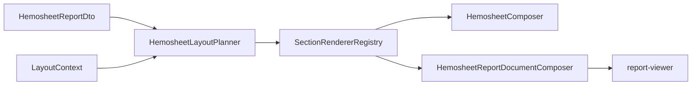

# Hemosheet Layout — แผนดำเนินการ (Phase 1–3A + Top Sections)

## เป้าหมาย Sprint นี้

แทนที่ Telerik `Hemosheet*.trdp` ในระดับ **โครงสร้าง layout + section บนฟอร์ม** — preview WYSIWYG บน A4 และ PDF จาก pipeline เดียวกัน ยัง **ไม่ cutover** (ไม่ลบ `tr-viewer`) และยัง **ไม่ทำ pagination** (Phase 5)



**หลักการ:** resolve visibility ฝั่ง server (`HemosheetLayoutResolver` + planner) — viewer แสดง blocks ที่ได้รับเท่านั้น

---

## Phase 1 — Layout Component Framework (Hemo-PDF)

### 1.1 สร้าง `IHemosheetSectionRenderer`

ไฟล์ใหม่ใน [`src/Hemo.Pdf.Layouts/Hemosheet/Sections/`](d:/GoodRepo/Hemo-PDF/src/Hemo.Pdf.Layouts/Hemosheet/):

```csharp
public interface IHemosheetSectionRenderer
{
    HemosheetSectionId SectionId { get; }
    ReportBlock? MapToPreview(HemosheetSectionPlan plan, HemosheetReportViewModel vm);
    void ComposePdf(IContainer container, HemosheetSectionPlan plan,
        HemosheetReportViewModel vm, PdfReportContext context);
}
```

- แยก renderer ต่อ `HemosheetSectionId` (เริ่มจาก section ที่มีอยู่แล้วใน [`HemosheetComposer.cs`](d:/GoodRepo/Hemo-PDF/src/Hemo.Pdf.Layouts/Template04_Hemosheet/HemosheetComposer.cs))
- ลงทะเบียน `services.AddEnumerable<IHemosheetSectionRenderer, ...>()` ใน [`ServiceCollectionExtensions.cs`](d:/GoodRepo/Hemo-PDF/src/Hemo.Pdf.Application/ServiceCollectionExtensions.cs) หรือ [`TemplateRegistration.cs`](d:/GoodRepo/Hemo-PDF/src/Hemo.Pdf.Layouts/TemplateRegistration.cs)
- Refactor [`HemosheetComposer`](d:/GoodRepo/Hemo-PDF/src/Hemo.Pdf.Layouts/Template04_Hemosheet/HemosheetComposer.cs) และ [`HemosheetReportDocumentComposer`](d:/GoodRepo/Hemo-PDF/src/Hemo.Pdf.Layouts/Preview/Template04_Hemosheet/HemosheetReportDocumentComposer.cs) ให้ loop `SectionPlan` แล้ว delegate ไป renderer — **ลบ switch ยาว**

### 1.2 `HemosheetLayoutProfileRegistry`

ไฟล์ใหม่: `HemosheetLayoutProfileRegistry.cs`

- กำหนด section list ต่อ `HemosheetLayoutProfile` (default / rama / thaiur)
- [`HemosheetLayoutPlanner`](d:/GoodRepo/Hemo-PDF/src/Hemo.Pdf.Layouts/Hemosheet/HemosheetLayoutPlanner.cs) ใช้ registry + `features` + data presence (assessment ว่างไม่ใส่)
- เพิ่ม unit tests ใน [`HemosheetLayoutPlannerTests.cs`](d:/GoodRepo/Hemo-PDF/tests/Hemo.Pdf.Core.Tests/HemosheetLayoutPlannerTests.cs) สำหรับ rama/thaiur section diff

### 1.3 มาตรฐาน block — `title` บนทุก content block

ขยาย [`ReportBlock.cs`](d:/GoodRepo/Hemo-PDF/src/Hemo.Pdf.Core/Models/Preview/ReportBlock.cs):

- เพิ่ม `Title` ให้ `ChecklistTableReportBlock`, `KeyValueTableReportBlock`, `DataGridReportBlock`, `VascularAccessReportBlock` (บางตัวมีแล้ว — unify)
- สร้าง [`ChecklistTablePreviewMapper.cs`](d:/GoodRepo/Hemo-PDF/src/Hemo.Pdf.Sections/Preview/ChecklistTablePreviewMapper.cs) จาก `ChecklistTableModel` → JSON 3 คอลัมน์ (`""`, `รายการ`, `หมายเหตุ`)
- แก้ [`HemosheetReportDocumentComposer.AddAssessment`](d:/GoodRepo/Hemo-PDF/src/Hemo.Pdf.Layouts/Preview/Template04_Hemosheet/HemosheetReportDocumentComposer.cs) — **ลบ** `TextReportBlock` นำหน้า checklist
- Mirror TypeScript ใน [`report-document.model.ts`](d:/GoodRepo/Hemo-PDF/client/projects/hemo-report-viewer/src/lib/models/report-document.model.ts) + sync copy ใน [`Hemo-frontend/.../report-viewer`](d:/GoodRepo/Hemo-frontend/src/app/share/hemo-pdf/report-viewer)

### 1.4 `ReportPageLayout` constants

ไฟล์ใหม่: `src/Hemo.Pdf.Core/Constants/ReportPageLayout.cs`

- A4: 210×297 mm; margin บน/ล่าง 3 mm, ซ้าย/ขวา 10 mm (ตรง [`QuestLayout.cs`](d:/GoodRepo/Hemo-PDF/src/Hemo.Pdf.Rendering/QuestLayout.cs))
- ใช้ร่วม QuestPDF composer + SCSS variables

---

## Phase 2 — Data Contract (Hemopro Web.Api)

### 2.1 Assessment `text`

แก้ [`HemosheetReportDataService.MapAssessmentGroup`](d:/GoodRepo/Hemo-backend/HemoDialysisPro/Wasenshi.HemoDialysisPro.Report/Services/HemosheetReportDataService.cs):

```csharp
Text = pair.Value?.Text,
Checked = pair.Value?.Selected?.Length > 0 || pair.Value?.Checked == true,
```

- `AssessmentItem.Text` มีอยู่ใน [`AssessmentItemCommon.cs`](d:/GoodRepo/Hemo-backend/HemoDialysisPro/Wasenshi.HemoDialysisPro.Models/Infrastructor/AssessmentItemCommon.cs)
- เพิ่ม unit test ใน [`Wasenshi.HemoDialysisPro.Services.Test`](d:/GoodRepo/Hemo-backend/HemoDialysisPro/Wasenshi.HemoDialysisPro.Services.Test)

### 2.2 Labs (ถ้า trdp default แสดง)

- เพิ่ม `HemosheetLabsDto` ใน [`HemosheetReportDto.cs`](d:/GoodRepo/Hemo-backend/HemoDialysisPro/Wasenshi.HemoDialysisPro.Report.Contracts/Hemosheet/HemosheetReportDto.cs)
- Map จาก `HemosheetData.Labs` ใน `HemosheetReportDataService` (อ้างอิง [`HemosheetData.cs`](d:/GoodRepo/Hemo-backend/HemoDialysisPro/Wasenshi.HemoDialysisPro.Report/Models/HemosheetData.cs))
- เพิ่ม `HemosheetSectionId.Labs` + renderer (key-value-table) ถ้า field สำคัญมีใน baseline trdp

### 2.3 ยืนยัน `layoutContext` ครบ

- ทบทวน features ใน [`HemosheetLayoutResolver.BuildFeatures`](d:/GoodRepo/Hemo-backend/HemoDialysisPro/Wasenshi.HemoDialysisPro.Report.Contracts/Hemosheet/HemosheetLayoutResolver.cs) กับ `showFlushNss`, `showCreatorName` — เพิ่ม test ถ้ายังขาด

---

## Phase 3A — หน้ากระดาษ + Header/Footer

### 3A.1 A4 + Sarabun + auto-fit (viewer)

ไฟล์หลัก:

- [`report-viewer.scss`](d:/GoodRepo/Hemo-PDF/client/projects/hemo-report-viewer/src/lib/styles/report-viewer.scss) — margin `3mm 10mm`, lock 297mm, border 0.5pt, ใช้ pt
- [`hemo-report-viewer.component.ts`](d:/GoodRepo/Hemo-PDF/client/projects/hemo-report-viewer/src/lib/components/hemo-report-viewer.component.ts) — auto-fit scale ตามความกว้าง container
- เพิ่ม `@font-face` Sarabun จาก [`Hemo-PDF/assets/fonts`](d:/GoodRepo/Hemo-PDF/assets/fonts) (copy/serve ไป frontend `assets/fonts/sarabun/`)
- `@media print` — ปิด transform, `@page { size: A4; margin: 0 }`
- **Sync** ไป [`Hemo-frontend/.../report-viewer`](d:/GoodRepo/Hemo-frontend/src/app/share/hemo-pdf/report-viewer)

### 3A.2 Header/Footer bands

- แยก header/footer ออกจาก content padding ใน [`hemo-report-page.component.ts`](d:/GoodRepo/Hemo-PDF/client/projects/hemo-report-viewer/src/lib/components/hemo-report-page.component.ts) + SCSS
- PDF: ยืนยัน [`BaseReportComposer`](d:/GoodRepo/Hemo-PDF/src/Hemo.Pdf.Layouts/Base/BaseReportComposer.cs) ใช้ `QuestLayout` header/footer band นอก content (ไม่ซ้ำใน `.hemo-report-page`)

---

## Phase 3B — Top Sections Parity (รวมใน sprint นี้ตามที่เลือก)

### 3B.1 `field-grid` block (ใหม่)

| ชั้น | ไฟล์ |
|------|------|
| Model | `FieldGridReportBlock` ใน [`ReportBlock.cs`](d:/GoodRepo/Hemo-PDF/src/Hemo.Pdf.Core/Models/Preview/ReportBlock.cs) |
| PDF | `FieldGridSection.cs` ใน [`Hemo.Pdf.Sections/Content/`](d:/GoodRepo/Hemo-PDF/src/Hemo.Pdf.Sections/Content/) — multi-column grid จาก `fields[]` + `columns` |
| Mapper | `HemosheetPreviewMappers.MapDehydration` / `MapPrescription` → `field-grid` แทน key-value แนวตั้ง |
| Angular | `field-grid-block.component.ts` + SCSS |
| Renderer | `DehydrationSectionRenderer`, `PrescriptionSectionRenderer` |

### 3B.2 `patient-info` 2 คอลัมน์

แก้ [`HemosheetPreviewMappers.MapPatient`](d:/GoodRepo/Hemo-PDF/src/Hemo.Pdf.Sections/Preview/Hemosheet/HemosheetPreviewMappers.cs) ให้ตรง [`PatientInfoSection.cs`](d:/GoodRepo/Hemo-PDF/src/Hemo.Pdf.Sections/Content/PatientInfoSection.cs):

- คอลัมน์ซ้าย: ชื่อ-สกุล, HN, เลขบัตร (เพิ่มใน ViewModel/DTO ถ้ายังไม่มี)
- คอลัมน์ขวา: วันเกิด, เพศ, หน่วย
- ย้าย อายุ/แพทย์/สิทธิ์/แพ้ยา ตาม trdp baseline (อ่าน binding ใน `Hemosheet.trdp` ก่อน implement)

### 3B.3 Checklist 3 คอลัมน์

- Server: `ChecklistTablePreviewMapper` + renderer สำหรับ AssessmentPre/Re/Post/Other
- Angular: [`checklist-table-block.component.ts`](d:/GoodRepo/Hemo-PDF/client/projects/hemo-report-viewer/src/lib/components/blocks/checklist-table-block.component.ts) — PDF-style checkbox box + `/`, ไม่ใช้ `<input type="checkbox">`

### 3B.4 Vascular access + session meta

- จูน [`vascular-access-block`](d:/GoodRepo/Hemo-PDF/client/projects/hemo-report-viewer/src/lib/components/blocks/vascular-access-block.component.ts) + mapper fields
- Session meta คง `key-value-table` หรือย้ายเป็น `field-grid` 2 คอลัมน์ถ้า trdp เป็นแบบนั้น

---

## Tests & Verification

| ชั้น | งาน |
|------|-----|
| Unit | `ChecklistTablePreviewMapperTests`, renderer smoke per section, planner profile tests |
| Integration | [`PdfApiIntegrationTests`](d:/GoodRepo/Hemo-PDF/tests/Hemo.Pdf.Integration.Tests/PdfApiIntegrationTests.cs) — assert JSON structure สำหรับ mock `template-04-hemosheet-hd-av.json` |
| Manual | Embedded hemosheet บน `:4200` เทียบ Telerik print preview สำหรับ patient เดียวกัน |
| Build | `dotnet test Hemo.Pdf.sln` + `nx build` (Hemo-frontend) |

---

## สิ่งที่อยู่นอก sprint นี้

- Pagination (`pages[]`) — Phase 5
- Profile YTL/New diff analysis — Phase 4
- Grid parity ละเอียด (dialysis/nurse/med) — Phase 3D
- Telerik cutover — Phase 6
- `HemoRecords.trdp` — template แยก

---

## ลำดับ PR แนะนำ

1. **Hemo-PDF Phase 1** — renderer framework + block title + checklist mapper (no visual change yet OK)
2. **Hemopro Phase 2** — assessment text + labs DTO
3. **Hemo-PDF Phase 3** — field-grid, patient, checklist, A4 SCSS
4. **Hemo-frontend** — sync report-viewer copy

PR 1–2 สามารถ parallel ได้ถ้า mock JSON มี `text` สำหรับทดสอบ Hemo-PDF ก่อน API merge
