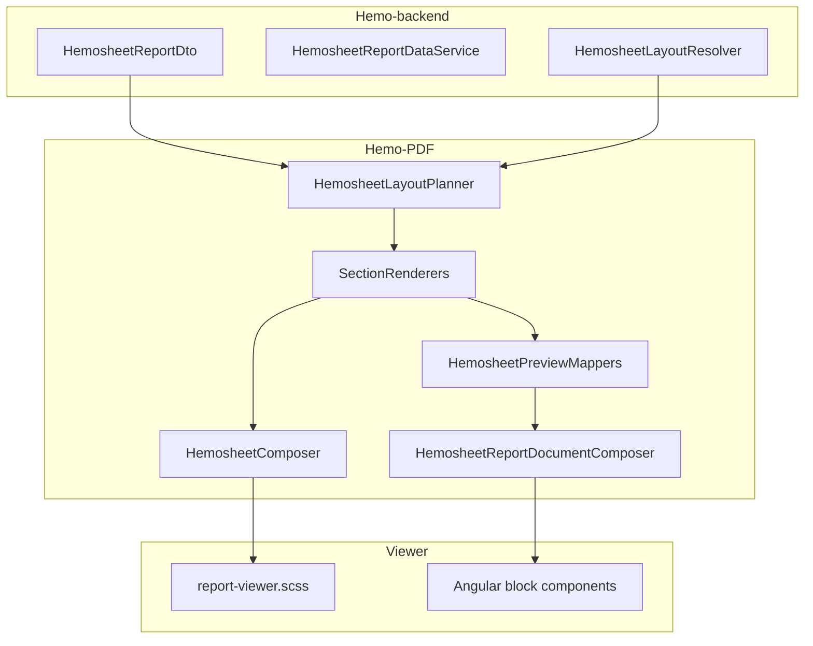
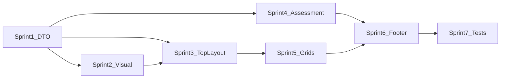

# Hemosheet Phase 3 Full Parity Plan

## เป้าหมายและขอบเขต

- **Profile:** `default` (`Hemosheet.trdp`) — ใช้ภาพ ThaiUR เป็น reference ด้านความหนาแน่น, สัดส่วนคอลัมน์, และ styling
- **ครอบคลุม:** Phase 2 (DTO ที่ขาด) + Phase 3A–3E ทั้งหมด
- **นอก scope:** Pagination (`pages[]` หลายหน้า), cutover ลบ Telerik, profile YTL/New



---

## Sprint 1 — Data Contract (Hemo-backend)

เติมข้อมูลที่ `HemosheetData` มีแต่ DTO/mapper ยังไม่ส่ง — บล็อกทุก layer ด้านล่าง

### 1.1 ขยาย DTO

ไฟล์: [`HemosheetReportDto.cs`](d:/GoodRepo/Hemo-backend/HemoDialysisPro/Wasenshi.HemoDialysisPro.Report.Contracts/Hemosheet/HemosheetReportDto.cs)

| เพิ่ม | แหล่ง HemosheetData |
|-------|---------------------|
| `Patient.Diagnosis`, `Patient.Underlying` | `AdmissionInfo.Diagnosis`, `Patient.UnderlyingDisplay` |
| map `Patient.Age` | `PatientData.Age` (property มีแล้ว ยังไม่ map) |
| `Dehydration.TotalUf`, `UfEstimate`, `UfGoal` | dehydration fields |
| `Dehydration.FlushNss`, `FlushNssTotal` | flush NSS |
| `HemosheetVitalSignDto` + `PreVital`, `PostVital` | `PreVitalFinal`, `PostVitalFinal` |
| `DialysisRecord.HdfVolume` (SAV), `UfTotal` | `DialysisRecord.SAV`, `UFTotal` |
| AC detail ใน prescription | `InitialAmount`, `MaintainAmount`, `AcPerSession` |
| Dialyzer, dialysate K/Ca, blood flow | prescription fields ใน HemosheetData |
| `AssessmentItemDto.SelectedOptions[]` + metadata | `Selected[]`, `Metadata` (ถ้า spike ยืนยัน matrix) |

### 1.2 Mapper + tests

ไฟล์: [`HemosheetReportDataService.cs`](d:/GoodRepo/Hemo-backend/HemoDialysisPro/Wasenshi.HemoDialysisPro.Report/Services/HemosheetReportDataService.cs)

- map ฟิลด์ใหม่ทั้งหมด
- อัปเดต [`HemosheetAssessmentMapping.cs`](d:/GoodRepo/Hemo-backend/HemoDialysisPro/Wasenshi.HemoDialysisPro.Report.Contracts/Hemosheet/HemosheetAssessmentMapping.cs) ให้ส่ง `Selected` เป็น display names
- unit tests ใน `Wasenshi.HemoDialysisPro.Services.Test` (ตาม pattern `HemosheetAssessmentMappingTests`)

**เกณฑ์ผ่าน:** `GET .../report-data` คืน JSON มีฟิลด์ใหม่; tests green

---

## Sprint 2 — Visual Polish (3A ต่อ)

อ้างอิง ThaiUR reference — ปรับก่อนเพิ่ม section ใหม่เพื่อให้ baseline อ่านง่าย

### 2.1 Typography & label/value

ไฟล์:
- [`PdfStyleDefaults.cs`](d:/GoodRepo/Hemo-PDF/src/Hemo.Pdf.Core/Constants/PdfStyleDefaults.cs) + [`PdfTextHelpers`](d:/GoodRepo/Hemo-PDF/src/Hemo.Pdf.Sections/Helpers/)
- [`report-viewer.scss`](d:/GoodRepo/Hemo-PDF/client/projects/hemo-report-viewer/src/lib/styles/report-viewer.scss)

งาน:
- label **semi-bold**, value normal ใน field-grid, key-value, header meta (`HemosheetHeaderLines`, `PatientInfoSection`, `FieldGridSection`)
- จูน header meta font ให้สมดุลกับ content (ไม่เล็กกว่า body)
- สีหัว section `#dce6f2` เทียบ ThaiUR (ปรับถ้าจำเป็น)

### 2.2 Header ขยาย meta

ไฟล์: [`HemosheetHeaderLines.cs`](d:/GoodRepo/Hemo-PDF/src/Hemo.Pdf.Sections/Headers/HemosheetHeaderLines.cs), [`HemosheetHeaderPreviewMapper.cs`](d:/GoodRepo/Hemo-PDF/src/Hemo.Pdf.Sections/Preview/Hemosheet/HemosheetHeaderPreviewMapper.cs)

เพิ่มบรรทัด: อายุ, สิทธิ์, แพ้ยา, แพทย์ (จาก DTO ที่ map แล้ว)

### 2.3 Sub-header bar (ใหม่)

Telerik มีแถบ Diagnosis / Drug Allergy ใต้ header หลัก

- block ใหม่: `sub-header-bar` (หรือ `field-row` แนวนอน 2 ช่อง)
- C#: `SubHeaderBarSection` + preview mapper
- Angular: component + SCSS
- planner: emit หลัง header เสมอถ้ามี diagnosis/allergy

**เกณฑ์ผ่าน:** preview + PDF download เทียบภาพ — header กว้างเท่า content, label/value ชัด

---

## Sprint 3 — Top Layout 2 คอลัมน์ (3B ขยาย)

### 3.1 Block `section-row` (2 คอลัมน์)

Telerik วาง Predialysis (ซ้าย) + Prescription/Dialysate (ขวา) คู่กัน

- block type ใหม่ใน [`ReportBlock.cs`](d:/GoodRepo/Hemo-PDF/src/Hemo.Pdf.Core/Models/Preview/ReportBlock.cs):

```json
{ "type": "section-row", "columns": 2, "blocks": [ {...}, {...} ] }
```

- PDF: `SectionRowSection` — QuestPDF `Row` + `RelativeItem` ต่อ child section
- Angular: `section-row-block` render child outlets
- planner กำหนด composition แทน emit แยก Dehydration/Prescription บางส่วน

### 3.2 Predialysis panel (section ใหม่)

- `HemosheetSectionId.Predialysis` ใน enum + renderer
- ประกอบจาก:
  - vitals field-grid (BP, PR, RR, BT, Sat)
  - weight field-grid (Pre BW, Dry weight, IDWG, Target UF, Post BW ฯลฯ)
  - symptom checklist (Y/N หรือ checkbox คอลัมน์เดียว — ดูผล spike Sprint 4)
- วางซ้ายใน `section-row` คู่กับ Prescription ขยาย (ขวา)

### 3.3 ขยาย mappers ที่มี

[`HemosheetPreviewMappers.cs`](d:/GoodRepo/Hemo-PDF/src/Hemo.Pdf.Sections/Preview/Hemosheet/HemosheetPreviewMappers.cs):

- `MapDehydration` — UF summary fields + flush ตาม `showFlushNss`
- `MapPrescription` — dialyzer, dialysate, AC doses, time start/duration ตาม features
- `MapSessionMeta` — ใช้ `showCreatorName` feature แทน hardcode RAMA

**เกณฑ์ผ่าน:** mock HD/AV แสดงบนฟอร์มแบบ 2 คอลัมน์บน; ความสูงหน้า 1 ลดลงเทียบภาพเดิม

---

## Sprint 4 — Assessment (3C)

### 4.1 Spike (ครึ่งวัน)

อ่าน binding ใน `Hemosheet.trdp` / `definition.xml` — ตัดสิน:
- **A)** `checklist-table` 3 คอลัมน์พอ (Y/N แยกคอลัมน์)
- **B)** ต้อง `assessment-matrix` (topic × options grid)

### 4.2 Implementation ตาม spike

**ถ้า A (น่าจะพอสำหรับ default):**
- ขยาย `ChecklistTableReportBlock` รองรับ `yn-columns` mode (คอลัมน์ Y/N แยก)
- อัปเดต `ChecklistTableSection` + Angular component

**ถ้า B:**
- block ใหม่ `assessment-matrix` ใน ReportBlock + section + Angular
- mapper จาก `Assessments.Metadata` + `SelectedOptions`

### 4.3 Nursing Care Plan

- section `NursingCarePlan` — ตาราง 3 คอลัมน์: Diagnosis / Intervention / Expected Outcomes
- ดึงจาก `Assessments.Other` หรือ group แยกใน mapper (ยืนยันจาก spike)

### 4.4 Planner

[`HemosheetLayoutPlanner.cs`](d:/GoodRepo/Hemo-PDF/src/Hemo.Pdf.Layouts/Hemosheet/HemosheetLayoutPlanner.cs): emit Pre/Re/Post/Other + Predialysis + NursingCarePlan ตาม data presence

**เกณฑ์ผ่าน:** assessment ทุกกลุ่มแสดง; checkbox style ใกล้ ThaiUR

---

## Sprint 5 — Grids & Dialysis (3D)

### 5.1 คอลัมน์ dialysis (default profile)

ปรับ [`HemosheetLayoutPlanner.cs`](d:/GoodRepo/Hemo-PDF/src/Hemo.Pdf.Layouts/Hemosheet/HemosheetLayoutPlanner.cs) + [`ResolveDialysisColumnWeights`](d:/GoodRepo/Hemo-PDF/src/Hemo.Pdf.Sections/Preview/Hemosheet/HemosheetPreviewMappers.cs):

- default columns ตาม `Hemosheet.trdp` (ไม่ใช่ ThaiUR MAP/EBFR ทุก tenant — ใช้ ThaiUR เป็นแนวทางสัดส่วน width เท่านั้น)
- map `HdfVolume`, `UfTotal` หลัง DTO พร้อม
- แถวสรุปใต้ตาราง: **UF Summary row** (`key-value-table` หรือ single-row `data-grid`) — NSS / Extra-fluid / Total UF

### 5.2 Fixed lines & grids อื่น

- Nurse / Doctor / Medicine / Progress Note — ยืนยัน `fixedLineCount` จาก `ReportSettings`
- จูน `columnWeights` ทุก grid

**เกณฑ์ผ่าน:** ตาราง dialysis + แถว UF summary ตรง reference; หมายเหตุกว้างพอ

---

## Sprint 6 — ท้ายฟอร์ม (3E)

### 6.1 Footer checklist cluster (4 คอลัมน์)

Telerik: Complication | Nursing management | Health education | Medication duration

- block `checklist-cluster` (4 × `checklist-table` ใน `section-row`)
- แยก assessment groups ใน mapper หรือ DTO ใหม่ `FooterChecklists`
- วางก่อน Pre/Post HD notes

### 6.2 Pre/Post HD notes + signatures

- section `PrePostHdNotes` — 2 แถว: Pre HD (text + sign), Post HD (text + sign)
- ดึงจาก nurse/doctor records หรือ DTO แยก (ยืนยันจาก HemosheetData)

### 6.3 Post vitals + AVF row

- section `PostVitals` — แถวเดียว BP/PR/RR/BT/Sat
- section `AvfAssessment` — Thrill/Bruit/Hematoma checkboxes (ถ้ามีใน assessment post)

### 6.4 Consent RAMA + staff signatures

- [`ConsentSectionRenderer`](d:/GoodRepo/Hemo-PDF/src/Hemo.Pdf.Layouts/Hemosheet/Renderers/HemosheetSectionRenderers.cs): แสดง `DoctorSignatureBase64` image
- footer signatures: Dialysis Nurse / NA / Nephrologist slots ตาม `SignatureNames`
- `showNurseInShift` feature gate ใน footer

**เกณฑ์ผ่าน:** ท้ายฟอร์มครบตาม ThaiUR reference layout

---

## Sprint 7 — Mock, Tests, Sync

### 7.1 Mock data

อัปเดต [`assets/mock-data/template-04-hemosheet-*.json`](d:/GoodRepo/Hemo-PDF/assets/mock-data/) ให้มีฟิลด์ใหม่ + scenario ครบ 5 ชุด

### 7.2 Tests

| Repo | Tests |
|------|-------|
| Hemo-backend | mapper unit tests ฟิลด์ใหม่ |
| Hemo-PDF | `HemosheetLayoutPlannerTests` — section ใหม่, profile default |
| Hemo-PDF | `HemosheetPreviewMapperTests` — dialysis weights, sub-header |
| Hemo-PDF | integration `PdfApiIntegrationTests` — block types ใหม่ |
| Hemo-frontend | `nx build` |

### 7.3 Viewer sync

ทุก block/SCSS ใหม่ sync ไป [`Hemo-frontend/src/app/share/hemo-pdf/report-viewer/`](d:/GoodRepo/Hemo-frontend/src/app/share/hemo-pdf/report-viewer/)

### 7.4 Manual QA

เทียบ side-by-side: preview (:4200) vs PDF download vs ThaiUR reference image — checklist จากบทสนทนาก่อนหน้า

---

## ลำดับ dependency



---

## ความเสี่ยงและ mitigation

| ความเสี่ยง | Mitigation |
|-----------|------------|
| Assessment matrix ซับซ้อนกว่าที่คิด | spike ก่อน Sprint 4; fallback checklist Y/N |
| 2-column layout ใน QuestPDF ยาก | `section-row` wrapper แยก PDF/JSON ชัด |
| ข้อมูล nursing care plan ไม่ชัดใน DTO | อ่าน HemosheetData binding ใน spike |
| เนื้อหายาวเกิน 1 หน้า | ยอมรับในรอบนี้; pagination เป็น Phase 5 |
