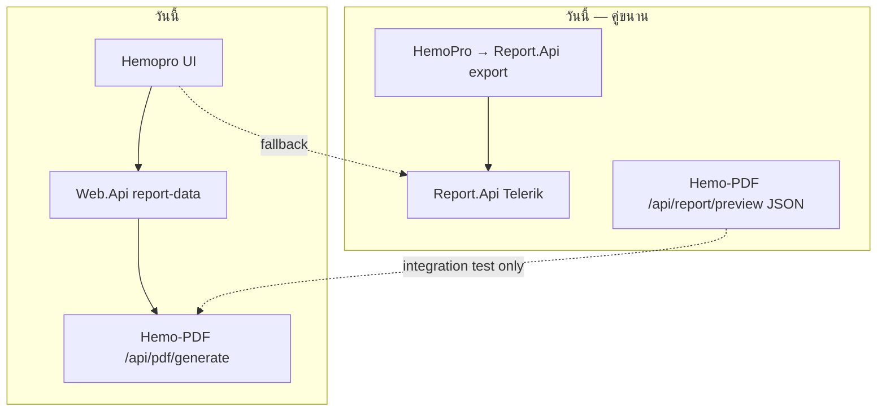
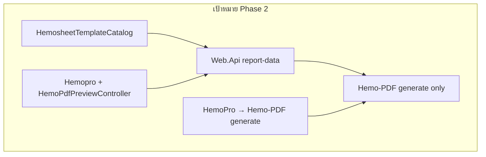
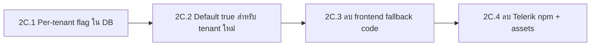

# PDF Chore Phase 2 — Template Catalog & Telerik Cutover

> **ขึ้นต่อจาก:** cleanup Phase 1 (unified pdf.js viewer + `HemoPdfPreviewController` + sync script)
> **สถานะ Phase 1:** เสร็จแล้ว — ดู `PDF-REPORT-SYSTEM.md` §9.1
> **เป้าหมาย Phase 2:** ลด dual stack, ทำให้เพิ่ม template/report ใหม่ predictable, และปิด Telerik path สำหรับ hemosheet ได้อย่างปลอดภัย
> **อัปเดต 2026-07-23:** Track **2A เสร็จ** — งานที่เหลือด้านล่าง + master checklist ใน [hemo-pdf_implementation](./hemo-pdf_implementation_8969dd4f.plan.md)

## Checklist งานที่เหลือ (Phase 2)

| Track | สถานะ | งาน |
|-------|--------|-----|
| **2A** Catalog BE+FE | ✅ | `HemosheetTemplateCatalog` + FE `hemo-pdf-report-catalog` |
| **2B** Preview pipeline | ⏳ | ตัดสินใจ deprecate `/api/report/preview` หรือลด dual ComposePdf+MapToPreview |
| **2B** Trim dual | ⏳ | Hemosheet: คง DOM preview หรือย้ายไป PDF-as-preview ทั้งหมด |
| **2C** Tenant flag | ⏳ | ย้าย `useHemoPdfPreview` → GlobalSetting (optional) / default on เมื่อพร้อม |
| **2C** Sunset FE | ⏳ | ลบ `tr-viewer`, Kendo CSS, toolbar hacks (embedded + reports) |
| **2D** Plugin send | ⏳ | `GenerateHemosheetPdf` → Hemo-PDF แทน Report.Api |
| **2E** Docs | ⏳ | อัปเดต `PDF-REPORT-SYSTEM.md` §7 + §9.4 หลัง catalog |

**ขึ้นกับภายนอก Phase 2:** Hemosheet visual parity ([03-IMPLEMENT-REPORT-LAYOUT.md](../../03-IMPLEMENT-REPORT-LAYOUT.md)) ควรถึงเกณฑ์ก่อนเปิด flag default / ลบ Telerik

---

## สถาปัตยกรรมปัจจุบัน vs เป้าหมาย





---

## ลำดับงาน (แนะนำ)

| ลำดับ | Track | ความเสี่ยง | ขึ้นกับ |
|-------|-------|-----------|---------|
| **2A** | Template Catalog (BE + FE) | ต่ำ | — |
| **2B** | Preview pipeline deprecate | กลาง | 2A (optional) |
| **2C** | Telerik sunset | สูง | 2A, rollout plan |
| **2D** | Plugin send → Hemo-PDF | กลาง | 2A, 2C partial |
| **2E** | Docs + checklist | ต่ำ | 2A |

**หลักการ:** ทำ **2A ก่อนเสมอ** — catalog เป็นฐานให้ FE gate, plugin send, และ HemoAdmin config ใช้ค่าเดียวกัน

---

## Track 2A — Template Catalog

### ปัญหา

- `HemosheetLayoutResolver.ResolveLayoutProfile` infer จากชื่อไฟล์ `.trdp` (`Contains("Thai")` อาจ match ผิด)
- Frontend `HEMO_PDF_REPORT_TEMPLATES` มีแค่ `hemosheet` — `reports.page` gate แค่ `report === 'hemosheet'`
- Telerik เลือก template ผ่าน `CoreReportResolver` + filename; Hemo-PDF ใช้ `template-04-hemosheet` คงที่

### เป้าหมาย

แหล่งความจริงเดียว (per tenant) ที่ map:

| Field | ตัวอย่าง |
|-------|----------|
| `Key` | `default` / `rama` / `thaiur` |
| `TelerikFile` | `Hemosheet-RAMA.trdp` (จนกว่าจะเลิก Telerik) |
| `HemoPdfTemplateId` | `template-04-hemosheet` |
| `LayoutProfile` | `HemosheetLayoutProfile.Rama` |
| `DisplayName` | สำหรับ HemoAdmin |

### Backend tasks

1. **สร้าง** `HemosheetTemplateCatalog.cs` ใน `Report.Contracts/Hemosheet/`
   - static registry + lookup by template filename หรือ explicit key
   - unit tests แทน/ขยาย `HemosheetLayoutResolverTests`

2. **แก้** `HemosheetLayoutResolver.ResolveLayoutProfile` ให้ delegate ไป catalog (ลบ `Contains("Thai")` heuristic)

3. **แก้** `CoreReportResolver.ResolveReportTemplate` ให้ validate ว่า filename อยู่ใน catalog (optional warn สำหรับ legacy `.trdp`)

4. **ขยาย DTO** (ถ้าจำเป็น): ส่ง `HemoPdfTemplateId` + `TemplateKey` ใน `LayoutContext` จาก `HemosheetReportDataService` — frontend ไม่ต้อง hardcode

5. **HemoAdmin:** `TenantHemosheetReportConfigStore` แสดง/บันทึก catalog key แทน free-text filename (optional ใน 2A, แนะนำถ้าจะ cutover Telerik)

### Frontend tasks

1. **ขยาย** `hemo-pdf-report-catalog.ts`:
   ```typescript
   export const HEMO_PDF_REPORT_TEMPLATES = {
     hemosheet: 'template-04-hemosheet',
     // dialysis-session: 'template-01-dialysis-session', // เมื่อพร้อม
   } as const;
   ```

2. **แก้** `reports.page` gate จาก `isHemosheetReport` → `isHemoPdfReport(report)` อ่านจาก catalog/map

3. **`HemoPdfPreviewController`:** รับ `reportTemplateId` จาก DTO `LayoutContext` ถ้ามี (fallback catalog)

### Acceptance criteria

- [ ] Tenant ตั้ง `Hemosheet-RAMA.trdp` → `LayoutProfile.Rama` ผ่าน catalog ไม่ใช่ string heuristic
- [ ] Unit test ครอบทุก entry ใน catalog (Default, Rama, ThaiUr)
- [ ] Frontend ไม่ hardcode `template-04-hemosheet` ใน provider (อ่านจาก request/DTO)

### ไฟล์หลัก

| Repo | Path |
|------|------|
| Hemo-backend | `Report.Contracts/Hemosheet/HemosheetLayoutResolver.cs` |
| Hemo-backend | `Report/CoreReportResolver.cs` |
| Hemo-backend | `Report/Services/HemosheetReportDataService.cs` |
| Hemo-frontend | `share/hemo-pdf/hemo-pdf-report-catalog.ts` |
| Hemo-frontend | `reports/reports.page.ts` |

---

## Track 2B — Deprecate `/api/report/preview` Dual Pipeline

### ปัญหา

- Hemosheet ต้อง maintain **คู่** `ComposePdf` (QuestPDF) + `MapToPreview` (ReportDocument JSON) ทุก section
- ThaiUr: PDF ใช้ `ThaiUrHemosheetForm` bypass; JSON preview ยังวิ่ง block planner → ไม่ WYSIWYG
- Hemopro **ไม่ใช้** preview JSON แล้ว — เหลือ integration test + `client/demo/report-preview-demo/index.html`

### ทางเลือก (เลือกหนึ่ง)

| ทาง | ข้อดี | ข้อเสีย |
|-----|-------|---------|
| **B1 — Soft deprecate** | เก็บ endpoint + test; mark `[Obsolete]` preview composers | ยัง maintain dual code |
| **B2 — Test-only** | ย้าย preview test ไป assert PDF bytes แทน JSON; ลบ preview renderers สำหรับ hemosheet | breaking สำหรับ demo HTML |
| **B3 — Full remove** | ลบ `ReportPreviewService`, preview factories, `IHemosheetSectionRenderer.MapToPreview` | งานใหญ่, กระทบ generic templates 02–12 |

**แนะนำ:** **B1 ระยะสั้น** → **B2 สำหรับ template-04** เมื่อไม่มี external consumer → **B3 ระยะยาว** เมื่อเลิก Telerik ครบ

### Tasks (B1 → B2)

1. เพิ่ม `[Obsolete]` + XML doc บน `ReportPreviewController`, `IReportPreviewService`
2. อัปเดต `PdfApiIntegrationTests` — เพิ่มเทส generate PDF สำหรับ ThaiUr profile parity
3. สำหรับ Hemosheet: ลบ `HemosheetReportDocumentComposer` path หรือ return 501 + message (ถ้า B2)
4. ลบ `MapToPreview` จาก section renderers ทีละ section (หรือ default throw `NotSupportedException`)
5. อัปเดต demo HTML ให้เรียก `/api/pdf/generate` + แสดง blob URL (แทน manual JSON render)

### Acceptance criteria

- [ ] Hemopro ไม่พึ่ง `/api/report/preview`
- [ ] Integration tests ยัง green (generate path)
- [ ] เอกสารระบุว่า preview JSON ไม่ใช่ WYSIWYG สำหรับ ThaiUr (จนกว่าจะลบ)

### ไฟล์หลัก

| Repo | Path |
|------|------|
| Hemo-PDF | `Hemo.Pdf.Api/Controllers/ReportPreviewController.cs` |
| Hemo-PDF | `Hemo.Pdf.Application/ReportPreviewService.cs` |
| Hemo-PDF | `Layouts/Template04_Hemosheet/*ReportDocumentComposer*` |
| Hemo-PDF | `tests/Hemo.Pdf.Integration.Tests/PdfApiIntegrationTests.cs` |

---

## Track 2C — Telerik Sunset

### ปัญหา

- `useHemoPdfPreview` เป็น **frontend-only** flag ใน `config.json`
- `reports.page` + `embedded-hemosheet-report` ยังมี `tr-viewer` branch + Kendo CSS + toolbar hacks
- `@progress/telerik-angular-report-viewer` ยังเป็น dependency ใหญ่

### Rollout แนะนำ



### Tasks

1. **Backend (optional แต่แนะนำ):** `GlobalSetting.Hemosheet.Report.UseHemoPdfPreview` หรือใช้ channel ใน tenant config
2. **Frontend:** อ่าน flag จาก API config แทน/คู่ `config.json`
3. **ขยาย gate:** report อื่น (เช่น `hemorecord`) เมื่อมี Hemo-PDF template ใน catalog
4. **ลบเมื่อพร้อม:**
   - `TelerikReportingModule`, `tr-viewer` templates
   - `embedded-hemosheet-report-toolbar.ts`, `telerik-viewer-teardown.util.ts`
   - Kendo CSS links
   - `@progress/telerik-angular-report-viewer` จาก `package.json`
5. **HemoAdmin / tenant detail:** toggle preview engine (ถ้ามี flag ฝั่ง server)

### Acceptance criteria

- [ ] Tenant production ทั้งหมด preview ผ่าน Hemo-PDF (monitor ก่อนลบ Telerik)
- [ ] ไม่มี `tr-viewer` ใน bundle production build
- [ ] Report.Api ยังรันได้สำหรับ report ที่ยังไม่ migrate (ถ้ายังมี)

### ไฟล์หลัก

| Repo | Path |
|------|------|
| Hemo-frontend | `reports/reports.page.ts/html` |
| Hemo-frontend | `embedded-hemosheet-report/*` |
| Hemo-frontend | `assets/config/config.json` |
| Hemo-frontend | `package.json` (telerik dep) |

---

## Track 2D — Plugin Send → Hemo-PDF

### ปัญหา

- **Preview** ใช้ Hemo-PDF (`/api/pdf/generate`)
- **Send PDF** (`DocumentHandler` → `HemoPro.GenerateHemosheetPdf`) ยังเรียก **Report.Api** Telerik export
- ผลลัพธ์ PDF อาจไม่ตรงกับที่ user เห็นใน preview

### Tasks

1. **สร้าง** `IHemoPdfClient` ใน `Services.Core` (หรือขยาย `HemoPro`):
   - `POST {PdfApiUrl}/api/pdf/generate`
   - body: `reportTemplateId`, `tenantCode`, `entityId`, `data` (ดึงจาก `HemosheetReportDataService` หรือ reuse mapper)

2. **แก้** `HemoPro.GenerateHemosheetPdf`:
   - เรียก Hemo-PDF แทน `exportPdfUrl`
   - feature flag: `Report:UseHemoPdfForSend` per tenant (rollback ได้)

3. **Config:** `appsettings` — `PdfApiUrl` (มีอยู่แล้วฝั่ง frontend; เพิ่มฝั่ง Web.Api/JobServer)

4. **Test:** unit test mock HTTP; integration test send-pdf flow (ถ้ามี)

### Acceptance criteria

- [ ] PDF จาก send-pdf ตรงกับ preview (same engine + same DTO)
- [ ] Rollback ไป Telerik ได้ด้วย flag จนกว่าจะมั่นใจ

### ไฟล์หลัก

| Repo | Path |
|------|------|
| Hemo-backend | `Services.Core/HemoPro.cs` |
| Hemo-backend | `PluginBase/DocumentHandler.cs` |
| Hemo-backend | `Report/Services/HemosheetReportDataService.cs` |

---

## Track 2E — Checklist เพิ่ม Template/Report ใหม่

หลัง **2A** เสร็จ ใช้ checklist นี้เป็นมาตรฐาน (อัปเดตใน `PDF-REPORT-SYSTEM.md` §7):

### Report ใหม่ (เช่น `dialysis-session`)

```
□ Hemo-PDF: ReportTemplates.cs + DataProvider + Composer (+ TemplateRegistration)
□ Hemo-PDF: integration test + mock JSON
□ Backend: *ReportDataService + DTO + controller endpoint
□ Backend: catalog entry (Telerik file ถ้ายังใช้, HemoPdfTemplateId, profile)
□ Frontend: HEMO_PDF_REPORT_TEMPLATES + isHemoPdfReport gate
□ Frontend: data fetch method ใน HemoDialysisService
□ Consumer: HemoPdfPreviewController.load({ reportKey, ... })
□ HemoAdmin: tenant config (ถ้าเลือก variant ได้)
□ Manual: preview + print + send-pdf parity
```

### Hemosheet section ใหม่ (template-04 เท่านั้น)

```
□ HemosheetSectionId + IHemosheetSectionRenderer.ComposePdf
□ HemosheetLayoutPlanner (ถ้าต้องตัดสิน visibility)
□ MapToPreview — เฉพาะถ้ายังไม่ deprecate track 2B
□ Mock scenario ใน assets/mock-data/
```

---

## ความเสี่ยงและการลดความเสี่ยง

| ความเสี่ยง | การลด |
|-----------|--------|
| Send PDF ไม่ตรง preview หลัง 2D | feature flag + compare bytes ใน staging |
| ลบ Telerik เร็วเกิน | per-tenant flag + monitor ก่อน 2C.3 |
| ลบ preview pipeline ทำลาย test | ย้าย test ไป generate ก่อนลบ |
| Catalog migration ผิด tenant | migration script map filename เดิม → catalog key |

---

## Definition of Done (Phase 2 ทั้งก้อน)

- [ ] Template catalog เป็นแหล่งความจริงเดียว BE/FE สำหรับ hemosheet variants
- [ ] Hemosheet ไม่บังคับ maintain MapToPreview (หรือ mark deprecated ชัดเจน)
- [ ] ไม่มี Telerik ใน Hemopro สำหรับ hemosheet preview (2C)
- [ ] Plugin send ใช้ Hemo-PDF สำหรับ hemosheet (2D)
- [ ] `PDF-REPORT-SYSTEM.md` อัปเดต checklist + architecture diagram

---

## Quick start (สำหรับ implementer)

```bash
# เริ่มที่ Track 2A
# 1. Backend catalog + tests
dotnet test HemoDialysisPro/Wasenshi.HemoDialysisPro.Services.Test/...

# 2. Frontend catalog + gate
cd Hemo-frontend && npx tsc -p tsconfig.app.json --noEmit

# 3. หลังแก้ viewer (ถ้ามี)
npm run sync:report-viewer -- --check
```

**อย่าเริ่ม 2C/2D ก่อน 2A** — จะได้ไม่แก้ template selection ซ้ำหลายรอบ
