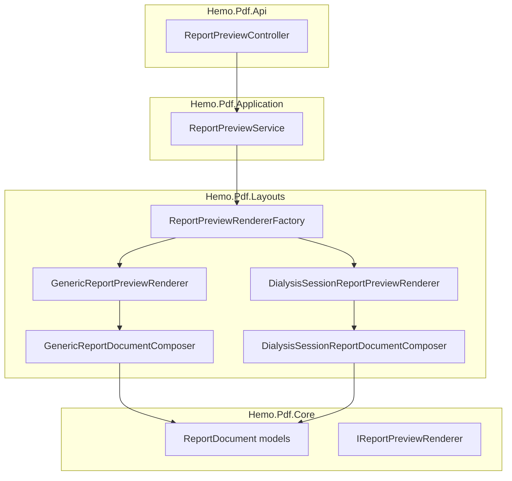
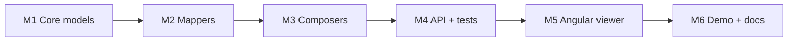

# แผน Phase 6 — Report Preview (พร้อมดำเนินการ)

อ้างอิง [02-FEATURE-PREVIEW-PDF.md](D:\GoodRepo\Hemo-PDF\02-FEATURE-PREVIEW-PDF.md) | ขอบเขตรอบนี้: **Hemo-PDF repo เท่านั้น** (Hemopro migration รอบถัดไป)

---

## เป้าหมาย Deliverable รอบนี้

เมื่อจบรอบนี้ต้องทำได้:

1. `POST /api/report/preview` คืน `ReportDocument` JSON (auth + tenant + rate limit เหมือน PDF)
2. Generic templates 02–12 + `template-01-dialysis-session` มี preview document จริง
3. `@hemo/report-viewer` render preview ใน browser (toolbar + A4 page + blocks)
4. Demo page ใน `client/` หรือ Swagger example ทดสอบ end-to-end ได้โดยไม่ต้องเปิด Hemopro
5. Integration tests ผ่าน (`dotnet test Hemo.Pdf.sln`)

**นอกขอบเขตรอบนี้:** `template-04-hemosheet` dedicated layout, Hemopro `embedded-hemosheet-report` migration

---

## สถาปัตยกรรมที่จะ implement



**หลักการ:** mirror pattern ที่มีอยู่แล้วใน [`PdfGenerationService`](D:\GoodRepo\Hemo-PDF\src\Hemo.Pdf.Application\PdfGenerationService.cs) + [`BaseReportRenderer`](D:\GoodRepo\Hemo-PDF\src\Hemo.Pdf.Layouts\Base\BaseReportRenderer.cs) — reuse `IReportDataProvider`, guard, branding; เปลี่ยน output จาก `QuestLayout` เป็น `ReportDocument`

---

## Milestone 1 — Core models + JSON contract

**ไฟล์ใหม่ใน** [`Hemo.Pdf.Core/Models/Preview/`](D:\GoodRepo\Hemo-PDF\src\Hemo.Pdf.Core)

| ไฟล์ | หน้าที่ |
|------|--------|
| `ReportDocument.cs` | root DTO: meta, branding, header, pages, footer |
| `ReportPage.cs` | `blocks[]` |
| `ReportHeaderBlock.cs`, `ReportFooterBlock.cs` | header/footer |
| `ReportBlock.cs` | base + `[JsonPolymorphic]` สำหรับ `patient-info`, `key-value-table`, `data-grid`, `checklist-table`, `signature`, `text` |
| `LabelValue.cs`, `SignatureSlot.cs`, `ChecklistCell.cs` | shared types |

**Abstractions ใหม่:**

- [`IReportDocumentComposer`](D:\GoodRepo\Hemo-PDF\src\Hemo.Pdf.Core\Abstractions) — `ReportDocument Compose(object viewModel, PdfReportContext context)`
- `IReportPreviewRenderer` — `Task<ReportDocument> RenderPreviewAsync(PdfReportContext, CancellationToken)`
- `IReportPreviewRendererFactory` — mirror [`IReportRendererFactory`](D:\GoodRepo\Hemo-PDF\src\Hemo.Pdf.Core\Factory)

**Unit test:** serialize/deserialize `ReportDocument` round-trip ใน [`Hemo.Pdf.Core.Tests`](D:\GoodRepo\Hemo-PDF\tests\Hemo.Pdf.Core.Tests)

---

## Milestone 2 — Preview mappers (Sections → blocks)

**โฟลเดอร์ใหม่:** `Hemo.Pdf.Sections/Preview/`

สร้าง static mapper classes (ไม่พึ่ง QuestPDF) คู่กับ section ที่มี:

| Mapper | Output block | อ้างอิง section |
|--------|-------------|----------------|
| `HeaderPreviewMapper` | `ReportHeaderBlock` + branding ใน document root | [`ConfigurableHeaderSection`](D:\GoodRepo\Hemo-PDF\src\Hemo.Pdf.Sections\Headers\ConfigurableHeaderSection.cs) |
| `KeyValueTablePreviewMapper` | `key-value-table` | [`KeyValueTableSection`](D:\GoodRepo\Hemo-PDF\src\Hemo.Pdf.Sections\Content\KeyValueTableSection.cs) + [`SimpleReportViewModel`](D:\GoodRepo\Hemo-PDF\src\Hemo.Pdf.Core\Models\SimpleReportViewModel.cs) |
| `PatientInfoPreviewMapper` | `patient-info` | `PatientInfoSection` |
| `DataGridPreviewMapper` | `data-grid` | `DataGridSection` |
| `SignaturePreviewMapper` | `signature` | `SignatureBlockSection` |
| `FooterPreviewMapper` | `ReportFooterBlock` | `ConfigurableFooterSection` |

**Branding mapping:** อ่าน `context.Branding` → `logoUrl` (base64 จาก `imageBytes` ถ้ามี), `companyLines`, `alignment`

**Unit test:** [`Hemo.Pdf.Sections.Tests`](D:\GoodRepo\Hemo-PDF\tests\Hemo.Pdf.Sections.Tests) — mapper คืน field ถูกต้องจาก mock ViewModel

---

## Milestone 3 — Layout composers + renderer factory

**โฟลเดอร์ใหม่ใน** [`Hemo.Pdf.Layouts/`](D:\GoodRepo\Hemo-PDF\src\Hemo.Pdf.Layouts)

```
Preview/
  Base/
    BaseReportDocumentComposer.cs    # wire header/footer mappers
    BaseReportPreviewRenderer.cs     # DataProvider → Composer (ไม่เรียก QuestPDF)
  Generic/
    GenericReportDocumentComposer.cs
    GenericReportPreviewRenderer.cs
  Template01_DialysisSession/
    DialysisSessionReportDocumentComposer.cs
    DialysisSessionReportPreviewRenderer.cs
```

**`GenericReportDocumentComposer`:** map [`SimpleReportViewModel.Rows`](D:\GoodRepo\Hemo-PDF\src\Hemo.Pdf.Core\Models\SimpleReportViewModel.cs) → `key-value-table` block (ครอบ template 02–12 ทันที)

**`DialysisSessionReportDocumentComposer`:** mirror [`DialysisSessionComposer`](D:\GoodRepo\Hemo-PDF\src\Hemo.Pdf.Layouts\Template01_DialysisSession\DialysisSessionComposer.cs) block order: patient-info → key-value → data-grid → signature

**Factory:** ขยาย [`TemplateRegistration.cs`](D:\GoodRepo\Hemo-PDF\src\Hemo.Pdf.Layouts\TemplateRegistration.cs) + [`TemplateReportRendererFactory`](D:\GoodRepo\Hemo-PDF\src\Hemo.Pdf.Layouts\TemplateReportRendererFactory.cs) ให้ register preview renderer ต่อ template id (fallback → Generic)

---

## Milestone 4 — Application service + API

**ไฟล์ใหม่:**

- [`IReportPreviewService.cs`](D:\GoodRepo\Hemo-PDF\src\Hemo.Pdf.Application) + `ReportPreviewService.cs`
  - copy orchestration จาก `PdfGenerationService` (guard → branding → signatures → context → factory)
  - เรียก `IReportPreviewRenderer` แทน `IReportRenderer`
- [`ReportPreviewController.cs`](D:\GoodRepo\Hemo-PDF\src\Hemo.Pdf.Api\Controllers) — `POST /api/report/preview`
  - `[Authorize]`, `[EnableRateLimiting("PdfGeneration")]`
  - body: `GeneratePdfRequest` (reuse model เดิม)
  - response: `Ok(ReportDocument)`

**DI:** ลงทะเบียนใน [`ServiceCollectionExtensions.AddHemoPdf`](D:\GoodRepo\Hemo-PDF\src\Hemo.Pdf.Application\ServiceCollectionExtensions.cs)

**Swagger:** เพิ่ม `ReportPreviewOperationFilter` คล้าย [`GeneratePdfOperationFilter`](D:\GoodRepo\Hemo-PDF\src\Hemo.Pdf.Api\Swagger)

**Exception handler:** ขยาย [`Program.cs`](D:\GoodRepo\Hemo-PDF\src\Hemo.Pdf.Api\Program.cs) ให้ map `PdfGenerationForbiddenException` → 403 สำหรับ preview path ด้วย

**Integration tests** ใน [`PdfApiIntegrationTests.cs`](D:\GoodRepo\Hemo-PDF\tests\Hemo.Pdf.Integration.Tests\PdfApiIntegrationTests.cs):

- `Preview_ReturnsJson` — template-02 → `application/json`, มี `meta.templateId`, `pages[0].blocks`
- `Preview_AllTwelveTemplates_ReturnDocument` — smoke ครบ 12 (generic fallback OK)
- `Preview_TenantA_And_TenantB_DifferentBranding` — `branding.companyLines` ต่างกัน
- `Preview_UnsignedRequiredTemplate_Returns403` — template ที่ `RequiresSignature`

---

## Milestone 5 — Angular `@hemo/report-viewer`

**Scaffold:** `client/projects/hemo-report-viewer/` — mirror โครง [`hemo-pdf-client`](D:\GoodRepo\Hemo-PDF\client\projects\hemo-pdf-client)

```
hemo-report-viewer/
  package.json                    # @hemo/report-viewer
  src/lib/
    models/report-document.model.ts
    tokens/hemo-report-viewer-config.token.ts   # reuse pdfApiUrl pattern
    services/hemo-report-preview.service.ts     # POST /api/report/preview
    components/
      hemo-report-viewer.component.ts
      hemo-report-page.component.ts
      hemo-report-toolbar.component.ts
      blocks/
        key-value-table-block.component.ts
        patient-info-block.component.ts
        data-grid-block.component.ts
        signature-block.component.ts
      hemo-report-header.component.ts
      hemo-report-footer.component.ts
    styles/report-viewer.scss
    public-api.ts
```

**MVP components รอบนี้:**

| Component | จำเป็นสำหรับ |
|-----------|-------------|
| `key-value-table-block` | Generic 02–12 |
| `patient-info-block`, `data-grid-block`, `signature-block` | template-01 |
| `hemo-report-header/footer` | branding |
| `hemo-report-toolbar` | zoom +/-, page nav, print/download events |
| `hemo-report-viewer` | dispatch block ตาม `type` |

**Toolbar print/download:** emit event → parent เรียก [`HemoPdfService`](D:\GoodRepo\Hemo-PDF\client\projects\hemo-pdf-client\src\lib\services\hemo-pdf.service.ts) (optional inject ผ่าน `@Optional()`)

**CSS:** mirror [`PdfStyleDefaults`](D:\GoodRepo\Hemo-PDF\src\Hemo.Pdf.Core\Constants\PdfStyleDefaults.cs) เป็น CSS variables; A4 `210mm` / margin `10mm`

**ยังไม่ทำรอบนี้:** `checklist-table-block`, `HemoReportPreviewModalComponent` (Ionic) — ใส่ใน backlog; demo ใช้ standalone page แทน

---

## Milestone 6 — Demo + docs

**Demo:** `client/demo/report-preview-demo/` (หรือ HTML ง่าย ๆ ใน README) — ปุ่มเลือก template → เรียก preview API → แสดง `<hemo-report-viewer>`

ทางเลือกที่เร็วกว่า: เพิ่ม curl + Swagger example ใน README ก่อน แล้วค่อยทำ Angular demo page

**อัปเดต docs:**

- [02-FEATURE-PREVIEW-PDF.md](D:\GoodRepo\Hemo-PDF\02-FEATURE-PREVIEW-PDF.md) — เปลี่ยนสถานะ checklist เป็น done ตาม milestone
- [README.md](D:\GoodRepo\Hemo-PDF\README.md) — คำสั่ง curl preview + วิธีรัน demo

**ตัวอย่าง curl:**

```bash
curl -X POST http://localhost:5090/api/report/preview \
  -H "Content-Type: application/json" \
  -H "X-Tenant-Code: tenant-demo-a" \
  -H "Authorization: Bearer dev" \
  -d '{"reportTemplateId":"template-02-lab-result","tenantCode":"tenant-demo-a","entityId":"test-1","data":{"patientName":"Test"}}'
```

---

## ลำดับ commit แนะนำ



| Commit | เนื้อหา |
|--------|--------|
| 1 | Core `ReportDocument` models + JSON polymorphism + unit tests |
| 2 | Section preview mappers + unit tests |
| 3 | Layout preview composers + factory + `ReportPreviewService` |
| 4 | `ReportPreviewController` + integration tests |
| 5 | `@hemo/report-viewer` library (MVP blocks + toolbar) |
| 6 | Demo + README + อัปเดต feature doc status |

---

## ความเสี่ยงและการลดความเสี่ยง

| ความเสี่ยง | แนวทาง |
|-----------|--------|
| Dual maintenance PDF + Preview | เริ่มจาก mapper แยก static class; ViewModel เดียวกัน; test คู่กัน |
| Logo ใน preview | ส่งเป็น base64 data URL จาก `branding.Header.Logo` — ไม่ต้อง hosted URL |
| Generic hemosheet ไม่พอ | ยอมรับในรอบนี้ — template-04 ยังได้ generic key-value; dedicated รอบถัดไป |
| Angular lib ไม่มี Nx workspace | copy pattern จาก `hemo-pdf-client` (standalone package, peer deps) |

---

## รอบถัดไป (นอกแผนนี้)

- `HemosheetReportDocumentComposer` + `checklist-table` block
- `HemoReportPreviewModalComponent` (Ionic 90dvh)
- Integrate เข้า [Hemo-frontend](D:\GoodRepo\Hemo-frontend) แทน `tr-viewer`
- Copy ฟอนต์ Sarabun → `assets/fonts/` + `@font-face` ใน viewer
