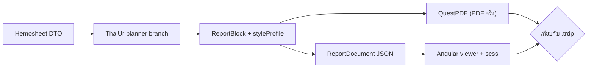

# ThaiUR Hemosheet Pixel Parity

## เป้าหมาย
ทำให้ report `template-04-hemosheet` **profile ThaiUr** ออกมาเหมือน `Hemosheet-ThaiUR.trdp` แบบ pixel-perfect (ฟอร์ม "Hemodialysis Record" อัดแน่น 1 หน้า) โดยยึด ThaiUR เป็น baseline ก่อน แล้วจึงแตกไป Default/tenant อื่นภายหลัง ต้องคงความยืดหยุ่นของ block/section เดิม และทำให้ PDF (QuestPDF) กับ preview (Angular viewer) หน้าตาตรงกัน

## ช่องว่างหลัก (ปัจจุบัน vs ThaiUR)
- สีแถบหัวข้อ: ปัจจุบัน `#dce6f2` (ฟ้าอ่อน) ตัวอักษรดำ -> ThaiUR ใช้ **`rgb(192,192,255)` = #C0C0FF** (ลาเวนเดอร์)
- ฟอนต์: ปัจจุบัน Sarabun -> ThaiUR ใช้ **Microsoft Sans Serif** (ส่วนใหญ่ 7.5pt, title 18pt) + fallback ไทย
- เส้นขอบ: ปัจจุบัน `0.5f` hardcode ทุก section -> ThaiUR **0.4pt**
- density: ปัจจุบัน block-flow กระจาย 2 หน้า -> ThaiUR grid 2 คอลัมน์ อัดแน่น 1 หน้า
- ลำดับ/label section, ตาราง (มีคอลัมน์ MAP, Cond., Nursing Diagnosis/Intervention/Outcomes) และกลุ่ม checkbox ล่าง 4 กลุ่ม แตกต่างจากที่ [`HemosheetLayoutPlanner`](d:/GoodRepo/Hemo-PDF/src/Hemo.Pdf.Layouts/Hemosheet/HemosheetLayoutPlanner.cs) สร้างอยู่

## แนวทางสถาปัตยกรรม (คงความยืดหยุ่น)
1. คงรูปแบบ "map once, render both": data -> `ReportBlock` -> ทั้ง QuestPDF ([`ReportBlockPdfComposer`](d:/GoodRepo/Hemo-PDF/src/Hemo.Pdf.Sections/Content/ReportBlockPdfComposer.cs)) และ Angular viewer
2. เพิ่มชั้น **style profile / per-block style override** เพื่อให้ ThaiUR กำหนดสี/เส้น/ฟอนต์/padding ต่างจาก Default ได้ โดยไม่กระทบ template อื่น (ปัจจุบันสไตล์ถูก hardcode รวมศูนย์ที่ [`PdfSectionMetrics`](d:/GoodRepo/Hemo-PDF/src/Hemo.Pdf.Core/Constants/PdfSectionMetrics.cs)/[`PdfStyleDefaults`](d:/GoodRepo/Hemo-PDF/src/Hemo.Pdf.Core/Constants/PdfStyleDefaults.cs))
3. เพิ่ม **ThaiUr branch** ใน planner + section renderers เพื่อจัด layout 2 คอลัมน์ตามฟอร์ม โดยใช้ block ที่มี/เพิ่มใหม่ (ไม่ใช้ absolute positioning; ใช้ nested table + column weight + fixed row height ที่แปลงจากค่า mm ของ .trdp -> ได้ผลตรงตาแต่ยัง maintain ได้)
4. Mirror ทุกการเปลี่ยนแปลงใน Angular viewer + `report-viewer.scss` แล้ว sync ด้วย `scripts/sync-report-viewer.mjs`

## ไฟล์อ้างอิงหลัก
- Engine: [`HemosheetLayoutPlanner.cs`](d:/GoodRepo/Hemo-PDF/src/Hemo.Pdf.Layouts/Hemosheet/HemosheetLayoutPlanner.cs), [`HemosheetLayoutProfileRegistry.cs`](d:/GoodRepo/Hemo-PDF/src/Hemo.Pdf.Layouts/Hemosheet/HemosheetLayoutProfileRegistry.cs), [`Renderers/HemosheetSectionRenderers.cs`](d:/GoodRepo/Hemo-PDF/src/Hemo.Pdf.Layouts/Hemosheet/Renderers/HemosheetSectionRenderers.cs), [`Renderers/HemosheetParitySectionRenderers.cs`](d:/GoodRepo/Hemo-PDF/src/Hemo.Pdf.Layouts/Hemosheet/Renderers/HemosheetParitySectionRenderers.cs)
- Block model + mappers: [`ReportBlock.cs`](d:/GoodRepo/Hemo-PDF/src/Hemo.Pdf.Core/Models/Preview/ReportBlock.cs), `HemosheetPreviewMappers.cs`
- Style/geometry: [`PdfSectionMetrics.cs`](d:/GoodRepo/Hemo-PDF/src/Hemo.Pdf.Core/Constants/PdfSectionMetrics.cs), [`PdfStyleDefaults.cs`](d:/GoodRepo/Hemo-PDF/src/Hemo.Pdf.Core/Constants/PdfStyleDefaults.cs), [`ReportPageLayout.cs`](d:/GoodRepo/Hemo-PDF/src/Hemo.Pdf.Core/Constants/ReportPageLayout.cs), `FontRegistration.cs`
- Target ต้นฉบับ: `d:/GoodRepo/Hemo-Report/Hemosheet-ThaiUR.trdp` (ภายใน: `definition.xml` = layout, `invariant.res` = พิกัด/label)
- Angular viewer: `d:/GoodRepo/Hemo-PDF/client/projects/hemo-report-viewer/src/lib/components/blocks/*`

## หมายเหตุ/ข้อควรระวัง
- "pixel-perfect" ในกระดาษ flow-based (QuestPDF) จะทำโดยจับสัดส่วน/ความสูงแถวให้ตรง ไม่ใช่ absolute x/y ของ Telerik — ต่างจริงระดับ sub-mm อาจมี ผมจะ tune จนตาแยกไม่ออก
- ฟอนต์ Microsoft Sans Serif เป็นฟอนต์ Windows หากรันบน Linux ต้อง embed ttf ที่เทียบเท่า (หรือ Arial/Liberation Sans) + Sarabun/Noto ไว้รองรับไทย — จะยืนยันฟอนต์ที่ฝังตอน implement
- ทุกการปรับ block ต้องแก้ทั้งฝั่ง C# และ Angular เพื่อให้ preview กับ PDF ตรงกัน