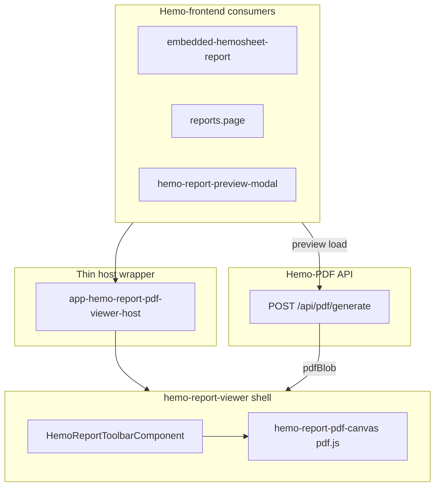

# Unified Custom Viewer — pdf.js มาตรฐานเดียว (เลิก iframe + blocks preview)

## การตัดสินใจ (อัปเดตจาก feedback)

ใช้ **pdf.js canvas เป็นทางเดียว** สำหรับ preview ทุก template (Default, Rama, ThaiUR และ tenant อื่นในอนาคต)

เหตุผล:

- report ทุก tenant มีความซับซ้อนใกล้เคียงกัน — ไม่จำเป็นต้องแยก engine
- **มาตรฐานเดียว** = code path เดียว, toolbar เดียว, debug ง่าย
- WYSIWYG ~100% กับ PDF ที่พิมพ์ (byte เดียวกัน)
- ลดการดูแล dual composer path ฝั่ง frontend (blocks vs pdf vs iframe)

Trade-off ที่ยอมรับ:

- Preview ช้ากว่า JSON blocks เล็กน้อย (ต้อง `POST /api/pdf/generate` ก่อนแสดง)
- โหลด pdf.js chunk ครั้งแรกที่เปิด preview (~300–500KB lazy)

---

## ปัญหาปัจจุบัน

- [hemo-report-pdf-viewer-host.component.ts](d:\GoodRepo\Hemo-frontend\src\app\share\hemo-pdf\hemo-report-pdf-viewer-host.component.ts) แยก **iframe** (ThaiUR) vs **blocks** (Default/Rama)
- iframe zoom ไม่ work (พึ่ง browser PDF viewer)
- 3 code paths ใน frontend: iframe / blocks / Telerik fallback — บำรุงรักษายาก

## เป้าหมาย




- **ทุก template** → `generate PDF` → `pdf.js` canvas → toolbar ของเรา
- Lazy load `pdfjs-dist` ครั้งแรกที่เปิด preview (ไม่ใช่ตอน boot แอป)
- ลบ iframe, ลบ `pdfBlobUrl`, ลบ blocks path จาก viewer shell ใน Hemopro

## หลักการสำคัญ (workflow ที่มีอยู่)

ตาม [PDF-REPORT-SYSTEM.md §9.3](d:\GoodRepo\Hemo-PDF.cursor\docs\PDF-REPORT-SYSTEM.md):

1. แก้ viewer ที่ **lib** ก่อน: `Hemo-PDF/client/projects/hemo-report-viewer/src/lib/`
2. รัน `npm run sync:report-viewer` ใน Hemo-frontend
3. แก้ glue ฝั่ง frontend: providers, host, consumers

---

## Phase 1 — Viewer shell ใหม่ใน lib (Hemo-PDF)

### 1.1 สร้าง PdfCanvas component

ไฟล์ใหม่: `client/projects/hemo-report-viewer/src/lib/components/hemo-report-pdf-canvas.component.ts`

- Input: `pdfBlob: Blob | null`, `pageIndex`, `scale`
- Dynamic import `pdfjs-dist` (lazy chunk)
- Worker: `/assets/pdfjs/pdf.worker.min.mjs` (copy ฝั่ง consumer)
- `getDocument({ data })` → `getPage(n)` → `render` ลง `<canvas>`
- `@Output() pageCountChange` หรือ signal สำหรับ pagination
- `cancel()` render เก่าเมื่อ scale/page/blob เปลี่ยน
- `updateFitScale()` จาก page viewport width + ResizeObserver

### 1.2 ปรับ hemo-report-viewer (ทางเดียว)

แก้ [hemo-report-viewer.component.ts](d:\GoodRepo\Hemo-PDF\client\projects\hemo-report-viewer\src\lib\components\hemo-report-viewer.component.ts):

**ลบออกจาก viewer shell:**

- Input `document` / `renderMode`
- Template branch `hemo-report-page` + blocks scale-wrap
- Logic `pageCount` จาก `document.pages`

**คงไว้ / เพิ่ม:**

- Input `pdfBlob: Blob | null` (required สำหรับแสดงผล)
- `hemo-report-toolbar` + `hemo-report-pdf-canvas` เท่านั้น
- zoom/page ผ่าน pdf.js viewport scale
- loading / error states
- `printing` / `downloading` busy state ใน toolbar

**Block components** (`hemo-report-page`, block-outlet, ฯลฯ) — **ไม่ลบจาก lib** แต่ไม่ mount ใน Hemopro preview อีก (ยังใช้ได้ใน demo Hemo-PDF / อนาคตถ้าต้องการ)

### 1.3 Styles

แก้ [report-viewer.scss](d:\GoodRepo\Hemo-PDF\client\projects\hemo-report-viewer\src\lib\styles\report-viewer.scss):

- เพิ่ม `.hemo-report-pdf-canvas` (canvas, shadow, พื้นหลังเทา)
- ลบ/ลด styles ที่ใช้เฉพาะ blocks preview ใน viewer shell (page A4 mock) ถ้าไม่ถูก mount อีก

### 1.4 Export

แก้ [public-api.ts](d:\GoodRepo\Hemo-PDF\client\projects\hemo-report-viewer\src\public-api.ts) — export `hemo-report-pdf-canvas`

**ไม่ต้องสร้าง** `viewer-render-mode.model.ts` (ไม่มี dual mode แล้ว)

---

## Phase 2 — Sync lib → frontend

```bash
cd Hemo-frontend
npm run sync:report-viewer
```

---

## Phase 3 — ปรับ data flow ฝั่ง frontend (มาตรฐานเดียว)

### 3.1 Payload เรียบง่าย

แก้ [hemo-pdf-preview.util.ts](d:\GoodRepo\Hemo-frontend\src\app\share\hemo-pdf\hemo-pdf-preview.util.ts):

```ts
export interface HemosheetPreviewPayload {
  pdfBlob: Blob | null;
}
```

- ลบ `document`, `pdfBlobUrl`, `renderMode`
- ลบ `revokeHemosheetPreviewUrl()` (ไม่ใช้ object URL)
- ลบ `isThaiUrHemosheetProfile()` จาก preview path (อาจเก็บไว้ที่อื่นถ้ายังใช้ — ถ้าไม่ใช้แล้วลบ)
- `hasHemosheetPreviewContent()` → `!!payload?.pdfBlob`

### 3.2 Provider — generate PDF ทุก template

แก้ [hemo-pdf.providers.ts](d:\GoodRepo\Hemo-frontend\src\app\share\hemo-pdf\hemo-pdf.providers.ts):

```ts
loadHemosheetPreview(request) {
  return requestPdfBlob(http, config(), request).pipe(
    map((blob) => ({ pdfBlob: blob })),
  );
}
```

- ลบ branch `isThaiUrHemosheetProfile` → preview API
- ลบ `POST /api/report/preview` จาก preview load path (API ยังอยู่บน server สำหรับ demo/tests)

`loadPreview()` อาจ deprecate หรือเปลี่ยนให้เรียก generate เช่นกัน — ตรวจ callers ก่อนลบ

### 3.3 Slim down host

แก้ [hemo-report-pdf-viewer-host.component.ts](d:\GoodRepo\Hemo-frontend\src\app\share\hemo-pdf\hemo-report-pdf-viewer-host.component.ts):

- ลบ iframe ทั้งหมด + DomSanitizer + embed toolbar/styles
- Thin wrapper:

```html
<hemo-report-viewer
  [pdfBlob]="pdfBlob"
  [loading]="loading"
  [errorMessage]="errorMessage"
  [printing]="printing"
  [downloading]="downloading"
  (print)="print.emit()"
  (download)="download.emit()" />
```

### 3.4 Consumers (3 จุด)


| ไฟล์                                                                                                                                                                                 | เปลี่ยน                                                                      |
| ------------------------------------------------------------------------------------------------------------------------------------------------------------------------------------ | ---------------------------------------------------------------------------- |
| [embedded-hemosheet-report.component.ts](d:\GoodRepo\Hemo-frontend\src\app\doctor-view\patient-overview\components\embedded-hemosheet-report\embedded-hemosheet-report.component.ts) | ลบ `reportDocument`, `pdfBlobUrl`; เหลือ `previewPdfBlob` + `pdfBlob` signal |
| [reports.page.ts/html](d:\GoodRepo\Hemo-frontend\src\app\reports\reports.page.ts)                                                                                                    | ลบ `hemoPdfDocument`; เหลือ blob เดียว                                       |
| [hemo-report-preview-modal.component.ts](d:\GoodRepo\Hemo-frontend\src\app\reports\hemo-report-preview-modal\hemo-report-preview-modal.component.ts)                                 | เหมือนกัน                                                                    |


เก็บ `previewPdfBlob` สำหรับ print โดยตรง (ไม่ regenerate)

---

## Phase 4 — Dependency + assets

### 4.1 ติดตั้ง pdf.js

```bash
cd Hemo-frontend
npm install pdfjs-dist
```

### 4.2 Worker asset

- Copy `node_modules/pdfjs-dist/build/pdf.worker.min.mjs` → `src/assets/pdfjs/pdf.worker.min.mjs`
- ตั้ง worker ใน pdf-canvas: `/assets/pdfjs/pdf.worker.min.mjs`

### 4.3 Lazy load คืออะไร (ในแผนนี้)

- **ไม่ใช่** lazy เฉพาะ ThaiUR
- **คือ** lazy โหลด library `pdfjs-dist` ครั้งแรกที่ user เปิด report preview ใดก็ได้
- หลังจากนั้น chunk อยู่ใน cache ของ browser แล้ว

---

## Phase 5 — อัปเดตเอกสาร

แก้ [PDF-REPORT-SYSTEM.md](d:\GoodRepo\Hemo-PDF.cursor\docs\PDF-REPORT-SYSTEM.md):


| Section        | อัปเดต                                                                                                                                                                       |
| -------------- | ---------------------------------------------------------------------------------------------------------------------------------------------------------------------------- |
| §2 แผนภาพ      | VIEW = pdf.js canvas เท่านั้น; ลบ blocks preview path จาก Hemopro flow                                                                                                       |
| §3 ขั้นที่ 2–4 | Preview load = `POST /api/pdf/generate` → blob → pdf.js (ทุก template)                                                                                                       |
| หลักการ §43    | เปลี่ยนจาก "Preview ไม่ parse PDF" → "Hemopro preview ใช้ pdf.js render PDF blob เพื่อ WYSIWYG; `POST /api/report/preview` (ReportDocument JSON) ยังมีสำหรับ demo/tests/lib" |
| §4 Fallback    | ลบ iframe ThaiUR; เพิ่ม lazy pdf.js                                                                                                                                          |
| §5.1           | อธิบายว่า ReportDocument/blocks ยังเป็น dual-output บน server แต่ Hemopro UI ไม่ใช้ blocks preview แล้ว                                                                      |
| §9.2           | บันทึกหนี้: block components ใน lib = legacy/demo จนกว่าจะตัดออก                                                                                                             |
| §10            | เพิ่ม `hemo-report-pdf-canvas.component.ts`                                                                                                                                  |


---

## Phase 6 — Verify

1. `npm run sync:report-viewer -- --check`
2. `npx nx build app --configuration=ci`
3. Manual test ทุก profile:
  - Default tenant: preview โหลด, zoom ±, page ‹›, print, download
  - Rama tenant: เหมือนกัน
  - ThaiUR tenant: เหมือนกัน (ไม่มี iframe)
  - embedded narrow column: toolbar wrap ถูกต้อง
4. ตรวจ Network: preview เรียก `/api/pdf/generate` เท่านั้น (ไม่เรียก `/api/report/preview` จาก UI)

---

## สิ่งที่ไม่ทำในรอบนี้

- ลบ block components / `POST /api/report/preview` จาก Hemo-PDF server (ยังมีประโยชน์ demo/tests)
- ลบ Telerik fallback (`useHemoPdfPreview=false`)
- เปลี่ยน backend API shape

## ลำดับ commit แนะนำ

1. `Hemo-PDF`: lib viewer (pdf.js only) + doc update
2. `Hemo-frontend`: sync + providers + host + consumers + pdfjs-dist

