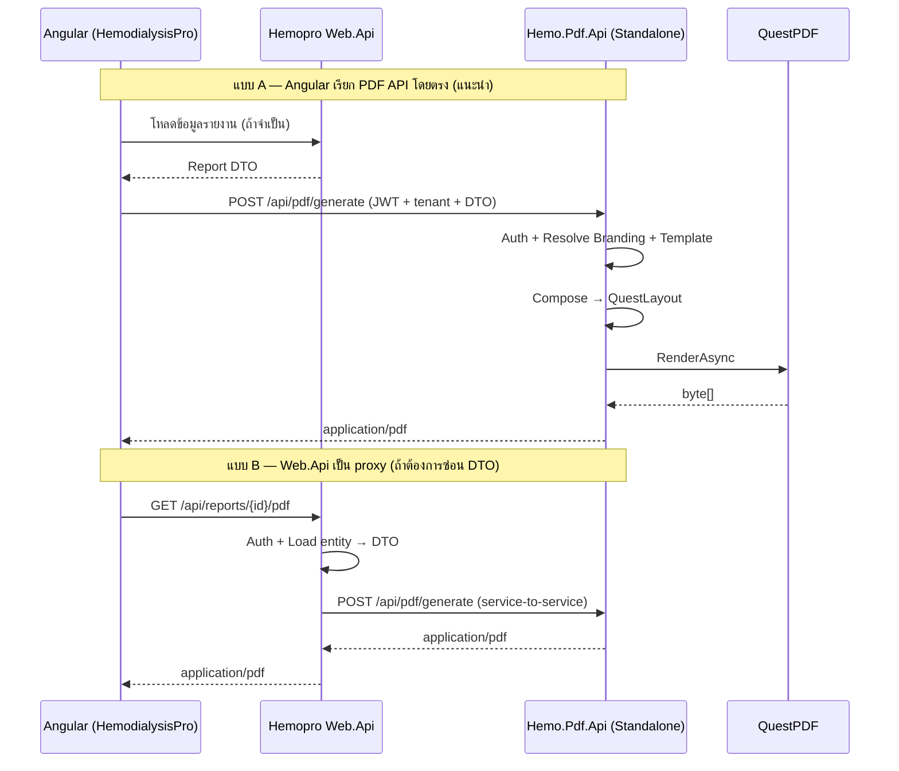
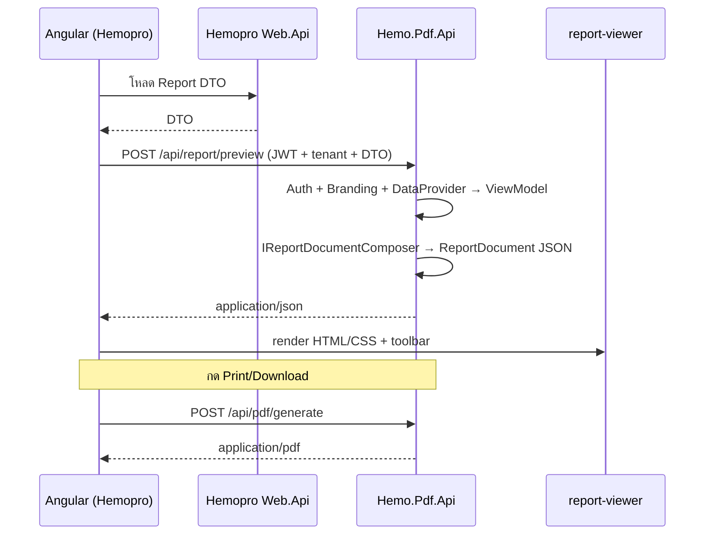

# Hemo-PDF — แผนออกแบบ Sub-Module สำหรับ HemodialysisPro

> เอกสารนี้วิเคราะห์จาก `ฺIMPLEMENT-PLANNING.md` (ระบบ PDF ของ NSS) และออกแบบ repo `Hemo-PDF` ให้เป็น **โมดูลเสริม** ที่แยกออกจาก HemodialysisPro หลัก  
> **HemodialysisPro**: Frontend Angular + Backend ASP.NET  
> **Hemo-PDF**: **Standalone PDF Service** (ASP.NET API แยก deploy) + Angular client library — integrate กับ HemodialysisPro ผ่าน REST API เท่านั้น

---

## 1. วิสัยทัศน์และขอบเขต

### เป้าหมาย

| เป้าหมาย | รายละเอียด |
|----------|------------|
| แยกความรับผิดชอบ | PDF generation ไม่อยู่ใน codebase หลักของ HemodialysisPro |
| Reusable | Component ส่วน Header / Content / Footer / Helper ใช้ซ้ำข้าม template ได้ |
| Customizable | ลูกค้าแต่ละรายได้หัวเอกสาร (logo, ชื่อหน่วยงาน, ที่อยู่) ตามแบบของตัวเอง |
| Maintainable | โครงสร้างชั้นชัด อ่านแล้วรู้ว่าแก้ template ไหน / header ลูกค้าไหน |
| Testable | Unit test ต่อ section, Integration test ต่อ endpoint |

### สิ่งที่ Hemo-PDF ทำ / ไม่ทำ

| ทำ | ไม่ทำ |
|----|-------|
| รับข้อมูลรายงาน (DTO) แล้ว render PDF | CRUD ข้อมูลคนไข้ / session (อยู่ที่ HemodialysisPro) |
| จัดการ branding (หัว/ท้าย) ต่อลูกค้า | Business logic หลักของ dialysis workflow |
| ให้ Angular library เรียก PDF API + แสดง preview | Parse PDF binary ฝั่ง browser (ใช้ ReportDocument JSON แทน — ดู [02-FEATURE-PREVIEW-PDF.md](./02-FEATURE-PREVIEW-PDF.md)) |
| รองรับ 12 Report Template | CRUD / business logic ของ HemodialysisPro (caller ส่ง DTO มาให้) |

---

## 2. วิเคราะห์ NSS อีกครั้ง — อะไรควรนำมา / ปรับอย่างไร

### 2.1 แพทเทิร์นที่ใช้ได้ดีจาก NSS (นำมาใช้ตรง ๆ)

```
Request → Controller → KindResolver → Factory → IReportRenderer
                                              ├─ DataProvider  (โหลด/แปลงข้อมูล)
                                              ├─ Composer      (ประกอบ layout)
                                              └─ IPdfRenderer  (QuestPDF → byte[])
```

NSS แยก 3 ชั้นชัดเจน — **Hemo-PDF ควรคง pattern นี้** แต่เปลี่ยนคำศัพท์:

| NSS | Hemo-PDF | เหตุผล |
|-----|----------|--------|
| `ReportKind` (6 แบบ) | `ReportTemplateId` (12 แบบ) | ลูกค้าต้องการ template มากกว่า |
| `ReportKindResolver` (จาก DB) | `IReportTemplateResolver` | resolve จาก request + host context |
| `ReportFactory` | `IReportRendererFactory` | เหมือนเดิม |
| `ReportContext.Parameters` | `PdfReportContext` + `BrandingContext` | แยก branding ออกจาก parameter ทั่วไป |
| `ReportSectionResolver<T>` | `ISectionResolver<T>` | **ขยาย key ให้รองรับ Customer** |
| `DefaultReportHeaderSection` | `ConfigurableHeaderSection` + override ต่อลูกค้า | รองรับ custom header |
| `QuestPdfRenderer` | เหมือนเดิม | proven, รองรับฟอนต์ไทย |
| `ReportComponentRenderer` | `PdfComponentHelpers` | checkbox, label-value, table |

### 2.2 จุดอ่อนของ NSS ที่ Hemo-PDF ควรแก้

| ปัญหาใน NSS | แนวแก้ใน Hemo-PDF |
|-------------|-------------------|
| Header hardcode บริษัท Nikkiso + logo path | **Branding Profile** ต่อลูกค้า (config/DB) |
| `ReportSectionResolver` resolve แค่ `(ReportKind, version)` | resolve เป็น `(SectionType, CustomerId, ReportTemplateId)` |
| PDF logic ฝังใน monolith API | **Standalone `Hemo.Pdf.Api`** — แยก process / deploy ตั้งแต่ Phase 0 |
| DataProvider ผูกกับ EF/Repository ของ NSS | DataProvider รับ **DTO ใน request body** — ไม่ query DB ของ Hemopro |
| Frontend Next.js specific | สร้าง **Angular library** (`@hemo/pdf-client`) |

### 2.3 บทเรียนจาก NSS Section System

NSS มี `IReportSection` + `ReportSectionResolver` ที่ Composer เรียกใช้:

```csharp
// NSS pattern (สรุป)
var headerSection = _headerResolver.Resolve(context);
var footerSection = _footerResolver.Resolve(context);

return new QuestLayout {
    Header  = c => headerSection.Compose(c, vm, context),
    Content = c => { /* template-specific */ },
    Footer  = c => footerSection.Compose(c, vm, context),
};
```

**Hemo-PDF จะยกระดับเป็น 3 แกนหลัก:**

1. **Report Template** — กำหนด *เนื้อหากลาง* (12 แบบ)
2. **Customer Branding** — กำหนด *หัว/ท้าย* ต่อลูกค้า
3. **Shared Components** — building block ที่ reuse ได้

---

## 3. โมเดลความต้องการ: 12 Template × Custom Header ต่อลูกค้า

### 3.1 แนวคิดหลัก — แยก "เนื้อหา" กับ "แบรนด์"

```
┌─────────────────────────────────────────────────────────────┐
│  PDF หนึ่งฉบับ = Branding Shell + Template Content            │
│                                                             │
│  ┌─────────────────────────────────────────────────────┐    │
│  │ HEADER  ← Customer Branding (logo, ชื่อรพ., ที่อยู่)     │    │
│  ├─────────────────────────────────────────────────────┤    │
│  │ CONTENT ← Report Template #N (12 แบบ — logic กลาง)  │    │
│  ├─────────────────────────────────────────────────────┤    │
│  │ FOOTER  ← Customer Branding + Template extras       │    │
│  └─────────────────────────────────────────────────────┘    │
└─────────────────────────────────────────────────────────────┘
```

- **12 Report Template** = โครงสร้างเนื้อหา (ตาราง lab, dialysis session, prescription ฯลฯ)
- **Customer Branding** = หัวเอกสารเฉพาะลูกค้า (โรงพยาบาล A ใช้ logo/ที่อยู่ของ A, ลูกค้า B ใช้ของ B)
- Template เดียวกัน + ลูกค้าต่างกัน = **เนื้อหาเหมือนกัน หัวเอกสารต่างกัน**

### 3.2 Customer Branding Profile

```json
{
  "customerId": "hospital-rama",
  "displayName": "โรงพยาบาลรามาธิบดี",
  "header": {
    "logoUrl": "/branding/rama/logo.png",
    "companyLines": [
      "โรงพยาบาลรามาธิบดี มหาวิทยาลัยมหิดล",
      "270 ถ.พระรามที่ 6 แขวงทุ่งพญาไท เขตราชเทวี กรุงเทพฯ 10400",
      "โทร. 02-201-1000"
    ],
    "titleAlignment": "center",
    "reportCodePrefix": "RAMA-HD",
    "showPageNumber": true
  },
  "footer": {
    "disclaimerText": "เอกสารนี้จัดทำโดยระบบ HemodialysisPro",
    "showSignatures": true
  },
  "style": {
    "primaryFontFamily": "Sarabun",
    "accentColor": "#1a5276"
  },
  "headerSectionOverride": null
}
```

| ระดับ Customization | วิธี | เหมาะกับ |
|---------------------|------|----------|
| **Level 1 — Config** | แก้ JSON/DB fields (logo, ข้อความ, alignment) | ~90% ลูกค้า |
| **Level 2 — Partial** | ใช้ `ConfigurableHeaderSection` + custom field mapping | ลูกค้าที่มี field พิเศษในหัว |
| **Level 3 — Code** | สร้าง `IReportHeaderSection` เฉพาะลูกค้า ลงทะเบียน DI | layout หัวแปลกมาก |

### 3.3 Resolution Strategy (หัวใจของความยืดหยุ่น)

```
ISectionResolver<IReportHeaderSection>.Resolve(context)

ลำดับการค้นหา (จากเฉพาะ → ทั่วไป):
  1. (CustomerId + ReportTemplateId)  → custom class ถ้ามี
  2. (CustomerId + *)                 → header เฉพาะลูกค้า ใช้ทุก template
  3. (* + ReportTemplateId)           → header เฉพาะ template (หายาก)
  4. Default ConfigurableHeaderSection ← อ่าน Branding Profile
```

เหมือน NSS `ReportSectionResolver` แต่เพิ่มมิติ **CustomerId**

---

## 4. สถาปัตยกรรมโมดูล

### 4.1 Deployment — Standalone ตั้งแต่แรก (ตัดสินใจแล้ว)

**หลักการ:** แยกความรับผิดชอบชัดเจน — Hemo-PDF เป็น service ของตัวเอง ไม่ฝังใน `Web.Api` หรือ `Report.Api`

```
┌─────────────────────────┐         HTTP (REST)         ┌─────────────────────────────┐
│  HemodialysisPro        │                             │  Hemo-PDF (repo นี้)          │
│  ┌───────────────────┐  │  POST /api/pdf/generate     │  ┌───────────────────────┐  │
│  │ Web.Api           │──┼────────────────────────────►│  │ Hemo.Pdf.Api          │  │
│  │ - โหลด entity     │  │  (DTO + templateId + tenant)│  │ - PDF + Preview doc   │  │
│  │ - ตรวจ permission │  │                             │  │ - branding / template │  │
│  └───────────────────┘  │                             │  └───────────────────────┘  │
│  ┌───────────────────┐  │  POST /api/pdf/generate     │  Port แยก เช่น :5090         │
│  │ Angular App       │──┼  POST /api/report/preview   │  Deploy แยก container       │
│  │ @hemo/pdf-client  │  │  (JWT + X-Tenant-Code)      │                             │
│  │ @hemo/report-viewer│ │                             └─────────────────────────────┘
│  └───────────────────┘  │
└─────────────────────────┘

Report.Api (Telerik เดิม) ── ไม่เกี่ยวกับ Hemo-PDF — คู่ขนานกัน
```

| ส่วน | ความรับผิดชอบ |
|------|----------------|
| **HemodialysisPro Web.Api** | Business logic, โหลดข้อมูล, ตรวจสิทธิ์, ส่ง DTO มา PDF service |
| **Hemo.Pdf.Api** | รับ DTO → render PDF (`application/pdf`) หรือ ReportDocument JSON (`/api/report/preview`) |
| **Angular** | `@hemo/pdf-client` (print/download) + `@hemo/report-viewer` (preview HTML) |
| **Hemo-PDF libraries** | Core / Sections / Layouts — อยู่ใน repo เดียวกับ Api |

**ทำไมไม่ embed:** แยก deploy, scale, version และทีมดูแลได้อิสระ — ไม่ปนกับ Telerik Report.Api หรือ business API

### 4.1.1 Auth & Tenant ข้าม Service

```
Request headers (จาก Angular หรือ Web.Api proxy):
  Authorization: Bearer <JWT จาก Hemopro>
  X-Tenant-Code: tenant-demo-a        ← เหมือน Hemopro ใช้อยู่
```

Phase 1: `MockAuthHandler` ยอมรับ dev token  
Phase 2: validate JWT ด้วย shared secret / authority เดียวกับ Hemopro

### 4.1.2 รูปแบบ API (Stateless — PDF service ไม่เปิด DB Hemopro)

```
POST /api/pdf/generate
Content-Type: application/json

{
  "reportTemplateId": "template-01-dialysis-session",
  "tenantCode": "tenant-demo-a",
  "entityId": "session-123",
  "data": { ... },              ← DTO ครบจาก caller
  "signatures": [ ... ]         ← optional ถ้า caller ส่งมา
}

Response: application/pdf
```

```
POST /api/report/preview
Content-Type: application/json

Body: เหมือน GeneratePdfRequest

Response: application/json → ReportDocument
```

> รายละเอียด schema, Angular viewer, checklist — [02-FEATURE-PREVIEW-PDF.md](./02-FEATURE-PREVIEW-PDF.md)

### 4.2 Flow การสร้าง PDF



### 4.2.1 Flow Report Preview (Phase 6 — แทน Telerik `tr-viewer`)



### 4.3 Layer Diagram

```
┌─────────────────────────────────────────────────────────────┐
│  Caller Layer (HemodialysisPro — นอก repo Hemo-PDF)        │
│  Web.Api: โหลด entity, ตรวจ permission, ส่ง DTO            │
│  Angular: เรียก Hemo.Pdf.Api ด้วย @hemo/pdf-client         │
└──────────────────────────┬──────────────────────────────────┘
                           │ HTTP POST /api/pdf/generate
┌──────────────────────────▼──────────────────────────────────┐
│  Hemo.Pdf.Api (Standalone — entry point ของ service)       │
│  - PdfController (บาง — ไม่มี business logic)              │
│  - Auth middleware + Tenant middleware                     │
│  - IPdfGenerationService                                   │
└──────────────────────────┬──────────────────────────────────┘
                           │
┌──────────────────────────▼──────────────────────────────────┐
│  Hemo.Pdf.Application + Libraries (ใน repo เดียวกัน)        │
│  Core / Layouts / Branding / Sections / Rendering           │
└─────────────────────────────────────────────────────────────┘
```

---

## 5. โครงสร้าง Repo ที่เสนอ

```
Hemo-PDF/
├── src/
│   ├── Hemo.Pdf.Core/                         # ไม่พึ่ง QuestPDF — reference ได้จากทุกที่
│   │   ├── Abstractions/
│   │   │   ├── IPdfRenderer.cs
│   │   │   ├── IReportRenderer.cs
│   │   │   ├── IReportDataProvider.cs
│   │   │   ├── ILayoutComposer.cs
│   │   │   ├── IReportHeaderSection.cs
│   │   │   ├── IReportFooterSection.cs
│   │   │   ├── IContentSection.cs             # optional partial content blocks
│   │   │   ├── ISectionResolver.cs
│   │   │   └── IReportRendererFactory.cs
│   │   ├── Context/
│   │   │   ├── PdfReportContext.cs            # TemplateId, CustomerId, Parameters
│   │   │   └── ReportMetadata.cs              # Title, Subtitle, ReportCode
│   │   ├── Models/
│   │   │   ├── GeneratePdfRequest.cs
│   │   │   └── ReportTemplateId.cs            # enum หรือ strongly-typed ids
│   │   ├── Factory/
│   │   │   └── ReportRendererFactory.cs
│   │   └── Constants/
│   │       └── PdfStyleDefaults.cs            # จาก NSS ReportStyleDefaults
│   │
│   ├── Hemo.Pdf.Branding/
│   │   ├── Models/
│   │   │   ├── CustomerBrandingProfile.cs
│   │   │   ├── HeaderBranding.cs
│   │   │   └── FooterBranding.cs
│   │   ├── IBrandingResolver.cs
│   │   ├── IBrandingStore.cs                  # JSON file / DB / in-memory
│   │   └── JsonFileBrandingStore.cs           # dev + seed
│   │
│   ├── Hemo.Pdf.Sections/                     # Reusable PDF components
│   │   ├── Headers/
│   │   │   ├── ConfigurableHeaderSection.cs   # อ่าน Branding Profile (default)
│   │   │   ├── DefaultHeaderSection.cs
│   │   │   └── Customers/                     # Level 3 overrides (ถ้าจำเป็น)
│   │   │       └── HospitalRamaHeaderSection.cs
│   │   ├── Footers/
│   │   │   ├── ConfigurableFooterSection.cs
│   │   │   ├── PageNumberFooterSection.cs
│   │   │   └── SignatureFooterSection.cs
│   │   ├── Content/                           # Shared content blocks
│   │   │   ├── KeyValueTableSection.cs
│   │   │   ├── DataGridSection.cs
│   │   │   ├── ChecklistTableSection.cs       # จาก NSS checklist pattern
│   │   │   └── SignatureBlockSection.cs
│   │   ├── Shared/
│   │   │   └── SectionResolver.cs             # (CustomerId, TemplateId, Type)
│   │   └── Helpers/
│   │       ├── PdfComponentHelpers.cs         # checkbox, label-value (จาก NSS)
│   │       ├── PdfTextHelpers.cs              # date format, placeholder "—"
│   │       ├── PdfTableHelpers.cs
│   │       └── PdfImageHelpers.cs             # logo load/cache
│   │
│   ├── Hemo.Pdf.Layouts/                      # 12 Report Templates
│   │   ├── _Base/
│   │   │   └── BaseReportComposer.cs          # wire header/footer resolver
│   │   ├── Template01_DialysisSession/
│   │   │   ├── DialysisSessionDataProvider.cs
│   │   │   ├── DialysisSessionComposer.cs
│   │   │   ├── DialysisSessionRenderer.cs
│   │   │   └── DialysisSessionViewModel.cs
│   │   ├── Template02_.../
│   │   └── ... (ถึง Template12)
│   │
│   ├── Hemo.Pdf.Rendering/
│   │   ├── QuestPdfRenderer.cs
│   │   ├── QuestLayout.cs
│   │   └── FontRegistration.cs
│   │
│   ├── Hemo.Pdf.Application/
│   │   ├── IPdfGenerationService.cs
│   │   ├── PdfGenerationService.cs            # orchestrator หลัก
│   │   └── ServiceCollectionExtensions.cs     # AddHemoPdf()
│   │
│   ├── Hemo.Pdf.Api/                          # ★ Standalone host (deploy แยก)
│   │   ├── Controllers/PdfController.cs
│   │   ├── Middleware/TenantResolutionMiddleware.cs
│   │   ├── Middleware/Auth/
│   │   ├── Program.cs
│   │   ├── Dockerfile
│   │   └── appsettings.json                   # HemoPdf:BaseUrl, UseMockServices
│   │
│   └── client/                                # Angular libraries
│       ├── projects/hemo-pdf-client/          # ✅ print/download API client
│       │   └── package.json                   # @hemo/pdf-client
│       └── projects/hemo-report-viewer/       # ⏳ Phase 6 — preview HTML/CSS
│           └── package.json                   # @hemo/report-viewer
│
├── assets/
│   ├── fonts/sarabun/
│   └── branding/                              # seed branding JSON ต่อลูกค้า
│
├── tests/
│   ├── Hemo.Pdf.Core.Tests/
│   ├── Hemo.Pdf.Sections.Tests/
│   ├── Hemo.Pdf.Layouts.Tests/
│   └── Hemo.Pdf.Integration.Tests/
│
├── docs/
│   ├── ฺIMPLEMENT-PLANNING.md
│   └── HEMO-PDF-SUB-MODULE.md                 # เอกสารนี้
│
├── Hemo.Pdf.sln
└── README.md
```

### 5.1 หลักการแบ่ง Project (ทำไมแยกแบบนี้)

| Project | Dependency | เหตุผล |
|---------|------------|--------|
| `Core` | ไม่มี QuestPDF | test ง่าย, Hemopro ไม่ต้อง reference library นี้ |
| `Branding` | Core | แยก concern ลูกค้า — แก้ branding ไม่กระทบ template |
| `Sections` | Core + Branding + QuestPDF | component reuse, แก้ header ที่เดียว |
| `Layouts` | Sections + Core | แต่ละ template แยก folder ชัด |
| `Rendering` | Core + QuestPDF | สลับ engine ในอนาคตได้ (ถ้าจำเป็น) |
| `Application` | Libraries ทั้งหมด | orchestrator — ใช้ภายใน `Hemo.Pdf.Api` |
| `Api` | Application | **entry point หลัก** — standalone service |
| `client` | ไม่พึ่ง .NET | Angular → ชี้ URL ของ `Hemo.Pdf.Api` |

---

## 6. Interface หลัก (ออกแบบ API ของ Standalone Service)

### 6.1 Request / Response Contract

```csharp
public sealed class GeneratePdfRequest
{
    public required string ReportTemplateId { get; init; }
    public required string TenantCode { get; init; }          // จาก X-Tenant-Code
    public string? EntityId { get; init; }
    public required JsonElement Data { get; init; }           // DTO จาก caller (stateless)
    public ReportSignatureContext? Signatures { get; init; }  // caller ส่งมา หรือ mock ภายใน
    public Dictionary<string, object?>? Parameters { get; init; }
}

public interface IPdfGenerationService
{
    Task<byte[]> GenerateAsync(GeneratePdfRequest request, CancellationToken ct);
}
```

### 6.2 PdfController ใน `Hemo.Pdf.Api` (บาง — ไม่มี business logic)

```csharp
[ApiController]
[Route("api/pdf")]
public class PdfController : ControllerBase
{
    [HttpPost("generate")]
    [EnableRateLimiting("PdfGeneration")]
    public async Task<IActionResult> Generate([FromBody] GeneratePdfRequest request, CancellationToken ct)
    {
        await _guard.EnsureCanGenerateAsync(request, ct);
        var pdf = await _pdfService.GenerateAsync(request, ct);
        return File(pdf, "application/pdf", $"report-{request.EntityId ?? "export"}.pdf");
    }
}
```

### 6.3 HemodialysisPro — บทบาทของ Caller (ไม่มี PDF logic)

**แบบ A — Angular เรียก PDF API โดยตรง** (แนะนำเมื่อ DTO พร้อมใน frontend):

```typescript
// environment.pdfApiUrl = 'https://pdf-api.hemopro.local:5090'
this.pdfService.generateAndOpen({
  reportTemplateId: 'template-01-dialysis-session',
  tenantCode: this.tenantService.currentTenantCode,
  entityId: sessionId,
  data: reportDto   // โหลดจาก Web.Api ก่อน
});
```

**แบบ B — Web.Api proxy** (ซ่อน DTO / centralize permission):

```csharp
// Hemopro Web.Api — thin proxy เท่านั้น ไม่มี QuestPDF reference
[HttpGet("dialysis/{sessionId}/pdf")]
public async Task<IActionResult> GetSessionPdf(string sessionId, CancellationToken ct)
{
    await _auth.EnsureCanReadSessionAsync(sessionId, ct);
    var dto = await _dialysisService.GetReportDtoAsync(sessionId, ct);
    var pdf = await _hemoPdfClient.GenerateAsync(new GeneratePdfRequest { ... }, ct);
    return File(pdf, "application/pdf", $"session-{sessionId}.pdf");
}
```

> Hemopro **ไม่ reference** `Hemo.Pdf.Layouts` / QuestPDF — ใช้แค่ `IHemoPdfApiClient` (HTTP client) หรือให้ Angular เรียกตรง

### 6.2 Context Object (ขยายจาก NSS)

```csharp
public sealed class PdfReportContext
{
    public Guid GenerationId { get; init; }
    public required string ReportTemplateId { get; init; }
    public required string CustomerId { get; init; }
    public CustomerBrandingProfile Branding { get; init; } = default!;
    public ReportMetadata Metadata { get; init; } = new();
    public IDictionary<string, object?> Parameters { get; init; } = new Dictionary<string, object?>();
}
```

### 6.3 Section Interface (เหมือน NSS แต่ generic กว่า)

```csharp
public interface IReportSection
{
    void Compose(IContainer container, object viewModel, PdfReportContext context);
}

public interface IReportHeaderSection : IReportSection { }
public interface IReportFooterSection : IReportSection { }

// Content block ที่ reuse ใน Composer
public interface IContentSection
{
    void Compose(IContainer container, object viewModel, PdfReportContext context);
}
```

### 6.4 Base Composer Pattern (ลด duplicate 12 template)

```csharp
public abstract class BaseReportComposer<TViewModel> : ILayoutComposer
{
    private readonly ISectionResolver<IReportHeaderSection> _headerResolver;
    private readonly ISectionResolver<IReportFooterSection> _footerResolver;

    public object Compose(object dataModel, PdfReportContext context)
    {
        var vm = (TViewModel)dataModel;
        PrepareContext(context, vm);

        return new QuestLayout
        {
            Header  = c => _headerResolver.Resolve(context).Compose(c, vm, context),
            Content = c => ComposeContent(c, vm, context),   // abstract — แต่ละ template implement
            Footer  = c => _footerResolver.Resolve(context).Compose(c, vm, context),
        };
    }

    protected abstract void ComposeContent(IContainer container, TViewModel vm, PdfReportContext context);
    protected virtual void PrepareContext(PdfReportContext context, TViewModel vm) { }
}
```

---

## 7. 12 Report Template — แนวทางจัดการ

### 7.1 การตั้งชื่อและลงทะเบียน

```csharp
public static class ReportTemplates
{
    public const string DialysisSession     = "dialysis-session";      // 01
    public const string LabResult           = "lab-result";          // 02
    public const string Prescription        = "prescription";        // 03
    // ... จนถึง 12
}
```

ลงทะเบียนใน `AddHemoPdf()`:

```csharp
services.AddScoped<IReportRendererFactory>(sp => new ReportRendererFactory(new[]
{
    (ReportTemplates.DialysisSession, typeof(DialysisSessionReportRenderer)),
    (ReportTemplates.LabResult,     typeof(LabResultReportRenderer)),
    // ...
}, sp, fallback: typeof(DefaultReportRenderer)));
```

### 7.2 แชร์ Content Block ข้าม Template

Template หลายแบบอาจใช้ block เดียวกัน:

| Content Block | ใช้ใน Template |
|---------------|----------------|
| `PatientInfoSection` | เกือบทุกแบบ |
| `KeyValueTableSection` | session, lab |
| `ChecklistTableSection` | assessment forms |
| `SignatureBlockSection` | รายงานที่ต้อง sign |
| `DataGridSection` | ตารางหลายคอลัมน์ |

Composer ของแต่ละ template **ประกอบ block** แทนการเขียน layout ใหม่ทั้งหมด:

```csharp
protected override void ComposeContent(IContainer container, DialysisSessionViewModel vm, PdfReportContext ctx)
{
    container.Column(col =>
    {
        col.Item().Element(c => _patientInfo.Compose(c, vm, ctx));
        col.Item().Element(c => _sessionTable.Compose(c, vm, ctx));
        col.Item().Element(c => _signatureBlock.Compose(c, vm, ctx));
    });
}
```

---

## 8. Angular Clients

### 8.1 `@hemo/pdf-client` — Print / Download

ออกแบบตาม NSS `pdf-utils.ts` แต่ชี้ไป **Standalone PDF API** โดยตรง:

```typescript
// environment.ts
export const environment = {
  pdfApiUrl: 'https://localhost:5090',   // Hemo.Pdf.Api
  webApiUrl: 'https://localhost:5000',   // Hemopro Web.Api
};

// pdf.service.ts
@Injectable({ providedIn: 'root' })
export class HemoPdfService {
  constructor(private http: HttpClient, private tenant: TenantService) {}

  generateAndOpen(request: GeneratePdfRequest): Observable<void> {
    const url = `${environment.pdfApiUrl}/api/pdf/generate`;
    return this.http.post(url, request, {
      responseType: 'blob',
      headers: {
        Authorization: `Bearer ${this.auth.token}`,
        'X-Tenant-Code': this.tenant.currentTenantCode,
      },
    }).pipe(
      tap(blob => {
        const blobUrl = URL.createObjectURL(blob);
        window.open(blobUrl, '_blank');
        setTimeout(() => URL.revokeObjectURL(blobUrl), 100);
      })
    );
  }
}
```

**Flow ทั่วไป (download / open tab):**
1. Angular โหลด DTO จาก Hemopro `Web.Api`
2. ส่ง `POST` ไป `Hemo.Pdf.Api` พร้อม DTO + `tenantCode`
3. เปิด PDF blob ในแท็บใหม่ หรือ download

**Integration**: `npm install @hemo/pdf-client` → ตั้ง `pdfApiUrl` ใน environment

### 8.2 `@hemo/report-viewer` — Preview บนจอ (Phase 6)

แทนที่ Telerik `tr-viewer` (`PRINT_PREVIEW`) — **ไม่ parse PDF** แต่ render `ReportDocument` JSON เป็น HTML/CSS

| หัวข้อ | รายละเอียด |
|--------|------------|
| Input | `ReportDocument` จาก `POST /api/report/preview` |
| Output | A4 page + toolbar (zoom, หน้า, print, download) |
| Block types | map 1:1 กับ `Hemo.Pdf.Sections` |
| Print คุณภาพเต็ม | เรียก `@hemo/pdf-client` → `POST /api/pdf/generate` |
| เอกสารเต็ม | [02-FEATURE-PREVIEW-PDF.md](./02-FEATURE-PREVIEW-PDF.md) |

**Flow preview (แนะนำ):**
1. Angular โหลด DTO จาก Hemopro `Web.Api`
2. `POST /api/report/preview` → ได้ JSON (เร็วกว่า generate PDF)
3. `<hemo-report-viewer [document]="doc" />` ใน modal หรือฝังในหน้า
4. กด Print/Download → `@hemo/pdf-client`

---

## 9. การเก็บ Customer Branding

| ช่วง | วิธีเก็บ | เหมาะกับ |
|------|----------|----------|
| Dev / POC | `assets/branding/{customerId}.json` | เริ่มต้นเร็ว |
| Production | ตารางใน HemodialysisPro DB (`CustomerBranding`) | ลูกค้าแก้ผ่าน admin UI |
| Scale | Blob storage สำหรับ logo + DB สำหรับ metadata | logo ใหญ่ |

`IBrandingStore` interface ให้ host เลือก implementation:

```csharp
public interface IBrandingStore
{
    Task<CustomerBrandingProfile> GetAsync(string customerId, CancellationToken ct);
}
```

HemodialysisPro implement `DbBrandingStore` — Hemo-PDF ไม่ผูกกับ DB โดยตรง

---

## 10. แผน Implement เป็นขั้นตอน

### Phase 0 — Foundation + Standalone Api (สัปดาห์ 1–2)

- [ ] สร้าง solution + projects ตามโครงสร้าง §5
- [ ] **`Hemo.Pdf.Api` scaffold** — Program.cs, Dockerfile, port 5090
- [ ] `PdfController` + `POST /api/pdf/generate`
- [ ] Port `QuestPdfRenderer`, `QuestLayout`, `PdfStyleDefaults` จาก NSS
- [ ] Port `PdfComponentHelpers` (checkbox, label-value)
- [ ] `FontRegistration` — Sarabun
- [ ] `MockAuthHandler` + `MockTenantMiddleware`
- [ ] Integration test ยิง HTTP ไปที่ Api โดยตรง

**Deliverable**: `dotnet run` ที่ `Hemo.Pdf.Api` → ได้ PDF ว่าง ๆ ผ่าน POST

### Phase 1 — Section System + Branding (สัปดาห์ 2–3)

- [ ] `CustomerBrandingProfile` + `JsonFileBrandingStore`
- [ ] `ConfigurableHeaderSection` (อ่าน logo, companyLines, alignment)
- [ ] `ConfigurableFooterSection` + `PageNumberFooterSection`
- [ ] `SectionResolver` รองรับ `(CustomerId, TemplateId)`
- [ ] Unit test: header 2 ลูกค้า + template เดียว → หัวต่างกัน

**Deliverable**: เปลี่ยน customerId แล้วได้หัวเอกสารต่างกัน

### Phase 2 — Template แรก + Angular Client (สัปดาห์ 3–4)

- [ ] `BaseReportComposer<T>`
- [ ] Template #1: `DialysisSession` (DataProvider รับ DTO)
- [ ] Content blocks: `PatientInfoSection`, `DataGridSection`
- [ ] `@hemo/pdf-client` — service + button component
- [ ] เอกสาร integration สำหรับ HemodialysisPro

**Deliverable**: end-to-end จาก Angular → **Hemo.Pdf.Api** → PDF (ไม่ผ่าน Web.Api ก็ได้)

### Phase 3 — Template 2–6 + Shared Blocks (สัปดาห์ 5–8)

- [ ] เพิ่ม template ทีละแบบ ใช้ shared content blocks
- [ ] Refactor block ที่ซ้ำออกมา
- [ ] Integration test ต่อ template

### Phase 4 — Template 7–12 + Customer Overrides (สัปดาห์ 9–12)

- [ ] template ที่เหลือครบ 12
- [ ] รองรับ Level 3 header override (ถ้ามีลูกค้าจริงที่ต้องการ)
- [ ] `DbBrandingStore` guideline สำหรับ host

### Phase 5 — Production Hardening

- [ ] Rate limiting (จาก NSS: `PdfGeneration` policy)
- [ ] `CancellationToken` + max PDF size 50MB
- [ ] JWT validation ร่วมกับ Hemopro (แทน MockAuth)
- [ ] CORS สำหรับ Angular origin
- [ ] Caching (optional): cache PDF ตาม `(templateId, entityId, brandingVersion)`
- [ ] Health check `/health` + Docker compose แยกจาก Hemopro

### Phase 6 — Report Preview (`@hemo/report-viewer`) ⏳

> รายละเอียดเต็ม: [02-FEATURE-PREVIEW-PDF.md](./02-FEATURE-PREVIEW-PDF.md)

- [ ] `ReportDocument` schema + block types ใน `Hemo.Pdf.Core`
- [ ] `IReportPreviewService` + `POST /api/report/preview`
- [ ] `IReportDocumentComposer` คู่กับ `ILayoutComposer` (เริ่ม Generic 02–12)
- [ ] `@hemo/report-viewer` — viewer + toolbar + block components
- [ ] CSS mirror `PdfStyleDefaults`; Ionic preview modal (90dvh)
- [ ] Hemopro: แทน Telerik `tr-viewer` (เริ่ม `embedded-hemosheet-report`)

**Deliverable**: preview บนจอจาก JSON โดยไม่พึ่ง Telerik; print/download ยังใช้ QuestPDF

---

## 11. แนวทางทดสอบ

| ระดับ | ทดสอบอะไร | ตัวอย่าง |
|-------|-----------|----------|
| Unit | Section แต่ละตัว | `ConfigurableHeaderSection` + branding A vs B |
| Unit | Helper | date format, checkbox render |
| Unit | DataProvider | DTO → ViewModel mapping |
| Integration | Full pipeline | `GenerateAsync` → PDF bytes + header ถูกต้อง |
| Integration | Preview pipeline | `PreviewAsync` → `ReportDocument` JSON ต่อ template |
| Snapshot | Visual regression | เก็บ PDF baseline ต่อ template (optional) |

---

## 12. สรุปการ Mapping NSS → Hemo-PDF

| แนวคิด NSS | Hemo-PDF |
|-----------|----------|
| Monolith endpoint | **Standalone `Hemo.Pdf.Api`** + `POST /api/pdf/generate` |
| `ReportKind` (6) | `ReportTemplateId` (12) |
| `ReportKindResolver` จาก DB | Caller ส่ง `reportTemplateId` + DTO ใน body |
| `DefaultReportHeaderSection` hardcode | `ConfigurableHeaderSection` + `CustomerBrandingProfile` |
| `ReportSectionResolver(Kind)` | `SectionResolver(CustomerId, TemplateId)` |
| `ReportComponentRenderer` | `PdfComponentHelpers` |
| `InstallPmDialysisComposer` | `BaseReportComposer<T>` + `ContentBlocks` |
| Next.js `pdf-utils.ts` | Angular `HemoPdfService` (`@hemo/pdf-client`) |
| Telerik `tr-viewer` (Hemopro) | `@hemo/report-viewer` — ReportDocument JSON + HTML/CSS |
| — | `POST /api/report/preview` (คู่กับ `/api/pdf/generate`) |
| EF DataProvider | DTO-based DataProvider |
| Template Snapshot | Caller ส่ง snapshot data ใน DTO (ถ้าต้องการ) |

---

## 13. ข้อตัดสินใจที่แนะนำ (Decision Log)

| หัวข้อ | ทางเลือกที่แนะนำ | เหตุผล |
|--------|------------------|--------|
| PDF Library | QuestPDF 2024.x | proven ใน NSS, Fluent API, ฟอนต์ไทย |
| แยก repo | ใช่ — repo `Hemo-PDF` แยก | maintain ง่าย, version ได้ |
| Customer header | Config-first + code override เมื่อจำเป็น | 90% ใช้ config พอ |
| Data access | DTO จาก host ไม่ query DB เอง | ไม่ผูก schema HemodialysisPro |
| Deploy | **Standalone `Hemo.Pdf.Api` ตั้งแต่ Phase 0** | แยกความรับผิดชอบ / deploy / scale ชัดเจน |
| ภาษาเอกสาร / ฟอนต์ | Sarabun + รองรับ EN/TH ใน branding | ตลาดไทย |

---

## 14. คำตอบข้อตัดสินใจ (ตอบแล้ว — อัปเดต 2026-07-06)

### ข้อ 1 — รายชื่อ 12 Report Template

**สถานะ:** ยังไม่ finalize — ใช้ **Dummy Template** 12 แบบก่อน โครงสร้างพร้อม rename ทีหลัง

| # | `ReportTemplateId` (dummy) | คำอธิบายชั่วคราว | ต้อง Sign ก่อน PDF |
|---|---------------------------|------------------|-------------------|
| 01 | `template-01-dialysis-session` | บันทึกการฟอกไตรายครั้ง | ใช่ |
| 02 | `template-02-lab-result` | ผล Lab | ไม่ |
| 03 | `template-03-prescription` | ใบสั่งยา/คำสั่งการรักษา | ใช่ |
| 04 | `template-04-hemosheet` | Hemosheet สรุปรอบฟอก | ใช่ |
| 05 | `template-05-nurse-record` | บันทึกพยาบาล | ใช่ |
| 06 | `template-06-doctor-record` | บันทึกแพทย์ | ใช่ |
| 07 | `template-07-med-history` | ประวัติยา | ไม่ |
| 08 | `template-08-adequacy` | ค่า Adequacy (Kt/V ฯลฯ) | ไม่ |
| 09 | `template-09-assessment` | แบบประเมิน | ใช่ |
| 10 | `template-10-admission` | ข้อมูล Admission | ไม่ |
| 11 | `template-11-progress-note` | Progress Note | ใช่ |
| 12 | `template-12-summary` | สรุปรายงานรวม | ไม่ |

> เมื่อ business finalize ชื่อจริง แก้เฉพาะ constant + folder name — pipeline ไม่ต้องเปลี่ยน

---

### ข้อ 2 — Tenant / CustomerId จาก HemodialysisPro

**สถานะ:** Wire ให้เหมือนมาจาก tenant ของ Hemopro ทั้งหมด แต่จบที่ **Mock Tenant Service** ก่อน — โครงสร้างพร้อมสลับ implementation จริงได้ทันที

HemodialysisPro มี tenant context อยู่แล้ว (`ITenantContext.TenantCode`, header `X-Tenant-Code` / claim `tenant_code`) — Hemo-PDF จะ **ไม่สร้างระบบ tenant ใหม่** แต่อ้างอิงผ่าน abstraction:

```csharp
// Hemo.Pdf.Core — abstraction ที่ host ต้องให้
public interface ITenantContextAccessor
{
    string TenantCode { get; }   // map จาก Hemopro ITenantContext
}

// Hemo.Pdf.Branding
public interface IBrandingStore
{
    Task<CustomerBrandingProfile> GetByTenantCodeAsync(string tenantCode, CancellationToken ct);
}
```

**Phase 1 (Mock):**

```
ITenantContextAccessor  → MockTenantContextAccessor (คืน "tenant-demo-a" / "tenant-demo-b")
IBrandingStore          → JsonFileBrandingStore (อ่าน assets/branding/{tenantCode}.json)
IReportDataProvider     → MockReportDataProvider (DTO ตัวอย่าง)
ISignatureStore         → MockSignatureStore (รูปลายเซ็น fake base64)
```

**Phase 2 (จริง — สลับที่ DI เท่านั้น):**

```
ITenantContextAccessor  → HemoTenantContextAccessor (อ่านจาก Wasenshi ITenantContext)
IBrandingStore          → DbBrandingStore หรือ Hemopro config service
IReportDataProvider     → HemoproXxxDataProvider (map entity → DTO)
ISignatureStore         → HemoproSignatureStore (ดึงจาก hemosheet signature setting)
```

```
┌─────────────────────┐     ┌──────────────────────────┐
│ HemodialysisPro     │     │ Hemo-PDF Module          │
│ ITenantContext      │────►│ ITenantContextAccessor   │  ← adapter
│ (TenantCode)        │     │         ↓                │
└─────────────────────┘     │ IBrandingStore           │
                            │ ISignatureStore          │
                            │ IReportDataProvider      │
                            └──────────────────────────┘
         Phase 1: Mock implementations
         Phase 2: Real implementations (แค่เปลี่ยน DI registration)
```

---

### ข้อ 3 — ใครจัดการ Branding

**ตัดสินใจ:** **ทีม implement ลง content ให้** (ไม่ทำ self-service UI สำหรับลูกค้าใน Phase แรก)

- เก็บเป็น JSON ใน `assets/branding/{tenantCode}.json` หรือ seed ใน DB
- ทีม deploy ต่อลูกค้าใหม่ = เพิ่ม/แก้ไฟล์ branding + logo
- ไม่ต้องสร้าง Admin UI ใน Hemo-PDF — ถ้าอนาคตต้องการ UI ให้ทำใน Hemopro Admin แทน

---

### ข้อ 4 — ต้อง Sign ก่อนออก PDF

**ตัดสินใจ:** **ใช่** — บาง template ต้อง sign ก่อน (ดูคอลัมน์ในตารางข้อ 1)

เตรียม signature infrastructure ไว้ล่วงหน้า:

```csharp
// Models
public sealed class SignatureInfo
{
    public string SignerName { get; init; } = "";
    public string? SignerRole { get; init; }      // "Nurse", "Doctor", "Patient"
    public byte[]? ImageBytes { get; init; }      // รูปลายเซ็น
    public DateTime? SignedAt { get; init; }
}

public sealed class ReportSignatureContext
{
    public bool IsFullySigned { get; init; }
    public IReadOnlyList<SignatureInfo> Signatures { get; init; } = [];
}

// Abstraction
public interface ISignatureStore
{
    Task<ReportSignatureContext> GetAsync(string reportTemplateId, string entityId, string tenantCode, CancellationToken ct);
}

// Guard ก่อน generate
public interface IPdfGenerationGuard
{
    Task EnsureCanGenerateAsync(GeneratePdfRequest request, CancellationToken ct);
    // ถ้า template ต้อง sign แต่ยังไม่ครบ → throw PdfGenerationForbiddenException
}
```

**Section/Helper ที่เตรียมไว้:**

| Component | หน้าที่ |
|-----------|---------|
| `SignatureBlockSection` | แสดงกรอบลายเซ็น + ชื่อ + วันที่ (จาก NSS `DefaultReportFooterSection`) |
| `PdfSignatureHelpers` | render รูปลายเซ็น, placeholder เมื่อยังไม่ sign |
| `SignedReportFooterSection` | footer แบบมี signature 2 ฝั่ง |
| `IPdfGenerationGuard` | ตรวจ `IsFullySigned` ก่อน render |

**Phase 1:** `MockSignatureStore` คืนลายเซ็นตัวอย่าง + flag `IsFullySigned` ปรับได้ใน mock  
**Phase 2:** `HemoproSignatureStore` ดึงจาก hemosheet signature / approval flow จริง

---

### ข้อ 5 — Deployment: Standalone ตั้งแต่แรก (อัปเดต)

**ตัดสินใจ:** ใช้ **Standalone `Hemo.Pdf.Api`** ตั้งแต่ Phase 0 — ไม่ embed ใน `Web.Api` หรือ `Report.Api`

#### เปรียบเทียบ (เพื่ออ้างอิง)

| | Embed ใน Host | **Standalone (ที่เลือก)** |
|--|---------------|---------------------------|
| Deploy | รวมกับ Hemopro API | **แยก container / port** |
| ความรับผิดชอบ | ปนกับ business API | **PDF เท่านั้น** |
| Scale | scale ทั้ง monolith | **scale PDF แยก** |
| Coupling | reference library ใน solution เดียว | **HTTP contract เท่านั้น** |
| Telerik Report.Api | อาจสับสน endpoint | **ไม่เกี่ยวกัน** |

#### สถาปัตยกรรมที่ใช้

```
Hemo-PDF repo
├── Hemo.Pdf.Api          ← deploy นี้ (port 5090)
├── Hemo.Pdf.Core         ← libraries ภายใน repo
├── Hemo.Pdf.Sections
└── client/               ← Angular ชี้ pdfApiUrl

Hemo-backend (Hemopro)
├── Web.Api               ← โหลดข้อมูล + permission (ไม่มี QuestPDF)
└── Report.Api            ← Telerik เดิม (ไม่แตะ)

Hemo-frontend
└── @hemo/pdf-client      ← เรียก Hemo.Pdf.Api โดยตรง
```

#### สิ่งที่ Hemopro ต้องทำ (น้อยมาก)

- ตั้ง `pdfApiUrl` ใน Angular environment
- (Optional) เพิ่ม `IHemoPdfApiClient` ใน Web.Api ถ้าต้องการ proxy
- **ไม่** reference `Hemo.Pdf.*` projects ใน solution Hemopro

#### สิ่งที่ Hemo-PDF ต้องทำ

- Auth: รับ JWT เดียวกับ Hemopro (Phase 1 = mock)
- Tenant: อ่าน `X-Tenant-Code` header
- Stateless: รับ DTO ใน request body — ไม่เปิด connection ไป DB Hemopro

---

## 15. ผลกระทบต่อแผน Implement (อัปเดตหลังตอบคำถาม)

### สิ่งที่เพิ่มใน Phase 0–1

- [ ] `ITenantContextAccessor` + `MockTenantContextAccessor`
- [ ] `IBrandingStore` + `JsonFileBrandingStore` + seed 2 tenant demo
- [ ] `ISignatureStore` + `MockSignatureStore`
- [ ] `IPdfGenerationGuard` + `SignatureRequiredGuard`
- [ ] `SignatureBlockSection` + `PdfSignatureHelpers`
- [ ] Dummy `ReportTemplates` constants (12 แบบ)
- [ ] `AddHemoPdf()` extension พร้อม switch Mock/Real ผ่าน config

### DI Registration ใน `Hemo.Pdf.Api`

```csharp
// Hemo.Pdf.Api/Program.cs
// appsettings.Development.json → "HemoPdf:UseMockServices": true

builder.Services.AddHemoPdf(options =>
{
    if (builder.Configuration.GetValue<bool>("HemoPdf:UseMockServices"))
    {
        options.UseMockAuth();
        options.UseMockTenant();
        options.UseJsonFileBranding();
        options.UseMockSignatures();
    }
    else
    {
        options.UseHemoproJwtAuth();     // shared authority
        options.UseTenantHeader();       // X-Tenant-Code
        options.UseJsonFileBranding();   // ทีม implement content
        options.UseRequestSignatures();  // signatures ใน request body จาก caller
    }
});
```

### บทบาทของแต่ละ Repo

| Repo | บทบาท |
|------|--------|
| `Hemo-PDF` | **Standalone Api** + libraries + mock services + `@hemo/pdf-client` |
| `Hemo-backend` | โหลดข้อมูล + permission — ส่ง DTO ให้ PDF Api (HTTP client หรือให้ Angular ส่ง) |
| `Hemo-frontend` | `@hemo/pdf-client` ชี้ `environment.pdfApiUrl` → `Hemo.Pdf.Api` |

---

*อ้างอิง: `ฺIMPLEMENT-PLANNING.md`, NSS `Services/Reports/*`, `REPORT_SYSTEM_GUIDE.md`, Hemopro `ITenantContext`*
