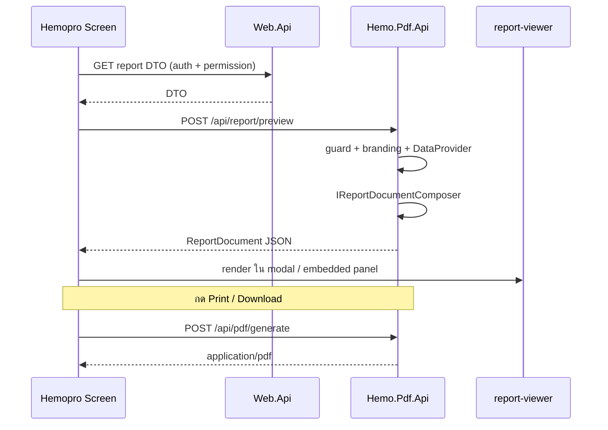

# Feature: Report Preview (`@hemo/report-viewer`)

> **เอกสารหลัก** สำหรับ feature preview รายงานใน Hemo-PDF  
> แทนที่ Telerik `tr-viewer` (PRINT_PREVIEW) ใน Hemopro ด้วย viewer ของเราเอง — **ReportDocument JSON + HTML/CSS**  
> อัปเดต: 2026-07-06 | สถานะ: **Phase 6 implement แล้ว (Hemo-PDF repo)**

---

## สารบัญ

1. [บริบทและปัญหา](#1-บริบทและปัญหา)
2. [การตัดสินใจ](#2-การตัดสินใจ)
3. [เป้าหมาย](#3-เป้าหมาย)
4. [สถาปัตยกรรม](#4-สถาปัตยกรรม)
5. [ReportDocument Schema](#5-reportdocument-schema)
6. [API](#6-api)
7. [Server — โครงสร้างและ Dual Composer](#7-server--โครงสร้างและ-dual-composer)
8. [Angular — `@hemo/report-viewer`](#8-angular--hemoreport-viewer)
9. [Block Mapping (C# Sections → HTML)](#9-block-mapping-c-sections--html)
10. [Flow ใน Hemopro](#10-flow-ใน-hemopro)
11. [UX อ้างอิง (Hemosheet)](#11-ux-อ้างอิง-hemosheet)
12. [Implementation Checklist](#12-implementation-checklist)
13. [ข้อจำกัดที่ยอมรับ](#13-ข้อจำกัดที่ยอมรับ)
14. [เอกสารอื่น (อ้างอิงเท่านั้น)](#14-เอกสารอื่น-อ้างอิงเท่านั้น)

---

## 1. บริบทและปัญหา

### สถานะปัจจุบัน (Phase 0–5 เสร็จแล้ว)

| ชั้น | มีแล้ว |
|------|--------|
| **Hemo.Pdf.Api** | `POST /api/pdf/generate` → `application/pdf` (QuestPDF) |
| **@hemo/pdf-client** | `generateBlob`, `generateAndOpen`, `download` |
| **Hemopro UI** | Telerik `tr-viewer` + `PRINT_PREVIEW` (`reports.page`, `embedded-hemosheet-report`) |

### ปัญหา

- `@hemo/pdf-client` เปิด PDF ในแท็บใหม่ได้ แต่ **ไม่มี inline preview** แบบ Telerik
- Telerik ผูกกับ license, jQuery, Kendo — ซ่อน toolbar command ต้อง hack DOM (`embedded-hemosheet-toolbar.ts`)
- ต้องการ **lib preview ของเราเอง** — เบา, lean, เฉพาะรายงาน Hemo-PDF

---

## 2. การตัดสินใจ

### ✅ เลือก: ReportDocument JSON → HTML/CSS viewer

แนวเดียวกับ Telerik `PRINT_PREVIEW` — definition + data → HTML บนจอ (ไม่ใช่ parse PDF binary)

### ❌ ไม่เลือก

| แนวทาง | เหตุผลที่ไม่ใช้ |
|--------|----------------|
| iframe + blob PDF | พึ่ง browser; ช้า (generate PDF ทุกครั้ง); ไม่ใช่ lib ของเรา |
| pdf.js / ng2-pdf-viewer | bundle ~500KB+; parse PDF ทั่วไป — เกินจำเป็นสำหรับ structured report |
| PDF parser ของเราเอง | PDF spec ใหญ่มาก — ไม่ lean |
| `GET /api/pdf/.../preview` + mock data | ไม่เข้ากับ stateless design; ใช้ได้แค่ dev |

### เปรียบเทียบ Telerik vs Hemo Report Viewer

| | Telerik `tr-viewer` (วันนี้) | `@hemo/report-viewer` (แผน) |
|--|------------------------------|------------------------------|
| Input | `.trdp` + parameters | `ReportDocument` JSON จาก pipeline เดียวกับ PDF |
| Render engine | Report.Api → HTML/CSS | Angular components + CSS |
| Toolbar | Kendo (zoom, หน้า, print, export) | `HemoReportToolbarComponent` — ทำเฉพาะที่ต้องการ |
| Print คุณภาพเต็ม | Telerik export PDF | `POST /api/pdf/generate` (QuestPDF) |
| Dependency | Telerik + jQuery + Kendo | ~20KB components + Sarabun web font |
| WYSIWYG บนจอ | ~95–100% | ~95%; print ใช้ PDF จริง |

---

## 3. เป้าหมาย

| เป้าหมาย | รายละเอียด |
|----------|------------|
| UX ใกล้ Telerik | Toolbar (zoom, หน้า, print, download), กระดาษ A4, ฝังในหน้า/modal |
| Lean | ไม่ใช้ pdf.js / iframe PDF — bundle ~20KB (ไม่รวมฟอนต์) |
| เป็นของเรา | Block vocabulary ตรงกับ `Hemo.Pdf.Sections` |
| Single pipeline | DTO + `GeneratePdfRequest` ชุดเดียวกับ PDF |
| Print คุณภาพเต็ม | Preview = HTML บนจอ; Print/Download = QuestPDF |

---

## 4. สถาปัตยกรรม

### หลักการ

**อย่า preview PDF — preview Report Document**

```
GeneratePdfRequest (DTO + templateId + tenant)
        │
        ├─► PdfGenerationService → QuestPDF → byte[]          (print / download)
        │
        └─► ReportPreviewService → ReportDocument JSON         (preview บนจอ)
                    │
                    ▼
            @hemo/report-viewer (Angular HTML/CSS)
```

### บทบาทแต่ละ package

| Package | หน้าที่ |
|---------|--------|
| `@hemo/pdf-client` | เรียก `POST /api/pdf/generate` — print, download, open tab |
| `@hemo/report-viewer` | รับ `ReportDocument` — แสดง preview + toolbar |

### ภาพรวมใน HemodialysisPro

```
┌─────────────────────────┐         HTTP              ┌─────────────────────────┐
│  Hemopro Angular        │  POST /api/report/preview │  Hemo.Pdf.Api (:5090)     │
│  @hemo/report-viewer    │◄─────────────────────────►│  ReportPreviewService   │
│  @hemo/pdf-client       │  POST /api/pdf/generate   │  PdfGenerationService   │
└───────────┬─────────────┘                           └─────────────────────────┘
            │
            ▼
┌─────────────────────────┐
│  Hemopro Web.Api        │  โหลด DTO + ตรวจ permission
└─────────────────────────┘
```

---

## 5. ReportDocument Schema

JSON ที่ server คืนและ client render — block `type` map 1:1 กับ C# sections:

```typescript
interface ReportDocument {
  meta: {
    templateId: string;
    title: string;
    pageSize: 'A4';
    generatedAt?: string;   // ISO 8601
  };
  branding: {
    logoUrl?: string;       // data URL หรือ URL ที่ resolve แล้ว
    companyLines: string[];
    alignment: 'left' | 'center' | 'right';
  };
  header: ReportHeaderBlock;
  pages: ReportPage[];
  footer: ReportFooterBlock;
}

interface ReportPage {
  blocks: ReportBlock[];
}

interface ReportHeaderBlock {
  title?: string;
  subtitle?: string;
  reportCode?: string;
  metadataLines?: string[];
}

interface ReportFooterBlock {
  type: 'page-number' | 'signed' | 'configurable';
  lines?: string[];
  pageNumber?: { current: number; total: number };
  signatures?: SignatureSlot[];
}

type ReportBlock =
  | { type: 'patient-info'; title?: string; columns: LabelValue[][] }
  | { type: 'key-value-table'; rows: LabelValue[] }
  | { type: 'data-grid'; columns: string[]; rows: (string | boolean)[][] }
  | { type: 'checklist-table'; columns: string[]; rows: ChecklistRow[] }
  | { type: 'signature'; slots: SignatureSlot[] }
  | { type: 'text'; content: string; style?: 'title' | 'body' | 'caption' };

interface LabelValue { label: string; value: string; }

interface ChecklistRow {
  cells: (string | { checked: boolean; label?: string })[];
}

interface SignatureSlot {
  role: string;
  name?: string;
  signedAt?: string;
  imageUrl?: string;
}
```

**C# mirror** (สร้างใน Phase 6):

```
Hemo.Pdf.Core/Models/Preview/
  ReportDocument.cs
  ReportBlock.cs          // discriminated union / polymorphic JSON
  ReportHeaderBlock.cs
  ReportFooterBlock.cs
```

---

## 6. API

### `POST /api/report/preview` — Preview (ใหม่)

```
POST /api/report/preview
Content-Type: application/json
Authorization: Bearer <JWT>
X-Tenant-Code: <tenant>

Body: เหมือน GeneratePdfRequest
{
  "reportTemplateId": "template-04-hemosheet",
  "tenantCode": "tenant-demo-a",
  "entityId": "hemo-123",
  "data": { ... }
}

Response: 200 application/json → ReportDocument
```

- ใช้ guard / branding / data provider **เดียวกับ** PDF generation
- **ไม่** เรียก QuestPDF — เร็วกว่า generate PDF ทุกครั้งที่เปิด preview
- Rate limit: ใช้ policy `PdfGeneration` เดียวกัน (~10 req/min)

### `POST /api/pdf/generate` — Print / Download (มีอยู่แล้ว)

```
Response: application/pdf
```

Preview toolbar กด Print หรือ Download → เรียก endpoint นี้ผ่าน `@hemo/pdf-client`

---

## 7. Server — โครงสร้างและ Dual Composer

### โครงสร้างไฟล์ (Phase 6)

```
src/
├── Hemo.Pdf.Core/
│   ├── Models/Preview/ReportDocument.cs
│   └── Abstractions/IReportDocumentComposer.cs
│
├── Hemo.Pdf.Application/
│   ├── IReportPreviewService.cs
│   └── ReportPreviewService.cs       # orchestrate คล้าย PdfGenerationService
│
├── Hemo.Pdf.Layouts/
│   ├── Generic/GenericReportDocumentComposer.cs
│   ├── DialysisSession/DialysisSessionReportDocumentComposer.cs
│   └── Hemosheet/HemosheetReportDocumentComposer.cs   # เป้าหมาย UX หลัก
│
└── Hemo.Pdf.Api/
    └── Controllers/ReportPreviewController.cs
```

### Dual composer pattern

แต่ละ template มีคู่ PDF + Preview:

| PDF (มีแล้ว — Phase 0–5) | Preview (Phase 6) |
|--------------------------|-------------------|
| `ILayoutComposer` → `QuestLayout` | `IReportDocumentComposer` → `ReportDocument` |
| `PatientInfoSection.Compose()` | `PatientInfoPreviewMapper` → `patient-info` block |
| `KeyValueTableSection.Compose()` | `KeyValueTablePreviewMapper` → `key-value-table` block |

### ลำดับ implement template

| ลำดับ | Template | เหตุผล |
|-------|----------|--------|
| 1 | Generic (02–12) | `SimpleReportViewModel` + key-value — ครอบคลุมเร็ว |
| 2 | `template-01-dialysis-session` | dedicated blocks มีอยู่แล้วฝั่ง PDF |
| 3 | `template-04-hemosheet` | UX หลักที่แทน Telerik — ซับซ้อนที่สุด |

### ลด dual maintenance

- ดึง field mapping ร่วมเป็น helper (เช่น `PatientInfoFields.From(IPatientInfoSource)`)
- ViewModel เดียวกัน — แค่ output ต่างกัน (QuestPDF vs JSON)
- (อนาคต) generate TypeScript types จาก C# ViewModel

---

## 8. Angular — `@hemo/report-viewer`

แยก package จาก `@hemo/pdf-client`:

```
client/projects/hemo-report-viewer/
├── package.json                         # @hemo/report-viewer
└── src/lib/
    ├── models/report-document.model.ts
    ├── services/
    │   └── hemo-report-preview.service.ts   # POST /api/report/preview
    ├── components/
    │   ├── hemo-report-viewer.component.ts      # root — รับ ReportDocument
    │   ├── hemo-report-page.component.ts        # A4 canvas + margin
    │   ├── hemo-report-toolbar.component.ts       # zoom | page | print | download
    │   ├── hemo-report-preview-modal.component.ts # Ionic modal (90dvh)
    │   └── blocks/
    │       ├── patient-info-block.component.ts
    │       ├── key-value-table-block.component.ts
    │       ├── data-grid-block.component.ts
    │       ├── checklist-table-block.component.ts
    │       └── signature-block.component.ts
    ├── styles/report-viewer.scss            # CSS vars ← PdfStyleDefaults
    └── public-api.ts
```

### Toolbar (MVP)

| ปุ่ม | พฤติกรรม |
|------|----------|
| Zoom +/- | CSS `transform: scale()` บน page container |
| หน้า prev/next | navigate `pages[]` |
| Print | เรียก `@hemo/pdf-client` → `POST /api/pdf/generate` (แนะนำ) |
| Download | `@hemo/pdf-client.download()` |

ซ่อน command ที่ไม่ใช้ — อ้างอิง pattern จาก `embedded-hemosheet-toolbar.ts` ใน Hemo-frontend

### Styling (mirror `PdfStyleDefaults`)

```scss
:root {
  --hemo-font: 'Sarabun', sans-serif;
  --hemo-body-size: 7.5pt;
  --hemo-section-title: 10pt;
  --hemo-header-title: 14pt;
  --hemo-page-width: 210mm;
  --hemo-page-min-height: 297mm;
  --hemo-page-margin: 10mm;
}
```

Ionic modal: ความสูง **fixed `90dvh`** — ไม่ใช้ `height: auto`

### ตัวอย่างการใช้งาน

```typescript
// app.config.ts
import { HEMO_PDF_CONFIG } from '@hemo/pdf-client';
import { HEMO_REPORT_VIEWER_CONFIG } from '@hemo/report-viewer';

providers: [
  {
    provide: HEMO_PDF_CONFIG,
    useValue: {
      pdfApiUrl: 'http://localhost:5090',
      getAuthToken: () => token,
      getTenantCode: () => tenantCode,
    },
  },
  // config เดียวกันได้ถ้า preview อยู่ API เดียวกัน
]
```

```typescript
// ใน component
import { HemoReportPreviewService } from '@hemo/report-viewer';
import { HemoPdfService } from '@hemo/pdf-client';

// 1. โหลด DTO จาก Web.Api (permission อยู่ที่นี่)
const dto = await firstValueFrom(this.reportApi.getHemosheetDto(hemoId));

// 2. Preview
const doc = await firstValueFrom(
  this.previewService.load({
    reportTemplateId: 'template-04-hemosheet',
    tenantCode,
    entityId: hemoId,
    data: dto,
  })
);

// 3. แสดงใน modal
// <hemo-report-viewer [document]="doc" (print)="onPrint()" />
```

---

## 9. Block Mapping (C# Sections → HTML)

| C# Section (`Hemo.Pdf.Sections`) | ReportBlock `type` | Angular Component |
|----------------------------------|-------------------|-------------------|
| `ConfigurableHeaderSection` | `header` (ใน document root) | `hemo-report-header` |
| `PatientInfoSection` | `patient-info` | `patient-info-block` |
| `KeyValueTableSection` | `key-value-table` | `key-value-table-block` |
| `DataGridSection` | `data-grid` | `data-grid-block` |
| `ChecklistTableSection` | `checklist-table` | `checklist-table-block` |
| `SignatureBlockSection` | `signature` | `signature-block` |
| `PageNumberFooterSection` | `footer.page-number` | `hemo-report-footer` |
| `SignedReportFooterSection` | `footer.signed` | `hemo-report-footer` |
| `ConfigurableFooterSection` | `footer.configurable` | `hemo-report-footer` |

---

## 10. Flow ใน Hemopro



### หน้าที่จะ migrate จาก Telerik

| Hemopro ปัจจุบัน | แทนด้วย |
|------------------|---------|
| `reports.page.html` → `tr-viewer` | `hemo-report-viewer` + modal/page |
| `embedded-hemosheet-report` → `tr-viewer` | `hemo-report-viewer` embedded |
| `embedded-hemosheet-report-toolbar.ts` (DOM hack) | `HemoReportToolbarComponent` config |

---

## 11. UX อ้างอิง (Hemosheet)

เป้าหมาย UX จาก Telerik `PRINT_PREVIEW` ปัจจุบัน (hemosheet):

### Toolbar
- Navigation: หน้าแรก / ก่อนหน้า / `1 / N` / ถัดไป / หน้าสุดท้าย
- Zoom in / out
- Print, Download (export PDF)
- (Optional ภายหลัง) Search — ซ่อนได้เหมือน embedded mode วันนี้

### เนื้อหาเอกสาร
- **Header:** logo โรงพยาบาล + ชื่อหน่วยงาน (branding)
- **Patient info:** ชื่อ, HN, เลขบัตร, วันเกิด, แพทย์, แพ้ยา, Treatment No, วันที่, เพศ, อายุ, สิทธิ์
- **ตาราง:** Topic / Assessment (checkbox Y/N) / Volume Assessment / Machine Info
- **Checkbox ในตาราง:** แสดงด้วย `checklist-table` block

→ ต้องมี **dedicated `HemosheetReportDocumentComposer`** — Generic key-value ไม่พอ

---

## 12. Implementation Checklist

### Phase 6.1 — Core + API
- [x] `ReportDocument` + block types ใน `Hemo.Pdf.Core`
- [x] `IReportPreviewService` + `ReportPreviewService`
- [x] `IReportDocumentComposer` + factory registration
- [x] `GenericReportDocumentComposer` (template 02–12)
- [x] `POST /api/report/preview` + `ReportPreviewController`
- [x] Integration test: preview JSON ต่อ template (smoke)
- [x] Rate limit ร่วม policy `PdfGeneration`

### Phase 6.2 — Angular `@hemo/report-viewer`
- [x] Scaffold `client/projects/hemo-report-viewer`
- [x] `report-document.model.ts` (TypeScript mirror)
- [x] `HemoReportPreviewService`
- [x] `HemoReportViewerComponent` + `HemoReportPageComponent`
- [x] `key-value-table-block` (Generic MVP)
- [x] `HemoReportToolbarComponent` (zoom, page, print, download)
- [ ] `HemoReportPreviewModalComponent` (Ionic, 90dvh) — รอ Hemopro integration
- [x] `report-viewer.scss`
- [x] Export `public-api.ts`

### Phase 6.3 — Template coverage
- [x] Generic templates 02–12
- [x] `template-01-dialysis-session` — patient-info, data-grid, signature blocks
- [ ] `template-04-hemosheet` — dedicated layout (รอบถัดไป)

### Phase 6.4 — Hemopro integration
- [ ] Link `@hemo/report-viewer` + `@hemo/pdf-client` เข้า Hemo-frontend
- [ ] แทน `embedded-hemosheet-report` ก่อน
- [ ] แทน `reports.page` ทีละ report type
- [ ] ลบ Telerik viewer dependency เมื่อ migration ครบ

### Phase 6.5 — Tests
- [x] Unit: preview mapper ต่อ section
- [x] Integration: `POST /api/report/preview` structure ต่อ template
- [ ] (Optional) visual regression screenshot

---

## Phase 7 — Hemopro Hemosheet Integration 🔄

> แผนเต็ม: [hemopro_hemosheet_integration plan](.cursor/plans/hemopro_hemosheet_integration_d1c358da.plan.md)

### 7.1 — Data contract + layout context
- [ ] `HemosheetReportDto` + `HemosheetLayoutContext` (JSON-friendly)
- [ ] `HemosheetLayoutResolver` — port Telerik `Visible` rules (HD/HDF, AV/perm-cath)
- [ ] Mock JSON หลาย scenario ใน `assets/mock-data/`

### 7.2 — Backend (Hemopro Web.Api)
- [ ] `IHemosheetReportDataService` + `GET .../records/{id}/report-data`
- [ ] Template preview: `GET .../report-data/template`

### 7.3 — Hemo-PDF dedicated Hemosheet layout
- [ ] `IHemosheetLayoutPlanner` + `HemosheetReportDocumentComposer`
- [ ] `checklist-table` + `vascular-access` blocks
- [ ] QuestPDF `HemosheetComposer` ใช้ planner เดียวกัน

### 7.4 — Frontend (Hemo-frontend)
- [ ] Link `@hemo/report-viewer` + `@hemo/pdf-client`
- [ ] Migrate `embedded-hemosheet-report` (feature flag)
- [ ] Migrate `reports.page` + `HemoReportPreviewModal` (90dvh)

### 7.5 — Production wiring
- [ ] `pdfApiUrl` config, JWT/CORS, `HemoproSignatureStore`
- [ ] Parity tests: tenant profiles × data scenarios

---

## 13. ข้อจำกัดที่ยอมรับ

| หัวข้อ | แนวทาง |
|--------|--------|
| WYSIWYG บนจอ | ~95% — print/download ใช้ QuestPDF จริง |
| Page break | เริ่ม single-page; ค่อย refine `pages[]` + CSS `break-inside: avoid` |
| Dual maintenance | คู่ composer/mapper ต่อ section — ลดด้วย shared field helpers |
| PDF จากแหล่งอื่น | ไม่รองรับใน viewer นี้ — ใช้ browser default แยก |
| ฟอนต์ไทย | ต้องมี Sarabun ใน PDF (`assets/fonts/`) และ `@font-face` ใน viewer |

---

## 14. เอกสารอื่น (อ้างอิงเท่านั้น)

เอกสารนี้เป็น **แหล่งความจริงหลัก (source of truth)** สำหรับ feature preview  
เอกสารอื่นใน repo อ้างอิงมาที่นี่:

| ไฟล์ | ความสัมพันธ์ |
|------|-------------|
| [01-IMPLEMENT-PLANNING.md](./01-IMPLEMENT-PLANNING.md) | สถาปัตยกรรมรวม Hemo-PDF — §4, §8 ลิงก์มาที่เอกสารนี้ |
| [.cursor/docs/PDF-REPORT-SYSTEM.md](./.cursor/docs/PDF-REPORT-SYSTEM.md) | สรุประบบปัจจุบันทั้ง 3 repo + flow + fallback |
| [.cursor/plans/hemo-pdf_implementation_8969dd4f.plan.md](./.cursor/plans/hemo-pdf_implementation_8969dd4f.plan.md) | Checklist รวม repo — Phase 6 สรุปจากเอกสารนี้ |
