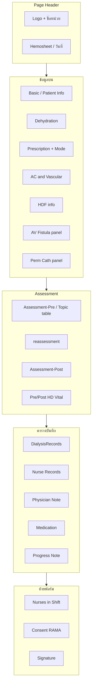
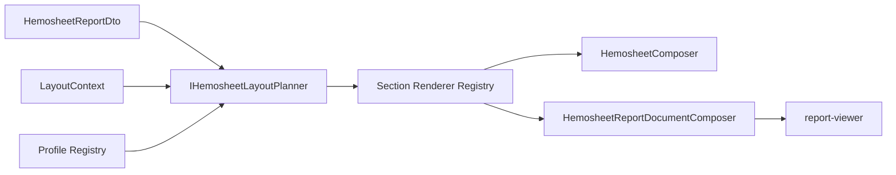

# Hemosheet Report Layout — แผนดำเนินการแทนที่ Telerik แบบสมบูรณ์

> **เป้าหมาย:** สร้าง Hemosheet (`template-04-hemosheet`) ที่ **แทน Telerik `Hemosheet*.trdp` ได้เต็มรูปแบบ** — preview WYSIWYG + PDF export จาก pipeline เดียวกัน  
> **อ้างอิง layout จริง:** [`Hemo-Report/Hemosheet.trdp`](file:///d:/GoodRepo/Hemo-Report/Hemosheet.trdp) และ variant (`Hemosheet-RAMA`, `Hemosheet-ThaiUR`, `Hemosheet-YTL`, `Hemosheet-New`)  
> เอกสารที่เกี่ยวข้อง: [02-FEATURE-PREVIEW-PDF.md](./02-FEATURE-PREVIEW-PDF.md), [hemopro_hemosheet_integration plan](.cursor/plans/hemopro_hemosheet_integration_d1c358da.plan.md)  
> **Master checklist รวมทั้งระบบ:** [.cursor/plans/hemo-pdf_implementation_8969dd4f.plan.md](.cursor/plans/hemo-pdf_implementation_8969dd4f.plan.md)  
> **อัปเดตสถานะ:** 2026-07-23

---

## Checklist งานที่เหลือ (Hemosheet layout — อัปเดต 2026-07-23)

### พื้นฐาน E2E — ทำแล้ว

- [x] DTO + layout context + resolver + catalog (Web.Api)
- [x] `report-data` API + S2S fetch จาก Hemo-PDF
- [x] Planner + `IHemosheetSectionRenderer` registry (ไม่ใช่ switch ใหญ่แล้ว)
- [x] FE opt-in preview (`useHemoPdfPreview`) + sync viewer
- [x] Mock scenarios หลัก (HD/AV, HDF, perm-cath, RAMA, ThaiUR, empty)

### ยังค้างก่อน DoD / แทน Telerik ได้

**Layout & data**

- [ ] Patient / dehydration / prescription / vascular — fidelity ใกล้ `.trdp` (field-grid, คอลัมน์)
- [ ] Assessment: map `text` + spike checklist vs topic matrix
- [ ] Labs ใน DTO + แสดงใน section
- [ ] Pre/Post vitals ถ้าแยกจาก dialysis records ใน trdp

**หน้ากระดาษ & ฟอนต์**

- [ ] Sarabun ใน `assets/fonts/sarabun/` + `@font-face` viewer
- [ ] A4 margin / header-footer bands ตรง PDF ↔ DOM
- [ ] Pagination หลายหน้า (QuestPDF hints + `pages[]` ใน ReportDocument)

**Profiles & ทดสอบ**

- [ ] Profile YTL / New (diff จาก `.trdp` → registry)
- [ ] Parity tests / visual sign-off ทุก mock scenario
- [ ] DoD §1.3 ครบ (รวมปิดพึ่ง `tr-viewer` เมื่อ flag เปิด — ดู cutover plan)

**นอกเอกสารนี้ (cutover):** [pdf_chore_phase2](.cursor/plans/pdf_chore_phase2_template_cutover.plan.md) — ลบ Telerik path, plugin send

---

## 0. หมายเหตุเรื่อง `HemoRecords.trdp`

| ไฟล์ | รายงาน | สถานะในแผนนี้ |
|------|--------|----------------|
| **`Hemosheet.trdp`** (+ RAMA/ThaiUR/YTL/New) | ฟอร์ม Hemosheet ต่อรอบฟอก (embedded report, print preview) | **เป้าหมายหลัก** |
| **`HemoRecords.trdp`** | ตาราง Hemo Dialysis Records (report key `hemorecords` ใน Report.Api) | **นอก scope** — เป็น template อื่น (`template-??`) ทำหลัง Hemosheet เสร็จ |

แผนนี้โฟกัส **Hemosheet ฟอร์มเต็มใบ** ไม่ใช่แค่ checklist หรือ section เดียว

---

## 1. วิสัยทัศน์

### 1.1 ทำไมไม่ copy `.trdp` ตรง ๆ

Telerik ใช้ `definition.xml` ~4,300 บรรทัด — absolute position, `Visible` expressions, checkbox ร้อยกล่อง  
เรา **ไม่ port XML** แต่ port **ความหมาย (semantic layout)** เป็น:

```
DTO + LayoutContext
    → Layout Planner (resolve กฎ visibility ฝั่ง server)
    → Section Renderer Registry (component ต่อ section)
    → ┬─ QuestPDF Composer  → PDF
      └─ JSON Composer      → ReportDocument → Angular viewer
```

**Viewer เป็น dumb renderer** — ไม่ evaluate rule ซ้ำ (ป้องกัน PDF/preview drift)

### 1.2 ความยืดหยุ่น 3 มิติ (จาก Telerik จริง)

| มิติ | ตัวอย่าง | ใคร resolve |
|------|----------|-------------|
| **1 — Data-driven** | HD/HDF, AV fistula vs Perm cath, AC not used, flush NSS, consent | `HemosheetLayoutResolver` → `features` |
| **2 — Tenant profile** | RAMA (consent, creator), ThaiUR (NursesInShiftNonPN) | `layoutProfile` + profile registry |
| **3 — Template mode** | ฟอร์มเปล่า HD/HDF, fixed lines | `reportSettings` + `templateMode` |

### 1.3 Definition of Done (แทน Telerik ได้)

- [ ] Preview บน A4 ใกล้ Telerik ≥ 95% ทุก section หลัก
- [ ] PDF จาก `POST /api/pdf/generate` เป็น source of truth สำหรับ print
- [ ] รองรับ profile: `default`, `rama`, `thaiur` (+ YTL ถ้า tenant ใช้)
- [ ] รองรับ data scenario: HD/AV, HDF/AV, HD/perm-cath, empty template
- [ ] ไม่มี `tr-viewer` ใน embedded hemosheet + reports hemosheet (feature flag ปิดได้)
- [ ] Parity tests ผ่านทุก scenario ข้างต้น

---

## 2. แผนผัง Hemosheet จาก `Hemosheet.trdp`

สรุป section หลักจาก `definition.xml` (ชื่อ element จริง):



### 2.1 ตาราง map: Telerik → Layout Component

| กลุ่มใน `.trdp` | ข้อมูลจาก DTO | Component เป้าหมาย | สถานะปัจจุบัน |
|----------------|---------------|-------------------|---------------|
| Logo / header | branding + meta | `ConfigurableHeaderSection` / `hemo-report-header` | มี — ต้องจูน A4 margin |
| Basic (ชื่อ, HN, วันเกิด, เพศ, แพทย์, แพ้ยา, สิทธิ์) | `patient` | `patient-info` | **ไม่ตรง** — PDF 2 คอลัมน์, preview 3 คอลัมน์ |
| Session (Ward, Bed, Treatment No, Kt/V…) | meta fields | `key-value-table` หรือ `field-row` | มีคร่าว ๆ |
| Dehydration | `dehydration` | `field-grid` (multi-column) | **key-value แนวตั้ง** — ไม่ตรง layout 2–3 คอลัมน์ใน trdp |
| Prescription + AC | `dialysisPrescription`, `isAcNotUsed` | `field-grid` + feature flags | บาง field ยังขาด (flush, duration split) |
| Vascular Access | `avShunt` + variant | `vascular-access` | มี variant — ต้องจูน field |
| Assessment Pre/Re/Post/Other | `assessments.*` | `checklist-table` × 4 | **โครงสร้างต่าง** — trdp มี Topic matrix + checkbox แยก; DTO เป็น list |
| Dialysis records | `dialysisRecords` | `data-grid` + fixed lines + HDF cols | มี — ต้อง parity width/padding |
| Nurse / Doctor records | `nurseRecords`, `doctorRecords` | `data-grid` | มี |
| Medicine | `medicineRecords` | `data-grid` | มี |
| Progress Note (A/I/E) | `progressNotes` | `data-grid` | มี |
| Nurses in Shift | `nursesInShift` / `NonPn` | `text` | มี — ThaiUR variant |
| Consent (RAMA) | `isConsent`, `doctorSignature` | `text` + image | บางส่วน |
| Signatures | `signatureNames` + images | `signature-block` | มีคร่าว ๆ |
| Labs | `labs` ใน `HemosheetData` | `key-value-table` | **ยังไม่มีใน DTO/report-data** |

---

## 3. สถาปัตยกรรม Layout Component ที่ยืดหยุ่น

### 3.1 หลักการ: Triple Mirror

ทุก layout component ต้องมี 3 ชั้นที่สอดคล้องกัน:

```
┌─────────────────────────────────────────────────────────────┐
│  IHemosheetSectionRenderer (C#)                             │
│    MapToPreview() → ReportBlock                             │
│    ComposePdf()   → QuestPDF via IContentSection            │
├─────────────────────────────────────────────────────────────┤
│  ReportBlock JSON (polymorphic type)                        │
├─────────────────────────────────────────────────────────────┤
│  Angular block component + SCSS                             │
└─────────────────────────────────────────────────────────────┘
```

**ไม่เพิ่ม `visibleWhen` ใน JSON** — planner ตัด section/column ก่อนส่ง (แนวทาง B จาก integration plan)

### 3.2 Layer แยกความรับผิดชอบ



| Layer | หน้าที่ | ไฟล์ (ปัจจุบัน / เป้าหมาย) |
|-------|---------|---------------------------|
| **Layout Resolver** | DTO → `features`, profile, vascular kind | `HemosheetLayoutResolver.cs` (Hemopro) ✅ |
| **Profile Registry** | profile → section descriptors ที่ tenant รองรับ | `HemosheetLayoutProfileRegistry.cs` **ใหม่** |
| **Layout Planner** | สร้าง `SectionPlan[]` (id, variant, columns, fixedLines) | `HemosheetLayoutPlanner.cs` ✅ ต้องขยาย |
| **Section Renderer** | `SectionPlan` + VM → block / PDF section | `IHemosheetSectionRenderer` **ใหม่** |
| **Page Composer** | header + content loop + footer + pagination | `HemosheetComposer` / `HemosheetReportDocumentComposer` |
| **Viewer** | render blocks เท่านั้น | `@hemo/report-viewer` |

### 3.3 Interface ใหม่: `IHemosheetSectionRenderer`

```csharp
// Hemo.Pdf.Layouts/Hemosheet/IHemosheetSectionRenderer.cs
public interface IHemosheetSectionRenderer
{
    HemosheetSectionId SectionId { get; }

    ReportBlock? MapToPreview(HemosheetSectionPlan plan, HemosheetReportViewModel vm);

    void ComposePdf(IContainer container, HemosheetSectionPlan plan,
        HemosheetReportViewModel vm, PdfReportContext context);
}
```

- ลงทะเบียนใน DI: `IEnumerable<IHemosheetSectionRenderer>`
- Composer เปลี่ยนจาก `switch` ยาว → `renderers.Single(r => r.SectionId == plan.SectionId)`
- เพิ่ม section ใหม่ = เพิ่ม renderer หนึ่งไฟล์ + Angular block หนึ่งไฟล์

### 3.4 Profile Registry (declarative)

```csharp
// ตัวอย่าง — ไม่ hardcode if กระจายใน planner
public sealed class HemosheetLayoutProfileRegistry
{
    public IReadOnlyList<HemosheetSectionDescriptor> GetSections(HemosheetLayoutProfile profile) =>
        profile switch
        {
            HemosheetLayoutProfile.Rama => DefaultSections.WithExtra(HemosheetSectionId.Consent),
            HemosheetLayoutProfile.ThaiUr => DefaultSections.WithNurseInShiftVariant("non-pn"),
            _ => DefaultSections,
        };
}
```

`HemosheetLayoutPlanner` รวม: **registry (tenant)** + **features (data)** + **data presence** (เช่น assessment ว่างไม่ใส่)

### 3.5 Block vocabulary (ขยายจากปัจจุบัน)

| Block type | ใช้เมื่อ | PDF Section | Angular |
|------------|---------|-------------|---------|
| `patient-info` | ข้อมูลผู้ป่วย 2 คอลัมน์ | `PatientInfoSection` | `patient-info-block` |
| `field-grid` | panel หลายคอลัมน์ (Dehydration, Prescription, AC) | `FieldGridSection` **ใหม่** | `field-grid-block` **ใหม่** |
| `key-value-table` | แถว label-value แนวตั้ง | `KeyValueTableSection` | `key-value-table-block` |
| `vascular-access` | AV vs Perm cath variant | reuse `KeyValueTableSection` หรือ dedicated | `vascular-access-block` ✅ |
| `checklist-table` | Assessment Pre/Re/Post/Other | `ChecklistTableSection` | `checklist-table-block` ✅ |
| `assessment-matrix` | Topic × checkbox grid แบบ trdp (ถ้าต้อง parity เต็ม) | `AssessmentMatrixSection` **ใหม่** | `assessment-matrix-block` **ใหม่** |
| `data-grid` | Dialysis / Nurse / Doctor / Med / PN | `DataGridSection` | `data-grid-block` |
| `text` | Nurses in shift, consent line | inline text | `text-block` |
| `signature` | ลายเซ็นท้ายฟอร์ม | `SignatureBlockSection` | `signature-block` |

**`field-grid`** — component ยืดหยุ่นหลักสำหรับแทน Telerik panel:

```json
{
  "type": "field-grid",
  "title": "Dehydration",
  "columns": 3,
  "fields": [
    { "label": "Pre Weight", "value": "60.1", "span": 1 },
    { "label": "UF Net", "value": "2.5", "span": 1 }
  ]
}
```

### 3.6 มาตรฐาน block ทุกตัว

- ทุก block มี `title?: string` (ไม่ใช้ `TextReportBlock` นำหน้า)
- ค่าว่าง → `"—"` ที่ mapper เท่านั้น
- หน่วย: `pt` / `mm` ใน SCSS ตรง `PdfStyleDefaults`
- A4: 210×297 mm, margin บน/ล่าง 3 mm, ซ้าย/ขวา 10 mm

---

## 4. สถานะปัจจุบัน (สรุป) — อัปเดต 2026-07-23

### 4.1 ทำแล้ว (Phase 7 พื้นฐาน + framework)

- [x] `HemosheetReportDto` + `HemosheetLayoutContext` + `HemosheetLayoutResolver` + catalog
- [x] `GET .../report-data` จาก Web.Api (+ template mode)
- [x] `IHemosheetLayoutPlanner` + unit tests
- [x] `IHemosheetSectionRenderer` registry + composers (PDF + preview)
- [x] Preview viewer ใน Hemopro (embedded + reports) ด้วย feature flag (default off)
- [x] Block พื้นฐาน: patient-info, key-value, data-grid, checklist, vascular-access, signature
- [x] ThaiUr PDF-as-preview path

### 4.2 ยังไม่พอสำหรับแทน Telerik

| หัวข้อ | ช่องว่าง |
|--------|---------|
| Layout fidelity | patient / dehydration / prescription ยังไม่ตรงสัดส่วน `.trdp` |
| Assessment | DTO เป็น list; trdp มี topic matrix; `text` ยังไม่ครบจาก API |
| Labs | ยังไม่ครบใน DTO / หรือยังไม่ wire แสดง |
| Pagination | ส่วนใหญ่ single page; trdp หลายหน้าเมื่อ records เต็ม |
| Fonts / A4 | โฟลเดอร์ `assets/fonts/sarabun/` ยังว่าง / อาจ fallback default font |
| Profile YTL/New | ยังไม่วิเคราะห์ diff จาก `.trdp` |
| Parity test | ไม่มีเทียบ screenshot/PDF กับ Telerik แบบเป็นระบบ |
| Cutover | `tr-viewer` ยังเป็น fallback; plugin send ยัง Report.Api |

---

## 5. แผนดำเนินการ (Phases)

### Phase 1 — Layout Component Framework `[Hemo-PDF]`

> วางรากก่อน — ทุก section ต่อไป plug เข้า registry ได้

| # | งาน | ผลลัพธ์ |
|---|-----|---------|
| 1.1 | สร้าง `IHemosheetSectionRenderer` + implementations แยกไฟล์ต่อ section | ลบ switch ใน composer |
| 1.2 | `HemosheetLayoutProfileRegistry` | profile กำหนด section list แบบ declarative |
| 1.3 | `ChecklistTablePreviewMapper` กลาง + `title` บน `ChecklistTableReportBlock` | checklist เป็น pattern แรกของ shared mapper |
| 1.4 | เพิ่ม `title` ให้ทุก `ReportBlock` ที่ยังไม่มี | ไม่ emit `TextReportBlock` นำหน้า section |
| 1.5 | `ReportPageLayout` — constants A4 + margin ใช้ร่วม QuestPDF + SCSS | หน้ากระดาษตรงกัน |

**เกณฑ์ผ่าน:** build ผ่าน, unit test planner + renderer smoke, preview โครงสร้าง JSON ไม่มี text block คั่น section

---

### Phase 2 — Data Contract ครบ `[Hemopro Web.Api]`

| # | งาน | ไฟล์ |
|---|-----|------|
| 2.1 | Map `assessments.*.text` + option metadata (ถ้าต้อง matrix) | `HemosheetReportDataService.cs` |
| 2.2 | เพิ่ม `labs` ใน DTO (ถ้า trdp แสดง) | `HemosheetReportDto.cs` + service |
| 2.3 | Pre/Post vital signs (ถ้าแยกจาก dialysis records) | DTO + resolver |
| 2.4 | ยืนยัน `layoutContext` คำนวณครบ features จาก §1.2 | `HemosheetLayoutResolver.cs` + tests |
| 2.5 | Template preview mode (`template: true`, `hd`/`hdf`) | controller + service |

**เกณฑ์ผ่าน:** integration test `report-data` คืน JSON ครบ field ที่ planner ต้องใช้

---

### Phase 3 — Section Parity ทีละกลุ่ม `[Hemo-PDF + viewer]`

ลำดับตามความเสี่ยงต่อ UX (มองเห็นบ่อยบนจอ):

#### 3A — หน้ากระดาษ + Header/Footer

- [ ] A4 canvas, auto-fit width, Sarabun `@font-face`
- [ ] Header: logo, company lines, title — ตรง `ConfigurableHeaderSection`
- [ ] Footer: disclaimer, page number — แยก band นอก content padding

#### 3B — Patient + Session + Dehydration + Prescription

- [ ] `patient-info` 2 คอลัมน์ตรง `PatientInfoSection`
- [ ] `field-grid` สำหรับ Dehydration (2–3 คอลัมน์ตาม trdp)
- [ ] `field-grid` Prescription + AC — respect `showAcFields`, `showDurationHours`, `showHdfColumns`
- [ ] `vascular-access` variant AV / perm-cath

#### 3C — Assessment (checklist + matrix ถ้าจำเป็น)

- [ ] `checklist-table` 3 คอลัมน์ (checkbox · รายการ · หมายเหตุ)
- [ ] ประเมินว่า trdp `AssessmentTable` ต้องใช้ `assessment-matrix` หรือ checklist พอ — **spike 1 วัน** อ่าน binding ใน `definition.xml`
- [ ] Pre / Re / Post / Other ตาม planner

#### 3D — ตารางบันทึก (grids)

- [ ] `data-grid` Dialysis — columns ตาม planner, fixed lines, HDF col
- [ ] Nurse / Doctor / Medicine / Progress Note — fixed lines + title
- [ ] จูน column width ratio ใกล้ trdp (optional: `columnWidths[]` ใน block)

#### 3E — ท้ายฟอร์ม

- [ ] Nurses in Shift (+ ThaiUR `NonPn` variant)
- [ ] Consent block (RAMA) + doctor signature image
- [ ] `signature-block` — slot layout ตรง PDF

**เกณฑ์ผ่าน Phase 3:** เทียบ mock 5 scenario กับ PDF generate — ทุก section มีใน JSON และแสดงบนจอ

---

### Phase 4 — Layout Profiles & Variants

| Profile | ไฟล์อ้างอิง | งานเพิ่ม |
|---------|-------------|----------|
| `default` | `Hemosheet.trdp` | baseline parity |
| `rama` | `Hemosheet-RAMA.trdp` | consent, creator, duration/HDF emphasis |
| `thaiur` | `Hemosheet-ThaiUR.trdp` | NursesInShiftNonPN |
| `ytl` | `Hemosheet-YTL.trdp` | วิเคราะห์ diff → เพิ่มใน registry |
| `new` | `Hemosheet-New.trdp` | วิเคราะห์ diff → เพิ่มใน registry |

แต่ละ profile: table-driven test ใน `HemosheetLayoutPlannerTests` + snapshot JSON

---

### Phase 5 — Pagination & Print

| # | งาน |
|---|-----|
| 5.1 | QuestPDF page break ตาม section hints (`PageBreakBefore`, `KeepTogether`) |
| 5.2 | Composer สร้าง `pages[]` หลายหน้าใน `ReportDocument` |
| 5.3 | Viewer toolbar pagination (มีอยู่แล้ว) ต่อกับ `pages[]` |
| 5.4 | `@media print` + download PDF จาก QuestPDF |

---

### Phase 6 — Cutover & ลบ Telerik (Hemosheet)

| # | งาน | Repo |
|---|-----|------|
| 6.1 | `useHemoPdfPreview: true` เป็น default ทุก tenant ที่พร้อม | Hemopro config |
| 6.2 | ลบ `tr-viewer` จาก `embedded-hemosheet-report`, `reports.page` | Hemopro |
| 6.3 | ลบ `embedded-hemosheet-report-toolbar.ts` DOM hack | Hemopro |
| 6.4 | (Optional) ลด dependency Report.Api สำหรับ hemosheet preview | Hemopro |
| 6.5 | Parity sign-off 3 tenant จริง | QA |

---

## 6. Mock Data & Parity Testing

### 6.1 ชุด mock บังคับ (`assets/mock-data/`)

| ไฟล์ | ทดสอบ |
|------|--------|
| `template-04-hemosheet-hd-av.json` | HD + AV + assessment + records |
| `template-04-hemosheet-hdf-av.json` | HDF columns |
| `template-04-hemosheet-hd-perm.json` | Perm cath panel |
| `template-04-hemosheet-rama.json` | consent + creator |
| `template-04-hemosheet-thaiur.json` | NursesInShiftNonPN |
| `template-04-hemosheet-empty-hd.json` | template preview |
| `template-04-hemosheet-heavy.json` | records เต็ม fixed lines + pagination |

### 6.2 ประเภท test

| ชั้น | เนื้อหา |
|------|---------|
| Unit | `HemosheetLayoutResolver`, `HemosheetLayoutPlanner`, แต่ละ `SectionRenderer` |
| Integration | `POST /api/report/preview` structure ต่อ mock |
| Parity | PDF bytes จาก Hemo-PDF vs Telerik export (same DTO) — optional screenshot |
| E2E | Hemopro embedded preview โหลดจริง |

---

## 7. ลำดับ PR แนะนำ

```
PR-A  Hemo-PDF: Section renderer framework + profile registry + block title standard
PR-B  Hemopro: DTO completeness (assessment text, labs, vitals)
PR-C  Hemo-PDF + viewer: field-grid + patient parity + A4/Sarabun
PR-D  Hemo-PDF + viewer: checklist + grids parity
PR-E  Hemo-PDF: profile variants (rama, thaiur) + mock + tests
PR-F  Hemo-PDF: pagination
PR-G  Hemopro: Telerik cutover
```

---

## 8. ความเสี่ยงและการตัดสินใจ

| ความเสี่ยง | แนวทาง |
|-----------|--------|
| Assessment ใน trdp ซับซ้อนกว่า list DTO | Spike `AssessmentTable` bindings → เลือก `checklist-table` หรือ `assessment-matrix` |
| Profile YTL/New ไม่รู้ diff | แตก `definition.xml` เทียบ default ก่อน Phase 4 |
| Pagination ใช้เวลา | ยอม single-page ชั่วคราวได้ระหว่าง Phase 3 แต่ต้องทำก่อน cutover production |
| Frontend copy ของ viewer | sync script หรือ publish `@hemo/report-viewer` เป็น package จริง — ลด drift |
| `HemoRecords.trdp` สับสน | แยก template id ชัด — hemosheet = `template-04`, hemorecords = template อื่น |

---

## 9. Checklist สรุป (ทั้งโครงการ)

### Framework
- [ ] `IHemosheetSectionRenderer` + DI registry
- [ ] `HemosheetLayoutProfileRegistry`
- [ ] `title` บนทุก content block
- [ ] Shared preview mappers ต่อ section type

### Layout components
- [ ] `patient-info` (2 col)
- [ ] `field-grid` (ใหม่)
- [ ] `key-value-table`
- [ ] `vascular-access`
- [ ] `checklist-table` (3 col)
- [ ] `assessment-matrix` (ถ้า spike บังคับ)
- [ ] `data-grid` (5 ตาราง)
- [ ] `text`, `signature`
- [ ] header / footer bands

### Data & profiles
- [ ] DTO ครบ (assessment text, labs, …)
- [ ] default + rama + thaiur parity
- [ ] mock 7 ไฟล์

### Viewer & cutover
- [ ] A4 + Sarabun + auto-fit
- [ ] pagination
- [ ] ลบ Telerik hemosheet

---

## 10. เอกสารและไฟล์อ้างอิง

| บทบาท | Path |
|--------|------|
| Telerik baseline | `Hemo-Report/Hemosheet.trdp` |
| Telerik mock shape | `Hemo-Report/MockData/HemosheetData.json` |
| Data resolver (legacy) | `Hemo-backend/.../HemosheetResolver.cs` |
| DTO + layout rules | `Hemo-backend/.../HemosheetLayoutResolver.cs` |
| Planner | `Hemo-PDF/.../HemosheetLayoutPlanner.cs` |
| PDF composer | `Hemo-PDF/.../Template04_Hemosheet/HemosheetComposer.cs` |
| JSON composer | `Hemo-PDF/.../HemosheetReportDocumentComposer.cs` |
| Sections | `Hemo-PDF/src/Hemo.Pdf.Sections/Content/` |
| Viewer | `Hemo-PDF/client/projects/hemo-report-viewer/` |
| Hemopro embedded | `Hemo-frontend/.../embedded-hemosheet-report/` |
| Preview feature | `Hemo-PDF/02-FEATURE-PREVIEW-PDF.md` |

---

## 11. งานถัดไป (แนะนำเริ่มที่นี่) — อัปเดต 2026-07-23

> Phase 1 framework (section registry) **ทำแล้ว** — เริ่มที่ fidelity ที่เห็นบนจอ

1. **Sarabun + A4 bands** — copy ฟอนต์ + จูน margin/header/footer (เห็นผลเร็ว)
2. **Spike assessment** — อ่าน `AssessmentTable` ใน `Hemosheet.trdp` ตัดสิน checklist vs matrix
3. **Phase 3B–3E** — จูน section ทีละกลุ่ม (patient → grids → signatures) ตาม checklist ด้านบน
4. **Parity sign-off** → ค่อยทำ cutover ใน [pdf_chore_phase2](.cursor/plans/pdf_chore_phase2_template_cutover.plan.md)

เมื่อ layout parity ถึงเกณฑ์ DoD §1.3 Hemosheet จะ **แทน Telerik ได้จริง** — แล้วค่อยปิด `tr-viewer`
